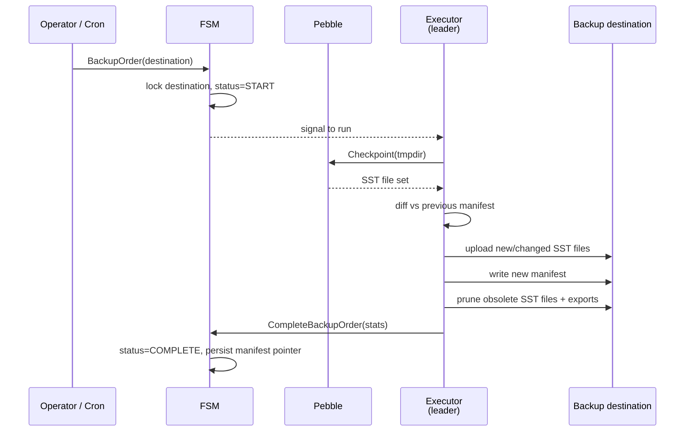

# Backup and Restore

## Overview

A **backup** is a snapshot of the **entire Pebble database**, exported to durable storage for disaster recovery. This is distinct from [cold storage](cold-storage.md), which only exports archived *chapters* of logs. Two different access patterns, two different code paths, two different concerns:

| | Cold storage | Backup |
|-|-|-|
| Scope | A sealed chapter's logs + audit entries | The whole Pebble database |
| Granularity | One file per chapter | A manifest + many SST segments |
| Trigger | Per-chapter Raft order (`ArchiveChapter`) | Per-destination Raft order (`Backup`), often scheduled |
| Recovery target | Selective revert via [receipts](receipts.md) | Whole-cluster reconstruction |

Backups are Raft-coordinated so the cluster can't double-write to the same destination and so a failure mid-upload is recoverable.

Source: `internal/infra/backup/` (lower-level storage + manifest) and `internal/application/backup/` (FSM-side orchestration).

## Drivers

| Driver | Build tag | File |
|--------|-----------|------|
| S3 | `s3` | `internal/infra/backup/s3.go` (stub at `s3_disabled.go` without the tag) |
| Azure Blob | `azure` | `internal/infra/backup/azure.go` (stub at `azure_disabled.go` without the tag) |

`internal/infra/backup/storage.go:51-57` dispatches on the `kind` field of `StorageConfig`: only `"s3"` and `"azure"` are recognised. **There is no filesystem driver for backup** (filesystem is supported for [cold storage](cold-storage.md), but backups must go to a real object store). The default light binary therefore has no functional backup target — operators who need backup build with `just build-full` or the matching `-tags` flag.

## How a backup is taken

A Pebble *checkpoint* is the engine primitive: hard-link every live SST file into a separate directory at a point in time. The checkpoint is **quasi-free** (no copy), and writes to the live database keep going untouched.

### Crash-safe write ordering and object immutability

Recoverability rests on two rules, both enforced in `internal/infra/backup/manager.go`:

1. **Ordering.** Every object the new manifest will reference is uploaded
   *before* the manifest, and *no object is deleted before* the new manifest is
   committed. Cleanup of everything the new manifest no longer references (stale
   checkpoint files, obsolete export segments, files leaked by earlier crashed
   runs) is a single orphan-prune pass that runs *after* `WriteManifest`.

2. **Immutability via content-addressing.** Checkpoint file objects are stored
   under **content-addressed keys** — `data/<filename>.<sha256>` — so any object
   a published manifest references is immutable. This matters because a Pebble
   checkpoint contains a `MANIFEST-NNNNNN` file that keeps the *same local name*
   but **grows** between checkpoints. Keying by name alone, the next full backup
   would re-upload it and overwrite the object the currently published backup
   manifest still points at, *before* the manifest swap — a crash in that window
   would corrupt the previous backup. Keying by content routes a changed file to
   a *new* key; the old object is untouched until the post-manifest prune.
   Identical content across checkpoints yields the same key, so unchanged SSTs
   are naturally deduped and skipped on re-upload (this replaces the old
   name+size diff — correctness is now the content hash, not the size).

Together these mean a crash at any point *before* `WriteManifest` leaves the
*previously published* manifest fully restorable, and a crash *after* it leaves
the *new* one restorable — there is never a window in which the current manifest
points at a deleted or half-overwritten object. A failed segment upload aborts
the run before the manifest is touched, so a partial upload can never publish a
dangling reference.

> **Manifest schema note (pre-GA, breaking):** `checkpoint.files` changed from
> `{ filename: size }` to `{ filename: { size, key } }`, where `key` is the
> content-addressed storage key. Restore resolves objects by that recorded
> `key`, never by reconstructing `prefix + filename`. Backups written by an
> older binary (bare-`data/<filename>` layout) are not readable by the new
> restore path and must be retaken. Reading a legacy manifest fails fast with a
> typed, actionable error (`ErrLegacyManifestFormat`) rather than a cryptic JSON
> decode error, so the operator knows to retake the backup. No in-place
> migration is provided — deliberately, as this is a pre-GA break.

The work is split between **Raft-coordinated lifecycle orders** (`BackupOrder`, `CompleteBackupOrder`, `FailBackupOrder` at `raft_cmd.proto:431-593`) and **executor work on the leader** (`internal/infra/backup/manager.go:40-180`). The FSM never blocks on the upload — it only records start, success, and failure.

### Per-destination mutual exclusion

Two simultaneous backups to the same destination are rejected at FSM apply time. The mutex is keyed by `CanonicalDestinationKey` — a hash of the namespace-determining fields of the `BackupDestination` (driver kind, canonicalised endpoint, bucket/container, bucket ID; region, `base_path`, and credentials are deliberately excluded, see `internal/infra/state/backup_jobs.go`). Full (`BackupOrder`) and incremental (`IncrementalBackupOrder`) backups **share the same slot**: both are routed through the leader and propose a `Start` order that lands on the same key, so a full backup and an incremental backup against the same bucket cannot run concurrently — the second gets `ErrBackupInProgress`. Two backups against genuinely distinct destinations (different bucket/endpoint) run in parallel.

This FSM-managed per-destination slot is what closes the manifest-atomicity race (EN-1055): because only one backup holds a destination at a time, the read-modify-write of the shared manifest can never interleave, so no writer can overwrite another's manifest update and orphan its segments. It is a deterministic, clock-free alternative to a leased lock — the slot is held from `Start` to `Complete`/`Fail`, and an orphaned slot (executor gone after a leadership change or crash) is freed by the leader-only cleanup loop (`internal/application/backup/cleanup.go`).

### Manifest + incremental segments

A full backup diffs the current checkpoint's SST file set against the previous manifest and uploads only the new/changed files, but always writes a fresh checkpoint manifest with an empty export set. An **incremental** backup (`IncrementalBackupOrder`) does not take a new checkpoint at all: it streams the log/audit/audit-item/applied-proposal entries written since the last recorded sequence into size-bounded export *segments* and appends them to the manifest's export list. Files that are no longer referenced by the newly written manifest are pruned from the destination *after* the manifest is committed (see "Crash-safe write ordering" above).

The manifest itself (`internal/infra/backup/manifest.go`) records:

- The Pebble checkpoint timestamp and applied Raft index.
- The last audit + log sequence numbers.
- The file map (`name → checksum → size`).
- Any exports (incremental segments not yet rolled into a checkpoint).

A fresh backup against an empty destination is just a "full" backup with an empty previous manifest. A backup right after a previous one transfers only the deltas.

## Restore

`internal/infra/backup/restore.go` is the entry point. The flow is conceptually the inverse:

1. Read the manifest from the destination.
2. Download every SST file the manifest references into a fresh Pebble directory.
3. Apply any incremental exports on top (`ApplyExports`).
4. Boot the node against the restored directory.

After the restore, the node rejoins (or initialises) the Raft cluster as a fresh peer. The standard config validation (`internal/bootstrap/config_validation.go`) verifies that the restored `cluster-id` matches the cluster the node is supposed to be joining.

A restore is **a node-level disaster-recovery operation**, not an in-cluster operation — it is not driven by a Raft order. Operators script it (or invoke it via the Operator) when a cluster needs to be rebuilt from cold.

## Scheduling

The Operator's `Backup` CRD (`misc/operator/api/v1alpha1/`) wraps backups behind a `BackupSchedule` with **two separate cron fields** — `Full` and `Incremental` — so operators can run a full checkpoint less often than the incremental segments. The Operator submits a `BackupOrder` (full) or `IncrementalBackupOrder` at each cron tick; the FSM enforces mutual exclusion; the executor on the leader does the upload. One-off backups can also be triggered manually through the same gRPC surface.

`IncrementalBackupOrder` is the right primitive for tight RPO targets — it flushes the in-progress segment without taking a fresh full checkpoint.

## Performance characteristics

- **Pebble checkpoint is hard-link-based.** Almost no I/O cost; the live database keeps serving writes.
- **Uploads are leader-only.** Followers are not involved. This avoids fan-out but means the leader's bandwidth caps backup throughput.
- **Full-backup dedup is by content hash.** Each checkpoint file is sha256-hashed; a file whose content is already present on storage (same content-addressed key) is skipped. Pebble's compaction rewrites SSTs, so a heavily-churned database changes more file contents and re-uploads more than a quiet one — dedup is at whole-file granularity, there is no key-level diffing.
- **No backups during snapshot transfer.** A follower receiving a Raft snapshot is in a transient state; the leader does not initiate a backup while a follower is mid-sync.

## What backup doesn't do

- **It does not back up cold storage.** Cold storage is durable by the driver's own guarantees. A node restore reconstructs only the hot Pebble database; archived chapters stay in their cold-storage location and the restored cluster reads them through the same `coldstorage.Reader` interface.
- **It does not provide point-in-time queries.** A backup is a *Pebble* snapshot, not a logical "as of this transaction" snapshot. For point-in-time logical reads, use [query checkpoints](../read-path/query-checkpoints.md) instead.
- **It does not retain by policy.** Retention (how many manifests to keep, how long incremental segments live) is operator-driven. The system will happily back up to the same destination forever.

## Where to look in the code

| Concern | File |
|---------|------|
| FSM lifecycle orders (Backup, IncrementalBackup, Complete, Fail) | `misc/proto/raft_cmd.proto:431-593` |
| FSM-side orchestration | `internal/application/backup/orchestrator.go` |
| Backup manager (Pebble checkpoint, diff, upload) | `internal/infra/backup/manager.go:40-180` |
| Manifest | `internal/infra/backup/manifest.go` |
| Storage abstraction (filesystem / S3 / Azure) | `internal/infra/backup/storage*.go` |
| Restore | `internal/infra/backup/restore.go` |
| `Backup` / `BackupRun` CRDs | `misc/operator/api/v1alpha1/` |
