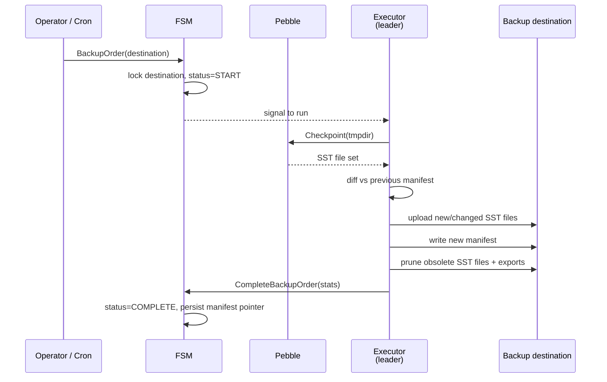

# Backup and Restore

## Overview

A **backup** is a snapshot of the **entire Pebble database**, exported to durable storage for disaster recovery. This is distinct from [cold storage](cold-storage.md), which only exports archived *chapters* of logs. Two different access patterns, two different code paths, two different concerns:

| | Cold storage | Backup |
|-|-|-|
| Scope | A sealed chapter's logs + audit entries | The whole Pebble database |
| Granularity | One file per chapter | A manifest + many SST segments |
| Trigger | Per-chapter Raft order (`ArchiveChapter`) | Per-destination Raft order (`Backup`), often scheduled |
| Recovery target | Selective revert via [receipts](receipts.md) | Whole-cluster reconstruction |

Backups are Raft-coordinated so the cluster can't double-write to the same destination and so a failure mid-upload is recoverable.

Source: `internal/infra/backup/` (lower-level storage + manifest) and `internal/application/backup/` (FSM-side orchestration).

## Drivers

| Driver | Build tag | File |
|--------|-----------|------|
| S3 | `s3` | `internal/infra/backup/s3.go` (stub at `s3_disabled.go` without the tag) |
| Azure Blob | `azure` | `internal/infra/backup/azure.go` (stub at `azure_disabled.go` without the tag) |

`internal/infra/backup/storage.go:51-57` dispatches on the `kind` field of `StorageConfig`: only `"s3"` and `"azure"` are recognised. **There is no filesystem driver for backup** (filesystem is supported for [cold storage](cold-storage.md), but backups must go to a real object store). The default light binary therefore has no functional backup target — operators who need backup build with `just build-full` or the matching `-tags` flag.

## How a backup is taken

A Pebble *checkpoint* is the engine primitive: hard-link every live SST file into a separate directory at a point in time. The checkpoint is **quasi-free** (no copy), and writes to the live database keep going untouched.

```mermaid
sequenceDiagram
    participant Op as Operator / Cron
    participant FSM
    participant Peb as Pebble
    participant Exec as Executor<br/>(leader)
    participant Dst as Backup destination

    Op->>FSM: BackupOrder(destination)
    FSM->>FSM: lock destination, status=START
    FSM-->>Exec: signal to run
    Exec->>Peb: Checkpoint(tmpdir)
    Peb-->>Exec: SST file set
    Exec->>Exec: diff vs previous manifest
    Exec->>Dst: upload new/changed SST files
    Exec->>Dst: write new manifest
    Exec->>Dst: prune obsolete SST files + exports
    Exec->>FSM: CompleteBackupOrder(stats)
    FSM->>FSM: status=COMPLETE, persist manifest pointer
```

### Crash-safe write ordering and object immutability

Recoverability rests on two rules, both enforced in `internal/infra/backup/manager.go`:

1. **Ordering.** Every object the new manifest will reference is uploaded
   *before* the manifest, and *no object is deleted before* the new manifest is
   committed. Cleanup of everything the new manifest no longer references (stale
   checkpoint files, obsolete export segments, files leaked by earlier crashed
   runs) is a single orphan-prune pass that runs *after* `WriteManifest`.

2. **Immutability via content-addressing.** Checkpoint file objects are stored
   under **content-addressed keys** — `data/<filename>.<sha256>` — so any object
   a published manifest references is immutable. This matters because a Pebble
   checkpoint contains a `MANIFEST-NNNNNN` file that keeps the *same local name*
   but **grows** between checkpoints. Keying by name alone, the next full backup
   would re-upload it and overwrite the object the currently published backup
   manifest still points at, *before* the manifest swap — a crash in that window
   would corrupt the previous backup. Keying by content routes a changed file to
   a *new* key; the old object is untouched until the post-manifest prune.
   Identical content across checkpoints yields the same key, so unchanged SSTs
   are naturally deduped and skipped on re-upload (this replaces the old
   name+size diff — correctness is now the content hash, not the size).

Together these mean a crash at any point *before* `WriteManifest` leaves the
*previously published* manifest fully restorable, and a crash *after* it leaves
the *new* one restorable — there is never a window in which the current manifest
points at a deleted or half-overwritten object. A failed segment upload aborts
the run before the manifest is touched, so a partial upload can never publish a
dangling reference.

> **Manifest schema note (pre-GA, breaking):** `checkpoint.files` changed from
> `{ filename: size }` to `{ filename: { size, key } }`, where `key` is the
> content-addressed storage key. Restore resolves objects by that recorded
> `key`, never by reconstructing `prefix + filename`. Backups written by an
> older binary (bare-`data/<filename>` layout) are not readable by the new
> restore path and must be retaken. Reading a legacy manifest fails fast with a
> typed, actionable error (`ErrLegacyManifestFormat`) rather than a cryptic JSON
> decode error, so the operator knows to retake the backup. No in-place
> migration is provided — deliberately, as this is a pre-GA break.

The work is split between **Raft-coordinated lifecycle orders** (`BackupOrder`, `CompleteBackupOrder`, `FailBackupOrder` at `raft_cmd.proto:431-593`) and **executor work on the leader** (`internal/infra/backup/manager.go:40-180`). The FSM never blocks on the upload — it only records start, success, and failure.

### Per-destination mutual exclusion

Two simultaneous backups to the same destination are rejected at FSM apply time. The mutex is keyed by `CanonicalDestinationKey` — a hash of the namespace-determining fields of the `BackupDestination` (driver kind, canonicalised endpoint, bucket/container, bucket ID; region, `base_path`, and credentials are deliberately excluded, see `internal/infra/state/backup_jobs.go`). Full (`BackupOrder`) and incremental (`IncrementalBackupOrder`) backups **share the same slot**: both are routed through the leader and propose a `Start` order that lands on the same key, so a full backup and an incremental backup against the same bucket cannot run concurrently — the second gets `ErrBackupInProgress`. Two backups against genuinely distinct destinations (different bucket/endpoint) run in parallel.

This FSM-managed per-destination slot is what closes the manifest-atomicity race (EN-1055): because only one backup holds a destination at a time, the read-modify-write of the shared manifest can never interleave, so no writer can overwrite another's manifest update and orphan its segments. It is a deterministic, clock-free alternative to a leased lock — the slot is held from `Start` to `Complete`/`Fail`, and an orphaned slot (executor gone after a leadership change or crash) is freed by the leader-only cleanup loop (`internal/application/backup/cleanup.go`).

### Manifest + incremental segments

A full backup diffs the current checkpoint's SST file set against the previous manifest and uploads only the new/changed files, but always writes a fresh checkpoint manifest with an empty export set. An **incremental** backup (`IncrementalBackupOrder`) does not take a new checkpoint at all: it streams the log/audit/audit-item/applied-proposal entries written since the last recorded sequence into size-bounded export *segments* and appends them to the manifest's export list. Files that are no longer referenced by the newly written manifest are pruned from the destination *after* the manifest is committed (see "Crash-safe write ordering" above).

### Interplay with chapter archival (cold backfill)

Chapter archival purges a confirmed chapter's log/audit entries from hot Pebble, so an export window can span ranges that are no longer in the hot store. A hot-only export would silently skip them while still advancing the manifest floor past them — dropping them from the backup chain permanently and corrupting the eventual restore (EN-1598). `RunIncrementalBackup` therefore **backfills** those ranges from cold storage (`backfillArchivedRanges` in `internal/infra/backup/cold_backfill.go`):

- The chapter registry (`ZoneGlobal/SubGlobChapters`, never purged) is read from the *same snapshot* as the hot export, so a chapter is `ARCHIVED` in that snapshot exactly when its purge is applied in it — cold and hot segments can never overlap.
- For each archived chapter intersecting the window, the chapter's cold SST (via `coldstorage.ColdReader`) is exported through the same `exportEntries` pipeline, producing ordinary export segments that `ApplyExports` restores unchanged. Only the intersection with the window is exported, and the floor then moves past it, so an archived range enters the backup chain **at most once**.
- Log and audit streams are gap-free (one entry per sequence; the audit is a hash chain), so the backfill checks the exported count against the range width and fails on a truncated archive. If the window overlaps an archived chapter and no cold reader is configured, the run fails loudly instead of publishing a lossy manifest.
- Backfilled segments precede the hot segments in the manifest's export list: `LastExportLogSequence`/`LastExportAuditSequence` read the *last* segment of each type as the next run's floor, and the hot tail always carries the highest sequences (the `ConfirmArchiveChapter` log itself lands above the chapter it archives).

The result is a **self-contained backup chain**: a restore needs only the backup destination, never cold-storage access, and later corruption or lifecycle changes in cold storage cannot retroactively invalidate an already-taken backup. The restore ingests the backfilled rows because `RebuildDelta` folds the chapter lifecycle out of them, then purges them once it has: a chapter the rebuilt registry calls `ARCHIVED` gets the same hot/cold split it had on the source, so reads route to the cold object and the checker's exclusion pass finds no purge receipts its replay cannot derive.

### Chapter identity across restore (EN-1750)

Three guarantees keep chapter archival safe against a restored store:

- **The chapter registry is a rebuilt projection.** `RebuildDelta` folds the chapter lifecycle logs (`ClosedChapterLog` carries both the closed and the newly opened chapter; seal/archive/confirm carry the accumulated state) into `ZoneGlobal/SubGlobChapters` rows and advances `SubGlobNextChapterID`, exactly as the live apply persists them. For a chapter closed but not yet sealed at backup time, the close log is the only lifecycle log in the delta, and the `last_audit_hash` it carries is the hash the checker chains from across the chapter's eventual purge; a close log without it is refused rather than rebuilt, because the resulting registry could not be verified. Without this rebuild, a restored node's registry is frozen at checkpoint time and the boot genesis path re-creates "chapter 1" spanning already-archived history.
- **The Archiver never confirms an archive it cannot prove matches the request.** Cold storage is keyed by chapter id alone, so the crash-recovery path (archive already exists) validates the object's checksum *and* decodes the SST's embedded `chapterMetadata`, comparing every sequence range against the `ArchiveRequest`. A mismatch means the stored object is a different chapter incarnation: confirming would purge the request's ranges with only the old object's ranges archived, destroying everything outside their intersection. The archiver fails loudly and never confirms, whatever produced the identity confusion.
- **A chapter's identity is its sealing hash, not its ranges.** Ranges alone cannot separate two incarnations: restoring an older backup over a surviving cold-storage namespace can reuse a chapter id and reach the same log and audit counts over different operations, so the stored object's metadata tuple matches while its contents belong to a history the store no longer has, and its checksum validates it against itself. The sealing hash commits a chapter to its content (`chapter_id`, `close_sequence`, `last_audit_hash`, attribute `state_hash`), so it travels in three places: into the archive's `chapterMetadata`, into the archiver's comparison above, and into `ConfirmArchiveChapter` itself. The handler compares the carried hash against the chapter it holds and rejects a mismatch with `CHAPTER_ARCHIVE_IDENTITY_MISMATCH` — in apply, in the same step as the purge it authorises, so nothing can change between the check and the deletion. It also means a hand-sent confirm cannot purge a chapter: the caller would have to know the incarnation the FSM holds.

The manifest itself (`internal/infra/backup/manifest.go`) records:

- The Pebble checkpoint timestamp and applied Raft index.
- The last audit + log sequence numbers.
- The file map (`name → checksum → size`).
- Any exports (incremental segments not yet rolled into a checkpoint).

A fresh backup against an empty destination is just a "full" backup with an empty previous manifest. A backup right after a previous one transfers only the deltas.

## Restore

`internal/infra/backup/restore.go` is the entry point. The flow is conceptually the inverse:

1. Read the manifest from the destination.
2. Download every SST file the manifest references into a fresh Pebble directory.
3. Apply any incremental exports on top (`ApplyExports`).
4. Reconstruct post-checkpoint derived state from the exported log and audit streams (`RebuildDelta`).
5. Boot the node against the restored directory.

`RebuildDelta` is a second fold of committed effects: the checkpoint contains
projection values only up to its sequence boundary, while later incremental
segments carry the evidence needed to reconstruct their updates. Any persisted
state that can change after the checkpoint must therefore follow the
[incremental restore contract](incremental-restore-contract.md). A restore test
that has no post-checkpoint export does not exercise this path.

After the restore, the node rejoins (or initialises) the Raft cluster as a fresh peer. The standard config validation (`internal/bootstrap/config_validation.go`) verifies that the restored `cluster-id` matches the cluster the node is supposed to be joining.

A restore is **a node-level disaster-recovery operation**, not an in-cluster operation — it is not driven by a Raft order. Operators script it (or invoke it via the Operator) when a cluster needs to be rebuilt from cold.

## Scheduling

The Operator's `Backup` CRD (`misc/operator/api/v1alpha1/`) wraps backups behind a `BackupSchedule` with **two separate cron fields** — `Full` and `Incremental` — so operators can run a full checkpoint less often than the incremental segments. The Operator submits a `BackupOrder` (full) or `IncrementalBackupOrder` at each cron tick; the FSM enforces mutual exclusion; the executor on the leader does the upload. One-off backups can also be triggered manually through the same gRPC surface.

`IncrementalBackupOrder` is the right primitive for tight RPO targets — it flushes the in-progress segment without taking a fresh full checkpoint.

## Performance characteristics

- **Pebble checkpoint is hard-link-based.** Almost no I/O cost; the live database keeps serving writes.
- **Uploads are leader-only.** Followers are not involved. This avoids fan-out but means the leader's bandwidth caps backup throughput.
- **Full-backup dedup is by content hash.** Each checkpoint file is sha256-hashed; a file whose content is already present on storage (same content-addressed key) is skipped. Pebble's compaction rewrites SSTs, so a heavily-churned database changes more file contents and re-uploads more than a quiet one — dedup is at whole-file granularity, there is no key-level diffing.
- **No backups during snapshot transfer.** A follower receiving a Raft snapshot is in a transient state; the leader does not initiate a backup while a follower is mid-sync.

## What backup doesn't do

- **It does not back up cold storage wholesale.** Cold storage is durable by the driver's own guarantees. A full checkpoint reconstructs only the hot Pebble database; chapters archived before it stay in their cold-storage location and the restored cluster reads them through the same `coldstorage.Reader` interface. (Ranges archived *inside an incremental export window* are the exception — those are backfilled into the backup chain, see above.)
- **It does not provide point-in-time queries.** A backup is a *Pebble* snapshot, not a logical "as of this transaction" snapshot. For point-in-time logical reads, use [query checkpoints](../read-path/query-checkpoints.md) instead.
- **It does not retain by policy.** Retention (how many manifests to keep, how long incremental segments live) is operator-driven. The system will happily back up to the same destination forever.

## Where to look in the code

| Concern | File |
|---------|------|
| FSM lifecycle orders (Backup, IncrementalBackup, Complete, Fail) | `misc/proto/raft_cmd.proto:431-593` |
| FSM-side orchestration | `internal/application/backup/orchestrator.go` |
| Backup manager (Pebble checkpoint, diff, upload) | `internal/infra/backup/manager.go:40-180` |
| Manifest | `internal/infra/backup/manifest.go` |
| Cold backfill of archival-purged ranges | `internal/infra/backup/cold_backfill.go` |
| Storage abstraction (filesystem / S3 / Azure) | `internal/infra/backup/storage*.go` |
| Restore orchestration | `internal/infra/backup/restore.go` |
| Delta projection rebuild | `internal/infra/backup/rebuild.go`, `internal/domain/replay/` |
| `Backup` / `BackupRun` CRDs | `misc/operator/api/v1alpha1/` |
