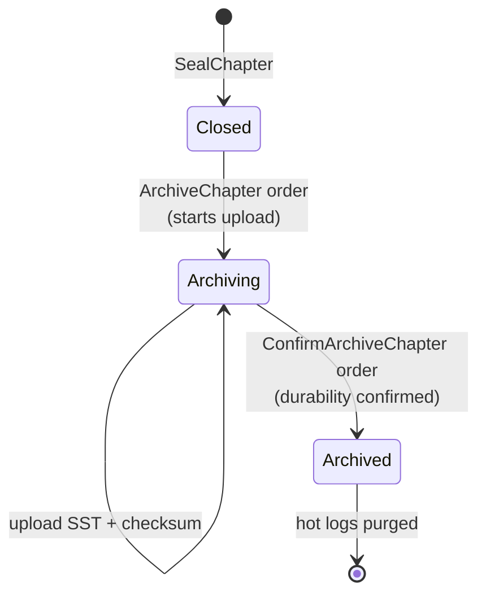

# Cold Storage

## Overview

When a chapter reaches `CLOSED` (sealed with its `state_hash`), its **logs and audit entries** can be exported to cold storage and **purged from Pebble**. Attributes — volumes, metadata, reversion state — stay in hot storage so live queries against the ledger continue working. The chapter's existing transactions become **archived** and can only be reverted through a [receipt](receipts.md); read access to the archived log range goes through cold storage rather than Pebble.

The point is **snapshot size and compaction cost**: a multi-year ledger keeps its hot footprint bounded by the size of attributes, which grows much more slowly than the cumulative log history.

Source: `internal/infra/coldstorage/`.

## Drivers

| Driver | Build tag | File |
|--------|-----------|------|
| Filesystem | (always built — default) | `internal/infra/coldstorage/filesystem.go` |
| S3 | `s3` | `internal/infra/coldstorage/s3.go` |

The `ColdStorage` interface (`coldstorage.go:35-76`) is small — `Put`, `Get`, `Exists`, `Delete`, `Iter` over an object key. Drivers do not coordinate with Pebble directly; the FSM does the coordination through Raft orders.

Azure Blob is a backup target ([backup.md](backup.md)) but is **not** currently a cold-storage driver. The split is intentional — cold storage exports a chapter's content, whereas backup exports the whole Pebble database; the two workloads have different access patterns.

## Lifecycle — two-phase archive

Archive is a **two-step Raft flow** so the cluster can recover deterministically from a crash mid-upload:

| Phase | Raft order | Effect |
|-------|-----------|--------|
| Start | `ArchiveChapterOrder` (`raft_cmd.proto:138-144`) | Sets chapter status to `ARCHIVING`. The leader begins uploading the SST file + checksum. |
| Confirm | `ConfirmArchiveChapterOrder` | Once the driver returns "object durable", the leader proposes the confirm order. The chapter transitions to `ARCHIVED` and the hot log + audit-item ranges are scheduled for Pebble `DeleteRange`. |

### Crash recovery

If the leader crashes between the two phases, the chapter is left in the `ARCHIVING` state. On leadership change, the new leader scans for `ARCHIVING` chapters and **retries the upload from scratch** — the cold-storage driver's `Put` is idempotent under the same object key (existing content is replaced), and the SHA-256 checksum is what tells the confirm phase whether the upload completed.

This is also why archive is **not** a single atomic Raft order: the upload itself can take minutes for a large chapter, and the cluster must remain available during that time.

## Export format

The exported object is the **Pebble SST file** containing the chapter's log + audit-item key range, plus a SHA-256 checksum.

| Driver | Object layout |
|--------|---------------|
| S3 | `BucketID/chapter-{chapter_id}.sst` |
| Filesystem | `<root>/BucketID/chapter-{chapter_id}.sst` |

Using SST directly (rather than re-encoding into a portable format like Parquet or JSON) keeps export and restore symmetric — Pebble already knows how to read these. The format is internal; consumers go through the `coldstorage.Reader` interface.

## Reading from cold storage

`internal/infra/coldstorage/reader.go` exposes the read side: open an archived chapter, iterate its log + audit ranges, and feed them back into queries that span archived data. Concretely:

- **Audit-chain verification** by the [checker](../checker/checker.md) walks past archive boundaries by joining each chapter's sealed `last_audit_hash` to the start of the next live chain (see [audit-chain.md § Verification](../checker/audit-chain.md#verification)).
- **Log lookups** by ID across the archived range go through `coldstorage.Reader.Open(chapterID)` and stream the SST.
- **Reverting an archived transaction** does **not** read cold storage — it uses a [receipt](receipts.md) to skip the round-trip entirely.

## Configuration

Operators configure cold storage at the cluster level (typically through the Operator's `Cluster` CRD or `--cold-storage-*` flags on the server binary): driver type, S3 endpoint + bucket + creds, filesystem root. The configuration is **cluster-wide**, not per-ledger — every chapter from every ledger lands in the same configured cold-storage target.

A chapter that should never be archived can be kept in `CLOSED` indefinitely; the FSM does not auto-archive — archive is always triggered explicitly via `ArchiveChapterOrder`, either by an operator command or by the chapter-schedule mechanism (`SetChapterSchedule` log).

## Restore

Cold storage is read-only at the API surface. There is no "thaw to hot" operation — once a chapter is `ARCHIVED`, its logs do not return to Pebble. If full-state recovery is needed (a fresh node joining the cluster, a wholesale disaster), the right primitive is [backup.md](backup.md), not cold storage.

## What cold storage doesn't do

- **Doesn't archive attributes.** Volumes, metadata, reversion bitsets, idempotency keys all stay hot. Cold storage covers log history only.
- **Doesn't replicate.** Each driver is single-target; durability is the driver's problem (S3 versioning, filesystem RAID, whatever the operator wires up).
- **Doesn't gate archive on retention policy.** Operators bring their own retention — the system will happily archive a chapter that was sealed yesterday if that's what the schedule says.

## Where to look in the code

| Concern | File |
|---------|------|
| `ColdStorage` interface | `internal/infra/coldstorage/coldstorage.go:35-76` |
| Filesystem driver | `internal/infra/coldstorage/filesystem.go` |
| S3 driver | `internal/infra/coldstorage/s3.go` |
| Archive reader | `internal/infra/coldstorage/reader.go` |
| Raft orders | `misc/proto/raft_cmd.proto:138-144` |
| FSM lifecycle | `internal/domain/processing/processor_chapter*.go` |
| Audit-chain continuity across archive | `internal/application/check/checker.go:1458-1472` |
