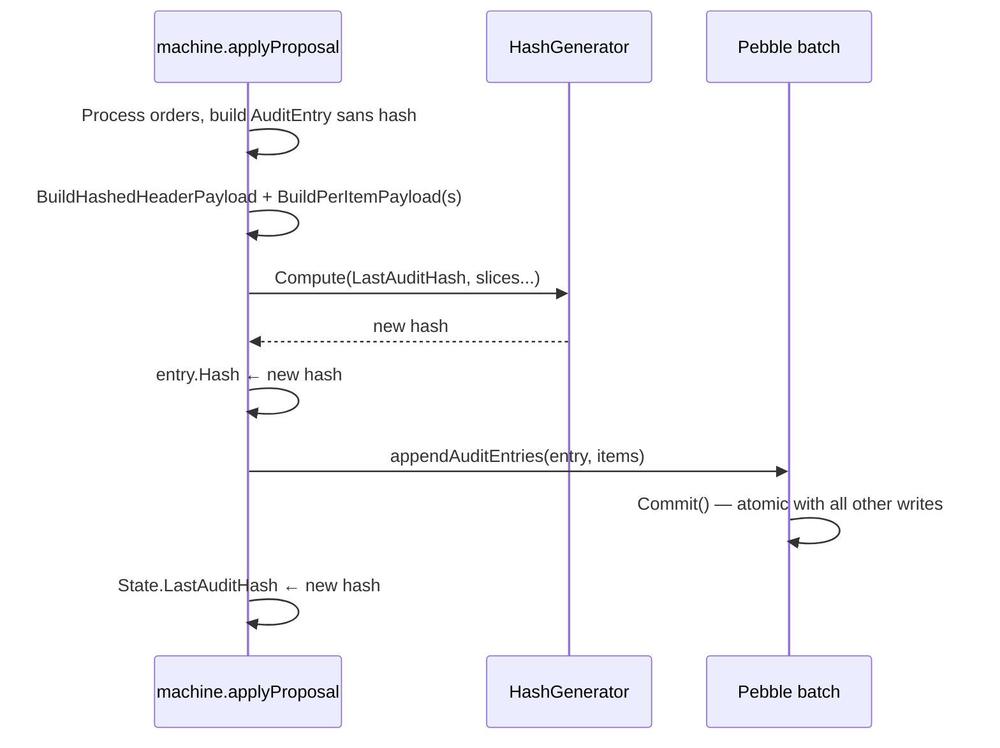

# Audit Hash Chain

## Overview

The audit hash chain is the **only cryptographically-bound dataset** in the system. Every other persisted dataset — volumes, metadata, transaction state, idempotency outcomes, applied-proposal records, the index registry, chapter sealing hashes, the read-side inverted index — is a *projection* of orders that already live in the audit chain, so every projection is derivable from the chain by replaying those orders. Per invariant #8 the checker must verify every such projection **it persists in the primary FSM store** on every `Check()` run (peer secondary stores are out of that scope by construction — see the readstore note below), and it does so today for volumes, metadata, transactions, exclusion projections, reversion bitsets, sealing hashes, idempotency outcomes, and the index **registry**. The mirror cursor's correctness-bearing high-water mark (`LedgerBoundaries.last_mirror_v2_log_id`) is verified by `compareMirrorV2LogID` (EN-1550) — its stored value must equal the audit-derived max, so the cursor *pointer* is technical replication state, **not** a gap; but the **advanced-cursor path** (a cursor advanced/tampered beyond the source head fetches no source logs and reports FOLLOWING, silently under-ingesting v2→v3) is a **current open correctness gap** until worker/startup reconciliation is wired. The readstore inverted-index *contents* are a peer secondary store, out of main-store checker scope by construction (only the registry presence/identity is checked in the main store); their integrity is a current open gap until per-replica detect/drop/rebuild is wired (`EN-1323`). A few main-store projections remain derivable but **not yet** re-derived by a checker pass — notably prepared queries and persisted bloom blocks reloaded on restart. Those are tracked integrity gaps rather than checker-verified state; see [Audit-Bound vs Technical State](../../audit-vs-technical-state.md) for the current coverage map.

The chain serves two purposes:

1. **Tamper-evidence**: any post-commit mutation of an audit entry (or of an `AuditItem` belonging to it) breaks the chain at that point. The break is detectable by recomputing the hashes forward; an attacker that rewrites entry *N* would have to recompute every entry from *N+1* onwards — and cannot, because the chain key is derived from the immutable `ClusterID`.
2. **A canonical derivation source**: because the orders that produced every projection are bound by the chain, every projection becomes verifiable by replaying those orders.

Hash primitive: BLAKE3, **keyed** with a per-cluster key derived from the `ClusterID` (so two distinct clusters cannot forge each other's chains, and the chain cannot be replayed offline without the key).

## What is hash-bound

The hash of an `AuditEntry` covers two payloads, concatenated in a fixed order before being fed to `HashGenerator.Compute(prevHash, ...)`:

### Header payload

Built by `state.BuildHashedHeaderPayload(entry)` (`internal/infra/state/audit_envelope.go:100-147`). Canonical encoding (big-endian, zero-padded, length-prefixed where variable):

| Field | Encoding |
|-------|----------|
| `Sequence` | `uint64` BE |
| `Timestamp` | `uint64` BE |
| `ProposalId` | `uint64` BE |
| `OrderCount` | `uint32` BE |
| `HashVersion` | `uint32` BE |
| `Ledgers` | length-prefixed, sorted ledger names |
| `Outcome` | tagged Success or Failure with its payload |
| `CallerSnapshot` | length-prefixed bytes |
| `IdempotencyKey` | length-prefixed bytes |
| `Signature` | length-prefixed bytes (Ed25519 from the originator) |

Every field is hashed — none is "informational and excluded".

### `CallerSnapshot` sub-payload

The `CallerSnapshot` bytes are built by `state.buildCallerSnapshotPayload` (`audit_envelope.go`): the subject (length-prefixed), then a one-byte source tag with its length-prefixed value, then the god flag (one byte), then the sorted scopes. The source tag identifies who acted:

| Tag | Source | Meaning |
|-----|--------|---------|
| `0x00` | none | subject with no known origin |
| `0x01` | issuer | OIDC token issuer URL |
| `0x02` | key_id | Ed25519 signing key ID |
| `0x03` | system_component | system/internal action (e.g. `chapter-archiver`, `mirror`); subject is empty |

The tag switches on the oneof *wrapper type*, not the inner string value, so a source set to an empty string is still distinct from an absent source. A system action therefore hashes differently from a caller-less entry (`0x03` + component vs `0x00` + empty), which is what makes system-generated entries unambiguously attributable in the chain.

### Per-item payloads

Each `AuditItem` (one per order in the proposal) is encoded by `state.BuildPerItemPayload(item)` (`audit_envelope.go:246-254`):

| Field | Encoding |
|-------|----------|
| `OrderIndex` | `uint32` BE |
| `LogSequence` | `uint64` BE |
| `SerializedOrder` | length-prefixed (the order's canonical vtprotobuf bytes) |

Items are concatenated in `OrderIndex` order before being fed into the hash. A single byte changed in any order, or any reordering, invalidates the hash.

### Chain link

`HashGenerator.Compute(prevHash, slices...)` (`internal/domain/processing/hash.go:54-77`) feeds `prevHash || header || items` into the BLAKE3 keyed hash. The resulting `hash` is stored on the `AuditEntry`; the *next* entry then consumes this as `prevHash`. Genesis (`Sequence = 0`) hashes `nil || header || items` — no external seed is required because the cluster-specific BLAKE3 key already domain-separates two distinct clusters.

## `AuditEntry` proto and persistence

`misc/proto/audit.proto:14-77` — hashed fields plus the chained `hash` itself:

```
message AuditEntry {
  uint64 sequence       = 1;   // hashed
  uint64 timestamp      = 2;   // hashed
  uint64 proposal_id    = 3;   // hashed
  oneof outcome { ... }        // hashed (Success | Failure)
  uint32 order_count    = 5;   // hashed
  repeated string ledgers = 6; // hashed (sorted)
  repeated AuditItem items = 7;// per-item payloads enter the hash via order_index
  uint32 hash_version   = 8;   // hashed
  bytes  hash           = 9;   // BLAKE3 output, chained
  bytes  caller_snapshot = 10; // hashed
  bytes  idempotency    = 11;  // hashed
  bytes  signature      = 12;  // hashed
}
```

Persistence layout:

- The entry itself lives under zone `Cold`, sub `Audit` (the `AuditEntry` row), with `items` **intentionally set to nil on disk** (`internal/infra/state/machine.go:1403`). Items live under their own keys (zone `Cold`, sub `AuditItem`), keyed by `(audit_sequence, order_index)`. This split prevents a `ListAuditEntries` reader from receiving items that have never been hash-checked against the chain.
- Reads that need item bodies join through the per-item keys; the checker uses `BuildPerItemPayload` to recompute the same byte sequence the writer used.

## When the hash is computed

Inside FSM apply, **before** the Pebble batch commit:



Reference: `internal/infra/state/machine.go:1370-1384`. The hash is bound to the entry *before* any byte hits the disk, and the same batch commits the entry plus every projection write produced by the proposal — so a crash mid-commit either rolls back the whole proposal or persists the entry already chained.

## What's in the chain — orders and logs

**Exactly one `AuditEntry` per Raft proposal.** The outcome is either `Success` (with `order_count` items and the resulting log range) or `Failure` (with a reason and message; zero items). Both outcomes are bound by the hash chain — a rejected proposal is just as auditable as an accepted one.

Each successful order produces a `Log` (`internal/proto/commonpb/common.proto`, `message Log { LogPayload payload = …; }`). The audit chain binds the orders via `AuditItem.SerializedOrder` (the order's canonical vtprotobuf bytes); the resulting `Log` rows are addressable separately by `LogSequence` and bound transitively through the items.

The log surface has **two levels**:

### Top-level `LogPayload` (~28 variants)

Covers everything a Raft proposal can produce, system-wide and ledger-management. Notably:

| Variant family | Examples |
|----------------|----------|
| Ledger lifecycle | `create_ledger`, `delete_ledger`, `promote_ledger` |
| Ledger apply | `apply` — wraps a `LedgerLogPayload` (see below) |
| Signing | `register_signing_key`, `revoke_signing_key`, `set_signing_config` |
| Event sinks | `added_events_sink`, `removed_events_sink` |
| Chapters | `close_chapter`, `seal_chapter`, `archive_chapter`, `confirm_archive_chapter`, `set_chapter_schedule`, `delete_chapter_schedule` |
| Maintenance | `set_maintenance_mode` |
| Prepared queries | `created_prepared_query`, `updated_prepared_query`, `deleted_prepared_query` |
| Numscript library | `saved_numscript`, `deleted_numscript` |
| Query checkpoints | `created_query_checkpoint`, `deleted_query_checkpoint`, `set_query_checkpoint_schedule`, `delete_query_checkpoint_schedule` |
| Ledger metadata | `saved_ledger_metadata`, `deleted_ledger_metadata` |

Every one of these is hashed via the corresponding `AuditItem.SerializedOrder`.

### Inner `LedgerLogPayload` (12 variants)

Only valid inside an `apply` (`ApplyLedgerLog`) wrapper. These are the *ledger-internal* mutations:

| Variant | Triggering order |
|---------|------------------|
| `created_transaction` | `CreateTransaction` |
| `reverted_transaction` | `RevertTransaction` |
| `saved_metadata` | `SaveMetadata` |
| `deleted_metadata` | `DeleteMetadata` |
| `set_metadata_field_type` | `SetMetadataFieldType` |
| `removed_metadata_field_type` | `RemovedMetadataFieldType` |
| `fill_gap` | (system) `FillGap` |
| `create_index` | `CreateIndex` |
| `drop_index` | `DropIndex` |
| `added_account_type` | `AddedAccountType` |
| `removed_account_type` | `RemovedAccountType` |
| `updated_default_enforcement_mode` | `UpdateDefaultEnforcementMode` |

The two layers exist because ledger-internal mutations have a fundamentally different identity model (they target a specific ledger's state) than top-level operations (which target the cluster or a ledger's metadata). The hash chain doesn't care — every `AuditItem` carries the order's full serialized form regardless of where in the hierarchy its log variant lives.

## Hash primitive

Default: **BLAKE3 keyed** (`internal/domain/processing/hash_blake3.go:18-32`). The key is derived once at boot:

```
key = blake3.Sum256([]byte("audit-hash:blake3:v1:" + ClusterID))
```

The `ClusterID` is part of the persisted config validated on boot (`internal/bootstrap/config_validation.go`) and a `node-id`/`cluster-id` mismatch is fatal — see [CLAUDE.md / Configuration Safety Checks](../../../../../AGENTS.md#configuration-safety-checks). This makes the chain key effectively immutable for the lifetime of the cluster.

A `HashVersion` field on every entry allows future rotation (an alternate algorithm like `HASH_ALGORITHM_XXH3` exists as a fallback, mapped to a different `HashGenerator` per entry).

## Companion streams and their gaps

The FSM writes up to four datasets per proposal, all in `ZoneCold`, but they diverge sharply between the possible proposal outcomes. Code that scans the audit range and iterates a companion stream in parallel MUST anchor on `SubColdAudit` and tolerate misses on the sibling — assuming lockstep cardinality is a recurring source of bugs (see EN-1424 for a case study).

| Sub-zone | Key | Success (N orders) | Failure | Idempotent replay (success or failure) |
|----------|-----|--------------------|---------|----------------------------------------|
| `SubColdAudit = 0x02` — `AuditEntry` | `[seq BE 8]` | 1 | 1 | **0** |
| `SubColdAuditItem = 0x03` — `AuditItem` | `[seq BE 8][order_idx BE 4]` | N (≥1) | **0** | **0** |
| `SubColdAppliedProposal = 0x04` — `AppliedProposal` | `[seq BE 8]` | 1 | **0** | **0** |
| `SubColdLog = 0x01` — `Log` | `[log_seq BE 8]` | 0..M (=`MaxLog-MinLog+1`) | 0 | 0 |

**Idempotent replay is the one exception to "one AuditEntry per proposal":** when the proposal carries a previously-recorded idempotency key with a matching hash, `applyProposal` short-circuits (`internal/infra/state/machine.go:1313-1326`) and returns the recorded outcome verbatim — no new pipeline run, no new logs, no new audit entry. `audit_sequence` does **not** advance for that proposal. The first-time apply of that key is what's already recorded under the "Success" or "Failure" column; the replay is invisible to Pebble.

A same-key-different-hash conflict, by contrast, is **not** a replay — it's a fresh rejection, so it takes the Failure column (1 audit entry, no items, no applied proposal, no log).

Two independent monotone counters, bridged per successful non-replayed proposal:

- **`audit_sequence`** advances by 1 on every non-replayed proposal — success or failure alike (`AppendAuditEntry` in `internal/infra/state/fsmstate.go`). The `audit_sequence` values themselves are **dense** (no gaps in the numbering), but the proposal-to-sequence mapping is many-to-one: several replayed proposals can share the sequence number of the next non-replayed one.
- **`log_sequence`** advances only when a log is produced. The mapping `audit_seq → [MinLog, MaxLog]` is sparse: failures contribute zero logs; a success in which every order is an in-batch idempotent reference contributes `[0, 0]`.

Gaps live on the **companion streams**, not on `audit_sequence` itself:

- `SubColdAppliedProposal` iteration shows a gap at every failed audit_seq.
- `SubColdAuditItem[seq][…]` shows no items at every failed audit_seq.
- A `Log` reader has no visibility into failures at all.

### Implication for downstream code

**`audit.count > 0` does NOT imply `auditItem.count > 0`.** An incremental range consisting of only failures has one AuditEntry per proposal (audit_seq advances) but zero AuditItems (nothing to hash into the per-item payload beyond an empty list). Anything that assumes the two rise together — a backup exporter that indexes segments by audit range, an indexer that scans AppliedProposal alongside AuditEntry, a mirror that assumes a log per audit — must guard on the companion stream's count independently, rather than deriving one count from the other.

The `internal/infra/backup/manager.go` incremental export is the canonical example: each of the three companion segments (`audit`, `auditItem`, `appliedProposal`) is guarded on its own count when appended to the manifest. Failure-only ranges produce an `audit` segment with `count > 0`, an `auditItem` segment with `count == 0` (skipped from the manifest), and no `appliedProposal` segment at all.

## Tampering model — what the chain detects

| Attack | Detected because |
|--------|-----------------|
| Mutate a hashed field on entry *N* | Recomputed `hash[N]` ≠ stored `hash[N]` → `CHECK_STORE_ERROR_TYPE_HASH_MISMATCH` at `N`. |
| Delete entry *N* | Sequence gap on read → `CHECK_STORE_ERROR_TYPE_SEQUENCE_GAP`. |
| Swap entries *N* and *M* | At least one of them has a `prev_hash` link that no longer matches → mismatch at the earliest violating slot. |
| Rewrite `hash[N]` to match a forged payload | `hash[N+1]` was computed against the original `hash[N]`. Recomputing forward from the forged value produces `computed[N+1] ≠ stored[N+1]`. The attacker must rewrite every entry from *N* to the head, but cannot regenerate hashes without the per-cluster BLAKE3 key. |
| Smuggle items into `entry.items` on disk | The on-disk row has `items = nil` by design (`machine.go:1403`); the checker flags `len(entry.Items) > 0` as tampering (`internal/application/check/checker.go:1523-1531`). |

The chain does *not* defend against an attacker who has the cluster's BLAKE3 key — that key is local to the node and is the same secret that lets the node propose. Securing the key is part of the threat model the operator-level [Security](../../../../security/) and [Request Signing](../../../../ops/signing.md) docs cover.

## Genesis

The first entry (`Sequence = 0`) is computed with `lastHash = nil`. The per-cluster BLAKE3 key is the only secret needed; there is no external seed and no genesis ceremony.

## Verification

The chain is verified by `checker.verifyAuditHashChain` (`internal/application/check/checker.go:1449-1616`):

1. Iterate non-archived `AuditEntry` rows in sequence order.
2. For each entry, rebuild the header payload + every per-item payload (joining `AuditItem` rows by `(sequence, order_index)`).
3. `HashGenerator.Compute(lastHash, ...)` with the version pinned by `entry.hash_version`.
4. Compare to the stored `entry.hash`. Mismatch → emit `CHECK_STORE_ERROR_TYPE_HASH_MISMATCH` and **stop** (the chain is broken from this point; downstream verifications would be meaningless).
5. Match → advance `lastHash`, continue.

The walk also collects an `expectedIdempotency` map (which idempotency keys were committed under which outcome) that `compareIdempotencyOutcomes` consumes downstream.

Archived chapters break the live chain by design: their entries have been exported to cold storage and their audit-entry range is closed by a `CloseAuditSequence` boundary on the chapter. The verification continues across the boundary using the chapter's sealed `last_audit_hash` as the new `lastHash`.

## Derivability rule

The chain's existence is what allows every other dataset in Pebble to be a *projection*:

> If a dataset is derivable from the audit chain by replay, the checker re-derives it and compares. If a dataset is *not* derivable, it **must** be hash-bound.

See `internal/application/check/checker.go:37-68` and `194-227` for the in-code formulation. The corollary is the rule in [`AGENTS.md` invariant #8](../../../../../AGENTS.md): adding a new persisted dataset without a matching `compare*` / `collect*` pass in the checker is the violation. Hash-binding is the escape hatch reserved for data that cannot be derived — and the audit chain is the only thing currently in that category.
