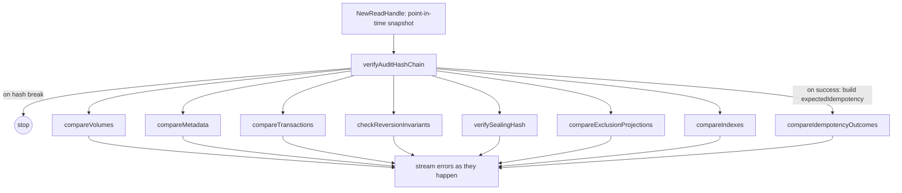

# Checker

## Overview

The checker (`internal/application/check`) verifies that the data persisted in Pebble matches what the [audit hash chain](audit-chain.md) says it should hold. It is invoked **on demand** through the `BucketService.CheckStore` gRPC streaming RPC — there is no built-in cron — and emits a stream of `CheckStoreEvent`s, one per finding, plus periodic `progress` events.

Its job is to enforce the system-wide invariant that the audit log is the only source of truth and every other persisted dataset is a re-derivable projection. Anything the checker doesn't verify is, by definition, an unmonitored tampering vector.

## Surface

`misc/proto/bucket.proto`:

```proto
rpc CheckStore(CheckStoreRequest) returns (stream CheckStoreEvent);

message CheckStoreEvent {
  oneof type {
    CheckStoreError    error    = 1;
    CheckStoreProgress progress = 2;
  }
}
```

The request is empty (the check always runs over the entire cluster state, single-pass). The response is streamed so errors surface immediately and large clusters don't have to wait for completion to see early signal. A single hash mismatch stops the walk for that branch (the chain is irrecoverably broken from that point); all other mismatches are non-fatal and the pass continues.

Entry point: `NewChecker(...).Check(ctx, callback)` (`internal/application/check/checker.go:68-546`). The checker takes a single Pebble read handle (`store.NewReadHandle()`), so every pass observes a consistent point-in-time snapshot.

## The verification passes

Each pass takes a persisted projection, re-derives the expected value by replaying the audit chain, and emits a `CHECK_STORE_ERROR_TYPE_*` event on divergence.

| # | Pass | What it verifies | Re-derivation source | Error type on divergence |
|---|------|------------------|----------------------|--------------------------|
| 1 | `verifyAuditHashChain` | The audit chain itself (every entry's hash equals the recomputed hash from header + items + prev_hash) | `HashGenerator.Compute` (see [audit-chain.md](audit-chain.md)) | `HASH_MISMATCH`, `SEQUENCE_GAP` |
| 2 | `compareVolumes` | Per-`(ledger, account, asset)` volume rows in the attribute store | `ReplayLedgerLog` + `ApplyPostings` over the audit-chain-bound orders | `VOLUME_MISMATCH` |
| 3 | `compareMetadata` | Account/transaction metadata attribute rows | Replay of `SavedMetadata` / `DeletedMetadata` orders | `METADATA_MISMATCH` |
| 4 | `compareTransactions` | Per-transaction state (postings, timestamp, reverted flag, fabricated/system) | Replay of `CreatedTransaction` / `RevertedTransaction` orders | `TRANSACTION_UPDATE_MISMATCH` |
| 5 | `checkReversionInvariants` | Each transaction is reverted at most once; the reversion bitset agrees with the replayed reverted flag | Replay-derived revert flags | `REVERTED_MISMATCH` |
| 6 | `verifySealingHash` | Each closed chapter's sealing hash equals `BLAKE3(chapter_id ‖ close_seq ‖ last_audit_hash ‖ state_hash)` | Recompute from the audit-chain-bound chapter close payload | `HASH_MISMATCH` (chapter-scoped) |
| 7 | `compareExclusionProjections` | `AppliedProposal.TransientVolumes` and `LedgerLog.PurgedVolumes` agree with what `SimulateEphemeralPurge` would have produced | Replay + `SimulateEphemeralPurge` | `EXCLUSION_RECORD_MISMATCH` |
| 8 | `compareIdempotencyOutcomes` | Frozen idempotency outcomes in `SubIdempKeys` match the outcome of the chain-bound `AuditSuccess` / `AuditFailure` that wrote them | Outcome map built during `verifyAuditHashChain` | `IDEMPOTENCY_MISMATCH` |
| 9 | `compareIndexes` | `SubAttrIndex` registry matches the set derived from `CreateIndex` / `DropIndex` / `RemovedMetadataFieldType` / `DeleteLedger` logs (presence + identity only) | Replay of the index-affecting log types | `INDEX_MISMATCH` |

Notes:

- **`compareIndexes` covers presence + identity** (`IndexID` match), **not `BuildStatus`** and **not `IndexVersionState`**. `BuildStatus` is informational and per-replica; `IndexVersionState` is by design local and may legitimately differ across nodes mid-rewrite (see [indexer / indexes.md](../indexer/indexes.md)).
- **`compareIdempotencyOutcomes`** is the one pass that consumes a side-effect of `verifyAuditHashChain` (the expected-outcome map). The two are coupled by design — re-deriving the idempotency outcome means re-walking the chain anyway.
- **Order matters**: `verifyAuditHashChain` runs **first**. A broken chain stops the walk before any downstream pass — running them with a tampered chain would produce noise from already-detected corruption.

## Replay machinery

Three building blocks under `internal/domain/replay/`:

| Function | Purpose |
|----------|---------|
| `ReplayLedgerLog` | Forward iteration over `LedgerLog` rows for a single ledger; dispatches each payload to a `Writer` interface that the caller implements per-pass (volumes, metadata, transactions, etc.). |
| `SimulateEphemeralPurge` | Re-runs the ephemeral-purge calculation the FSM applied at proposal time: which volumes that were touched by transient accounts must be purged from the live state and accumulated as exclusions. Used by `compareExclusionProjections`. |
| `partitionVolumes` | Helper used during replay to split per-transaction volume contributions between "persistent" (kept) and "transient" (purged) — mirroring exactly the apply-time split. |

Replay reads from a Pebble-backed `replayStore` with merge operators so a multi-million-row accumulation stays `O(1)` per write rather than `O(log n)`.

## Pass-by-pass derivation flow



All non-chain passes are independent of each other (each replays the subset of orders it needs) and can be reordered without changing semantics — they share only the Pebble snapshot and the `expectedIdempotency` map.

## Error event shape

`misc/proto/bucket.proto:699-753`:

```proto
message CheckStoreError {
  CheckStoreErrorType type = 1;
  string message = 2;
  uint64 log_sequence = 3;
  string ledger = 4;
  string account = 5;
  string asset = 6;
  bytes  transaction_id = 7;
}

enum CheckStoreErrorType {
  HASH_MISMATCH               = 1;
  SEQUENCE_GAP                = 2;
  VOLUME_MISMATCH             = 3;
  METADATA_MISMATCH           = 4;
  UNKNOWN_LEDGER              = 5;
  TRANSACTION_UPDATE_MISMATCH = 6;
  REVERTED_MISMATCH           = 7;
  EXCLUSION_RECORD_MISMATCH   = 8;
  IDEMPOTENCY_MISMATCH        = 9;
  INDEX_MISMATCH              = 10;
}
```

Adding a new persisted projection requires adding a new pass *and* a new error type — both are part of the same invariant.

## What is **not** verified

A short list, because it matters for the threat model:

- **`IndexVersionState`** (per-replica): legitimately diverges during a rewrite — see [indexer / indexes.md](../indexer/indexes.md).
- **`Index.BuildStatus`**: informational and per-replica.
- **Bloom filters**: a probabilistic cache; correctness is a function of the underlying attribute store, which the checker *does* verify.
- **Read store (inverted index for queries)**: rebuildable from scratch by the [indexer](../indexer/), so a divergence is recoverable without an audit — but the *source* attributes the indexer projects from are checked.
- **Snapshot files and the spool**: transient transport artefacts, not persisted projections.

## Performance

Single-pass forward iteration over the audit chain and the per-ledger log rows. Replay accumulates into a Pebble-backed scratch. There is no "fast" vs "thorough" mode toggle — the chain check is non-optional, and once you've paid for it, the projection compares are cheap by comparison.

Cost is dominated by Pebble I/O over the audit and ledger-log ranges; expect it to scale linearly with the number of audit entries plus the number of replayed log payloads.

## Adding a new projection

The contract every new persisted projection must satisfy:

1. The orders that produce the projection must already be hash-bound by the audit chain (in practice, this means landing them as Raft proposals that get the standard `AuditEntry`).
2. A pass — typically `compare<X>` — must be added to `Checker.Check` that re-derives the projection from those orders and emits the matching `CHECK_STORE_ERROR_TYPE_*` event on mismatch.
3. A new `CheckStoreErrorType` enum value is reserved for the new pass (extending the proto rather than reusing an existing type).

Skipping any of these makes the projection an unmonitored tampering vector. The rule is enforced by code review and by the [AGENTS.md / invariant #8](../../../../../AGENTS.md) constraint: a projection without a checker pass is the violation.
