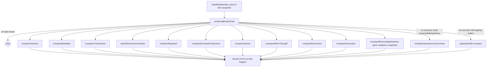

# Checker

## Overview

The checker (`internal/application/check`) verifies that the data persisted in Pebble matches what the [audit hash chain](audit-chain.md) says it should hold. It is invoked **on demand** through the `BucketService.CheckStore` gRPC streaming RPC — there is no built-in cron — and emits a stream of `CheckStoreEvent`s, one per finding, plus periodic `progress` events.

Its job is to enforce the system-wide invariant that the audit log is the only source of truth and every other persisted dataset is a re-derivable projection. Anything the checker doesn't verify is, by definition, an unmonitored tampering vector.

## Surface

`misc/proto/bucket.proto`:

```proto
rpc CheckStore(CheckStoreRequest) returns (stream CheckStoreEvent);

message CheckStoreEvent {
  oneof type {
    CheckStoreError    error    = 1;
    CheckStoreProgress progress = 2;
  }
}
```

The request is empty (the check always runs over the entire cluster state, single-pass). The response is streamed so errors surface immediately and large clusters don't have to wait for completion to see early signal. A single hash mismatch stops the walk for that branch (the chain is irrecoverably broken from that point); all other mismatches are non-fatal and the pass continues.

Entry point: `NewChecker(...).Check(ctx, callback)` (`internal/application/check/checker.go:68-546`). The checker takes a single Pebble read handle (`store.NewReadHandle()`) on the **main store**, so every pass observes a consistent point-in-time snapshot of it. One pass — `compareReverseMapOrphans` — additionally opens a read-only snapshot of the **peer readstore**; it is the single, deliberate exception to the main-store-only scope of invariant #8 and is described in the table below.

## The verification passes

Each pass takes a persisted projection, re-derives the expected value by replaying the audit chain, and emits a `CHECK_STORE_ERROR_TYPE_*` event on divergence.

| # | Pass | What it verifies | Re-derivation source | Error type on divergence |
|---|------|------------------|----------------------|--------------------------|
| 1 | `verifyAuditHashChain` | The audit chain itself (every entry's hash equals the recomputed hash from header + items + prev_hash) | `HashGenerator.Compute` (see [audit-chain.md](audit-chain.md)) | `HASH_MISMATCH`, `SEQUENCE_GAP` |
| 2 | `compareVolumes` | Per-`(ledger, account, asset)` volume rows in the attribute store | `ReplayLedgerLog` + `ApplyPostings` over the audit-chain-bound orders | `VOLUME_MISMATCH` |
| 3 | `compareMetadata` | Account/transaction metadata attribute rows | Replay of `SavedMetadata` / `DeletedMetadata` orders | `METADATA_MISMATCH` |
| 4 | `compareTransactions` | Per-transaction state (postings, timestamp, metadata, reverted flag, fabricated/system) | Replay of `CreatedTransaction` / `RevertedTransaction` / metadata orders, baseline-seeded under archiving (`newLazyTxSeedWriter`) | `TRANSACTION_UPDATE_MISMATCH` |
| 5 | `checkReversionInvariants` | Log-stream consistency: each transaction is reverted at most once, and reverts target transactions that exist | Replay-derived revert flags | `REVERTED_MISMATCH` |
| 6 | `verifySealingHash` | Each closed chapter's sealing hash equals `BLAKE3(chapter_id ‖ close_seq ‖ last_audit_hash ‖ state_hash)` | Recompute from the audit-chain-bound chapter close payload | `HASH_MISMATCH` (chapter-scoped) |
| 7 | `compareExclusionProjections` | `AppliedProposal.TransientVolumes` and `LedgerLog.PurgedVolumes` agree with what `SimulateEphemeralPurge` would have produced | Replay + `SimulateEphemeralPurge` | `EXCLUSION_RECORD_MISMATCH` |
| 8 | `compareIdempotencyOutcomes` | Frozen idempotency outcomes in `SubIdempKeys` match the outcome of the chain-bound `AuditSuccess` / `AuditFailure` that wrote them | Outcome map built during `verifyAuditHashChain` | `IDEMPOTENCY_MISMATCH` |
| 9 | `compareIndexes` | `SubAttrIndex` registry matches the set derived from `CreateIndex` / `DropIndex` / `RemovedMetadataFieldType` / `DeleteLedger` logs (presence + identity only) | Replay of the index-affecting log types | `INDEX_MISMATCH` |
| 10 | `compareMirrorV2LogID` | Stored `LedgerBoundaries.last_mirror_v2_log_id` **equals** the max audited `MirrorIngest.v2_log_id` per ledger (full equality) | Live audit chain (`recordMirrorIngestMutations`) over a baseline floor (`foldBaselineBoundaries`) | `MIRROR_V2LOGID_MISMATCH` (any divergence) |
| 11 | `compareReversions` | Stored reversion bitsets (`ZonePerLedger`/`SubPLReversions`, the rows the already-reverted gate reads) equal the audit-derived reverted set, both ways; stored rows for non-live ledgers and undecodable rows are flagged | Baseline tx-row markers + replayed `RevertedTransaction` logs | `REVERTED_MISMATCH` |
| 12 | `compareNumscripts` | `SubAttrNumscriptContent` immutable version entries and `SubAttrNumscriptVersion` latest pointers (the greatest stored semver) match the saved versions | Replay of `SavedNumscript` / `DeleteLedger` logs | `NUMSCRIPT_MISMATCH` |
| 13 | `compareReverseMapOrphans` | Reverse-map (`0x03`) rows in the **peer readstore** whose `(ledger, target, metadata key)` is in **neither** the stored `SubAttrIndex` registry **nor** the audit-replayed `MetadataSchema`; also rows belonging to a ledger the audit does not list as live, and keys that do not decode | Stored index registry **and** the replayed schema (`CreateLedger.initial_schema` + `SetMetadataFieldType` / `RemovedMetadataFieldType`) | `REVERSE_MAP_ORPHAN` |
| 14 | `signingVerifier.compare` | The `SubGlobSigningKey` rows (public-key bytes + `parent_key_id`) and the `SubGlobSigningConfig` require-signatures flag, compared in both directions | Fold of the chain-bound `RegisterSigningKey` / `RevokeSigningKey` / `SetSigningConfig` orders over the archived (cold-storage) then live audit ranges | `SIGNING_KEY_MISMATCH`, `SIGNING_CONFIG_MISMATCH`, `SIGNING_VERIFICATION_INCOMPLETE` |
| 15 | `compareLogBounds` | That the log stream does not extend **past** the highest sequence the audit chain authenticates — the one relation every other pass is blind to, because they are all driven *from* the log stream | `chainBound.expectedLogMax`, the maximum `AuditSuccess.max_log_sequence` accumulated over the chain walk, against the maximum log **key** in the store | `LOG_UNAUDITED`, `LOG_VERIFICATION_INCOMPLETE` |

Notes:

- **`compareIndexes` covers presence + identity** (`IndexID` match), **not `IndexVersionState`** — that state is by design local and may legitimately differ across nodes mid-rewrite (see [indexer / indexes.md](../indexer/indexes.md)).
- **`compareIndexes` has no archive-orphan tolerance.** Under archiving the pre-archive registry state is seeded from the boundary-time baseline snapshot (`foldBaselineIndexes`, which reads the `SubAttrIndex` rows the compact snapshot already carries), so expected = baseline + replay delta and an unmatched stored entry is a hard mismatch with or without archives. Only ledgers the baseline lists as live are seeded: rows of a ledger deleted before the boundary await the deferred purge, and expecting them would turn that normal cleanup into a phantom missing-row event. The earlier behaviour — skip any stored entry the replay never touched whenever archives exist — was removed because it accepted a stale or tampered registry row, and a lingering *metadata* entry is what makes `compareReverseMapOrphans`' registry term treat orphaned reverse-map rows as legitimate. Those two corrupted projections could mask each other and leave `Check()` clean; do not reinstate the tolerance without replacing that coverage.
- **`compareNumscripts`** re-derives both numscript projections from the audit chain. The library is immutable and append-only: a `SavedNumscript` writes an immutable content entry and advances the per-name latest pointer to the greatest stored semver (versions may be saved out of order). It catches altered/missing/extra content and a latest pointer that is not the greatest saved semver. Like `compareIndexes`, the expected state is baseline-seeded under archiving (`foldBaselineNumscripts`), so there is no archive-orphan tolerance — a stored row absent from both baseline and replay is flagged as surplus; only the deferred-cleanup (pending-purge) tolerance remains.
- **`compareIdempotencyOutcomes`** consumes a side-effect of `verifyAuditHashChain` (the expected-outcome map). The two are coupled by design — re-deriving the idempotency outcome means re-walking the chain anyway. `signingVerifier` is coupled the same way: its live-range fold rides inside the chain walk, which already classifies entries as successful or failed, rather than iterating the audit range a second time.
- **`compareMirrorV2LogID` is a full equality check.** The FSM enforces a contiguous applied prefix (`processMirrorIngest` rejects any `v2LogId` gap with `ErrMirrorV2LogIDGap`), so at rest the stored EN-1550 high-water mark must be exactly `max(audited v2_log_id)`. Any divergence is flagged: `stored > max` claims a source log the audit never recorded; `stored < max` means the projection lost applied ground. A never-mirrored ledger has stored `0` and max `0` → equal → clean. There is no legacy/no-backfill leniency — pre-field clusters are unsupported. The audited max is seeded from a baseline floor (the compact baseline snapshot now includes `Boundary` rows) so archived-only mirror ingests are not undercounted. The comparison is driven from the **union** of stored boundary rows and audited-mirror ledgers, so a mirror ledger whose `Boundary` row is absent while it still has audited ingests (audited max > 0, no row) is treated as stored `0` and flagged — not silently skipped. The absent-row branch is suppressed only for a ledger audited as **deleted** (a `DeleteLedger` log replayed in the verified range, `deletedInReplay`): `WriteSet.Absorb` legitimately removes the boundary row on deletion, so its missing row is expected. Present-row equality still applies to every ledger (including one in the pending-cleanup window whose row is still present).
- **`compareReverseMapOrphans` is the only pass that reads a peer store**, and the only exception to invariant #8's main-store scope. The reverse map is the one read-index limb that cannot be range-deleted by field — its metadata key sits *after* a fixed-width 4-byte version block — so field removal has to scan the namespace and point-delete row by row (`purgeReverseMapForKey`), and a row that scan misses is a permanent divergence no other mechanism detects. The `0x01` forward index and `0x02` existence counters are dropped by a range delete, which is atomic and self-healing.
  - **The oracle is a conjunction**: a row is an orphan only when its field is absent from the stored registry **and** absent from the replayed schema. `RemovedMetadataFieldType` is the one log that both removes the schema field type and runs the point-delete scan, so "absent from the replayed schema, still has live rows" means exactly "the scan missed rows". The schema must be the **replayed** one, never stored `LedgerInfo`, or the pass would legitimise a tampered schema row.
  - **`DropIndex` residue is deliberately not flagged, and is not covered by this pass.** `DropIndex` removes the registry entry, leaves the schema field declared, and purges no readstore rows at all. `Check()` has no warning channel — `cmdutil.IntegrityResult` fails on any error event — so a registry-only oracle would leave every cluster that has ever dropped a metadata index permanently red. That leak is tracked as `EN-1621`. Once `EN-1621` makes `DropIndex` purge rows, a regression in that new purge would strand rows while the schema field is still declared, and this oracle would **not** catch it; the oracle must be revisited then.
  - **The encoding version is deliberately not validated.** Current and pending forward-encoding versions legitimately coexist while a per-replica schema rewrite runs, and versions outside that live pair are reclaimed at boot by `purgeOrphanVersions`. Flagging on version would report every in-flight rewrite.
  - **One skip condition**, logged at INFO and never reported as a clean result: no readstore handle is attached to the checker (restore, or the CLI validating a staged main store that has no peer readstore). An empty audit does **not** skip the pass — the read index folds from the log stream, so a reverse-map row over a zero-log store is unaudited by definition.
  - **A verdict requires an exactly aligned peer cursor.** Every oracle term is pinned at the verified log sequence, so the pass only judges rows when the read index has folded exactly that range (`indexedSequence == lastSequence`). Malformed keys need no oracle and are always reported. The two unaligned positions are not symmetric. *Behind* is the ordinary state on a live cluster — the registry is written at Raft apply while the rmap folds later — so nothing can be concluded. *Ahead* cannot happen by race, because the builder folds from the primary log stream and writes its cursor only for logs it has already read out of the primary store (`progress(t) <= maxLogSeq(t)` at every instant) and **`Check()` pins the peer snapshot strictly before the primary one** so the two pinned values inherit that ordering. That ordering is what removes the need for cross-store atomicity: an ordering that can only leave the peer behind is sufficient, since behind is already a skip. Ahead is not reachable at runtime at all: `RestoreCheckpoint`'s only production caller (`dal.incomingRestoreFactory.Run`, via `state.Synchronizer.SynchronizeWithLeader`) installs a checkpoint fetched from the leader, which only moves a node forward. Reaching it means the primary store was replaced beneath a surviving read index — an offline restore into a dirty data directory — and that never self-heals, so the position is **reported** as `REVERSE_MAP_ORPHAN` rather than skipped (invariant #7). No per-row verdict is produced either way, the oracle terms being frozen at the verified sequence.
  - **The unknown-ledger verdict is driven by liveness alone.** A ledger recreated under the same name is live again in the audit-derived set, so its fresh rows are legitimate. Deriving the verdict from a separate append-only "was deleted in the replay" set consulted *before* the live set would report them, and would leave correctness resting on the retained tombstone that makes the lifecycle unreachable rather than on the pass's own structure.
  - Findings are aggregated per `(ledger, namespace, metadata key)` with a row count and one sample entity — a field dropped on a large ledger can strand millions of rows, and the pass must stay `O(distinct fields)` in both memory and emitted events.
- **Order matters**: `verifyAuditHashChain` runs **first**. A broken chain stops the walk before any downstream pass — running them with a tampered chain would produce noise from already-detected corruption.

### Signing keys and signing config

Two projections sit under the Global zone (`0x06`) and are verified together by `signingVerifier` (`internal/application/check/signing.go`):

- **`SubGlobSigningKey`** (sub `0x04`) — one row per registered key, keyed `[0x06][0x04][keyID]` and valued `[publicKey 32B][parentKeyID variable]`. A root key stores a bare 32-byte value; anything shorter than 32 bytes cannot be decoded at all.
- **`SubGlobSigningConfig`** (sub `0x05`) — a fixed 2-byte key holding a single `0x01` / `0x00` byte, the cluster-wide require-signatures flag. An absent row decodes as `false`.

They matter because `state.Recovery` (`internal/infra/state/recovery.go`) loads them straight into the runtime key store and the `requireSignatures` gate, and admission consults both to accept or reject every write. A row edited on disk therefore changes **who may write** — and before EN-1515 `CheckStore` reported such a store healthy.

**The expectation comes from chain-bound orders and nothing else.** The fold decodes `AuditItem.SerializedOrder` — the business-intent bytes whose entry hash `verifyAuditHashChain` has already verified — and dispatches the `RegisterSigningKey`, `RevokeSigningKey` and `SetSigningConfig` variants of `SystemScopedOrder`. `LogPayload` rows are never consulted (signing orders produce no ledger log), and only orders carried by **successful** entries are folded: a rejected order left no trace in the projection, so folding it would manufacture a divergence. Registration is an **upsert**, matching the FSM, which has no duplicate-ID rejection — re-registering a key ID legitimately replaces both its material and its parent link.

The expectation is **never** seeded from the live projection, and — unlike `compareSchema`, `compareIndexes`, `compareNumscripts` and the other baseline-seeded passes — never from the baseline checkpoint either. `attributes.writeBaselineAttributes` copies the attribute zone verbatim from the live store, so a checkpoint seed would verify old, never-touched keys against a copy of themselves: worthless for exactly the keys most exposed, since a key untouched since before the archive boundary is the one with no live register order to re-derive it from. That is the single structural difference from the baseline-seeded passes, and it is why incomplete archived coverage must be *reported* rather than papered over.

**Row absence is the only representation of revocation**, so the comparison runs both ways. A stored key with no audited registration is a finding (injected, or an audited revocation the store lost); an audited key missing from the store is equally a finding (a revocation the audit never recorded). Public keys are compared with `bytes.Equal`, parents by string equality, and each diverging field emits its own event so a row tampered twice does not lose half its evidence. An undecodable row is reported in its own right; it also reads as absent below, which is two symptoms of one corruption rather than a duplicate.

**Cascade descendants are re-derived, never read back.** A `RevokeSigningKey` with `cascade` set removes the target plus every key reachable from it through the *expected* parent map, walked breadth-first. The log's own `cascaded_key_ids` is deliberately ignored: re-deriving the cascade is the entire point of the pass, and trusting the recorded list would let a tampered projection justify itself. Traversal *order* is irrelevant — the comparison is over the final key *set* — so the walk deliberately does not reproduce the FSM's ordering (`WriteSet.GetSigningKeyChildren` returns sorted committed children followed by un-re-sorted in-proposal additions, an implementation detail the checker must not couple to).

The set of *edges*, however, is load-bearing, and this is the one place the cascade must follow the FSM closely. `GetSigningKeyChildren` returns the **union** of the revoked key's committed children, minus any the same proposal removed, and the key of *every* pending addition in that proposal whose parent matches — every element of `pendingSigningKeyUpdates`, not just the last one per key. It never consults a reassigned parent pointer to exclude a key. So `descendantsOf` treats a key as a child when **any of three** edge sources points at the current node:

- the **running** relation, for a key whose parent this proposal did not touch;
- **`proposalParents`**, the relation as it stood before the proposal's first signing order, for a key this proposal *reassigned* — the FSM still cascades through the committed edge, so a key re-registered under a new parent in the same proposal as a cascade revoke of its old parent is still revoked;
- **`proposalEdges`**, every edge the proposal *asserted*, keyed by child, for an edge a later registration in the same proposal **superseded**. The other two cannot see it: the replacement overwrote the running pointer, and a key first registered inside this proposal has no pre-proposal entry at all. `register(child→parent)` + `register(child→root)` + `cascade-revoke(parent)` in one proposal deletes the child on the live path, and a two-source walk would keep it.

All three are per-proposal state, invalidated by `beginProposal` — one call per audit entry, matching the FSM's single `WriteSet.Reset` per proposal — and rebuilt lazily by `ensureProposalSnapshot` on the proposal's first signing order, so the overwhelming majority of entries, which carry none, cost nothing.

The edge union is only half the model. `GetSigningKeyChildren` also builds its `pendingRemovals` filter over the **whole** slice with no ordering awareness, so once a proposal removes a key that key is excluded from *every* cascade in the same proposal — including one evaluated after a later registration in that proposal put it back, and even when that registration pointed it straight at the key being cascade-revoked. Absence from the expected key map cannot reproduce that: absence is a point-in-time fact and re-registration reinstates the row, so the walk would follow the reinstated edge. The checker therefore keeps a third piece of per-proposal state, **`proposalRevoked`** — every key each revoke removed, target *and* re-derived descendants, since `processRevokeSigningKey` calls `RemoveSigningKey` on all of them. Without it, `revoke(X)` + `register(X under P)` + `cascade-revoke(P)` in one proposal — reachable through a single multi-request `ApplyRequest` — has the FSM keep `X` while the replay cascades it out, reporting a false `SIGNING_KEY_MISMATCH` against a healthy store.

Two details of `proposalRevoked` are load-bearing rather than incidental. It is populated **after** `descendantsOf` runs, mirroring the FSM walking the child relation before removing anything — populate it first and a revoke excludes its own targets from its own cascade. And it skips the candidate **entirely** rather than merely omitting it from the result, because the FSM filters the key out of what `GetSigningKeyChildren` returns, so its BFS never recurses through it and the excluded key's own subtree survives too.

Each piece guards a false positive in one direction. Walking only the running pointer — or dropping either `proposalParents` or `proposalEdges` — leaves a key expected that the store legitimately deleted. Keeping any of this state beyond its proposal, including forgetting to refresh it on a revoke in a proposal that registered nothing, cascades from a parent link that has since been committed away and deletes a key that should survive.

A `visited` set is what makes the walk terminate: registration is an upsert and nothing validates that a parent exists or that the graph is acyclic, so a parent cycle is reachable.

**Archived history is folded from cold storage, oldest chapter first.** Signing state has no TTL — a key registered before an archive boundary stays authoritative forever — so unlike `reDeriveArchivedIdempotency`, which walks newest-first and stops at the first chapter outside the retention window, there is no cutoff and **every** archived chapter must be read. Ordering is the other difference: signing state accumulates forward, so a chapter must be folded before any later chapter whose revoke may target one of its keys; chapters are therefore sorted by `CloseAuditSequence`. The highest `CloseSequence` becomes `archiveEndSeq`, and the live fold skips audit items at or below it, so a register already folded from cold storage cannot resurrect a key a later revoke removed. Archived entries are trusted as read and are **not** re-chained — the same cold-storage trust boundary the idempotency pass inherits, cold storage sitting outside the follower-disk threat model this pass targets.

The cost is `O(archived chapters)` on every `Check()` run, since there is no TTL to exit early on. That is accepted — chapter counts are small and signing orders are rare — and it must **not** be optimised by caching the folded state into a persisted projection: that would reintroduce exactly the circularity that ruled out baseline seeding, verifying the signing rows against a value derived from the signing rows.

Three error types, emitted only after the findings are sorted by (class, key ID, message) — both sides of the comparison are Go maps, so unsorted emission would make two runs over the same store produce different event streams:

| Error type | Emitted for |
|------------|-------------|
| `SIGNING_KEY_MISMATCH` | An injected, missing, re-parented or byte-altered key row, or a row too short to decode |
| `SIGNING_CONFIG_MISMATCH` | The stored require-signatures flag differs from the value the audited `SetSigningConfig` orders derive |
| `SIGNING_VERIFICATION_INCOMPLETE` | Part of the audit history could not be folded. Either the archived side — no cold reader (restore, or the CLI validating a staged store), a chapter that failed to read, an order that failed to decode — or the live side, cut short by a hash chain break. The message names which |

`SIGNING_VERIFICATION_INCOMPLETE` marks a **partial result, not a failed check**, and its absence is what makes a silent pass meaningful. The verifier is fail-closed — a zero value reports incomplete coverage rather than presenting a live-range-only replay as complete — and every cold-side failure downgrades coverage and logs, never aborts `Check()`.

**Incomplete coverage suppresses the key and config comparisons.** An incomplete fold leaves the expectation a *prefix* of the real history, which is unsound in both directions: a revoke in the unread part leaves its key expected (read as missing from the store), and a register in it leaves its row unexpected (read as injected). Both are false positives against a healthy store, so the run reports only that it could not verify. This holds for a *partial* fold as well — chapters 1..n-1 folded with chapter n unreadable is exactly as unsound as nothing folded, so the accumulated prefix must not be "salvaged" as a usable expectation. Suppressing detection for that run is the honest outcome; claiming a mismatch that cannot be substantiated is worse than admitting the gap. The malformed-row class stays outside the suppression: a row too short to decode is a fact about that row and needs no audit oracle.

**A hash chain break truncates the live fold, and counts as incomplete coverage too.** `verifyAuditHashChain` emits `HASH_MISMATCH` and returns early at each of its three non-error exits — an entry carrying embedded items in its persisted value, a header that cannot be re-hashed, a computed hash that differs from the stored one — so `Check()` can still surface the other projections. The live signing fold runs inside that same loop, so it stops at the break with `coldComplete` possibly already true. Each exit therefore calls `signing.markLiveTruncated()`, and the suppression gate is `!coldComplete || liveTruncated`. The contrast with the other outputs of that walk is the point: `expectedSkippable` and the chain-bound maps are consulted *per log sequence*, so an absent entry simply yields no expectation, whereas the signing comparison is over whole key **sets** in both directions — a prefix reports every registration past the break as injected and every revocation past it as a lost row, piling false positives on top of the one event that describes the store's actual problem. A new early exit added to that walk must mark the fold truncated.

**Both folds are bounded by the entry's fresh-log window, not by the archive boundary alone.** Items are folded only when `success.MinLogSequence <= AuditItem.LogSequence <= success.MaxLogSequence` — the same discriminant `collectExpectedSkippable` uses, and sound because those two fields are computed only over freshly-created logs, never over reference sequences. On stores upgraded from before state commit `f9ee1e829`, a per-order idempotency replay persisted the *referenced* log sequence into `AuditItem.LogSequence`, so a successful entry can carry an item pointing back at a log an earlier entry already folded. Re-applying it replays that order out of sequence: register(K) at log 5, revoke(K) at log 10, then a reference back to log 5 puts K back into the expected set and reports a false `SIGNING_KEY_MISMATCH` against a healthy store. The individual orders are idempotent — register upserts, revoke deletes — but the *ordering* is not, so idempotence is not an argument for dropping the window. Duplicate-sequence items inside the window need no dedup, unlike the `nextTxID` fold: they carry the same order, and upsert, delete and assign all converge when applied twice.

This is why `foldChapter` walks archived audit **entries** and reads each entry's items (`query.ReadAuditEntries` then `query.ReadAuditItems`, the same shape `collectChapterIdempotency` uses) instead of scanning the `SubColdAuditItem` rows directly: only the entry carries the fresh-log window, and only the entry says whether the outcome was a success. Scanning items alone forces both decisions onto per-item proxies — `LogSequence == 0` for the failure side, and nothing at all for the window.

Public-key **bytes never appear in an event message**. The key ID plus the name of the diverging field identifies the problem completely, and the material is sensitive-adjacent.

**The pass also runs over a store with no logs.** There used to be an `lastSequence == 0` fast path that returned before the replay, duplicating this pass (and one other, `compareReverseMapOrphans`) inside the early return; EN-1526 deleted it, because gating audit verification on the *log* projection let one unhashed field disable the whole chain walk. This pass now reaches a zero-log store through the single normal call site. That matters here because signing is not per-ledger: the projections are cluster-global and a zero-log store can still hold `SubGlobSigningKey` rows. Because every successful signing order writes a log — `processOrder` assigns each returned payload a global sequence — a zero-log store *proves* the audit registered no key, so the expectation is legitimately empty and every stored row is unaudited by construction. Reporting clean there would have left an injected key on a freshly bootstrapped cluster undetected, which is precisely the tamper class this pass exists to catch. `foldArchived` runs rather than hardcoding complete coverage: archived chapters are unreachable with no logs today, since the archive flow emits its own logs above the range it purges and at least one log therefore always survives, but that is a property of that flow's log emission rather than an invariant of this pass — folding cold storage keeps a fully-archived store reporting one `SIGNING_VERIFICATION_INCOMPLETE` instead of a spurious mismatch per legitimate key if it ever stops holding.

### Log bounds

`compareLogBounds` (`log_bounds.go`) is the only pass that checks the log stream itself rather than a projection folded from it. Every other pass is driven *from* the logs, so none of them can notice the stream continuing past the point the audit chain vouches for: a row appended above the audited maximum is replayed as authoritative, its transactions and volumes become part of the expectation the projections are compared against, and the store reports clean.

The comparison is **max-only**, and deliberately so. Everything *inside* the audited range is already covered — the replay loop reports each missing sequence as `SEQUENCE_GAP`, `verifySkippedOrder` pins each log's outcome to its chain-bound order, and the projection passes compare what the logs fold into. Only the upper bound is unowned.

| Side | Source | Why |
|------|--------|-----|
| Stored maximum | The highest log **key**, captured in the replay loop | The key is what `AppendLogs` derives from the FSM counter. The value's `sequence` field is not hash-bound — it is the EN-1526 bypass, and a separate assertion now reports any row whose key and value disagree |
| Audited maximum | `max(AuditSuccess.max_log_sequence)` over the chain walk | Log sequences are allocated by the two producers in `processing.ProcessOrders` and committed in the same batch as the audit entry, so the audit range *is* the allocator's record |

Two error types:

| Error type | Emitted for |
|------------|-------------|
| `LOG_UNAUDITED` | The store holds a log above the audited maximum, so it was written outside the audited apply path |
| `LOG_VERIFICATION_INCOMPLETE` | The chain walk was truncated (a hash-chain break, or a live fold cut short), leaving `expectedLogMax` a *prefix* maximum that cannot be compared |

**Fail-closed, and for a concrete reason.** A truncated walk makes every log above the break look unaudited, so a single chain break would emit one `LOG_UNAUDITED` per surviving log — a flood that buries the break that caused it. The pass reports incomplete coverage once and compares nothing, the same choice `SIGNING_VERIFICATION_INCOMPLETE` makes.

Only the one direction is reported. The opposite — the chain authenticating a log the store lacks — is a missing log like any other, and where it is reported depends on where the hole is. An **interior** hole is `SEQUENCE_GAP`: that detector is the `for expectedSeq < seq` loop *inside* the log iteration, so it fills the span between two stored rows and stops at the highest stored key. A lost **tail** above that key is invisible to it, and to this pass; it surfaces through the replayed boundary expectation instead (see the qualification in [audit-chain.md](audit-chain.md#tampering-model--what-the-chain-detects)). Adding a third finding for either would double-report one fault under two names.

**`archiveEndSeq` is excluded from the comparison on purpose.** It is read from the chapters projection, whose only guard is an *unkeyed* sealing hash (`verifySealingHash` recomputes plain BLAKE3 over `(id, close_sequence, …)`), unlike the audit chain's keyed MAC. Whoever edits `close_sequence` recomputes that hash, so `archiveEndSeq` is attacker-controlled and must never gate which rows are compared nor raise the threshold — clamping to it would let a forged `close_sequence` lift the bound above an injected row, which is the EN-1526 defect shape rather than a refinement of it. The accepted cost is documented in `log_bounds.go`: a store with archived chapters, retained sub-boundary rows and *zero* live audit entries would report a false `LOG_UNAUDITED`, a shape the archive flow cannot produce.

**It also runs without a baseline checkpoint.** An archived store whose baseline is missing skips entry-by-entry verification, but the audited maximum comes from the chain walk and the stored maximum from a reverse seek (`readStoredLogMax`'s iterator bounds match the replay loop's), so neither side needs the baseline. The signing compare runs on that path for the same reason. `compareReverseMapOrphans` does not: its `liveLedgers` and `replayedSchemas` terms are baseline-seeded and would report every declared ledger's rows as orphaned.

### The baseline-less archived shape reports its own coverage

An archived store with no baseline checkpoint returns from `Check` early, after the audit hash chain, the chapter sealing hashes, the signing compare and the log bound — and *before* every projection comparison. That skip emits `ARCHIVED_STATE_VERIFICATION_INCOMPLETE`, naming the passes that did not run.

The finding exists because the skip was previously announced only through `c.logger.Error`, which never reaches the event stream. `CheckStoreEvent` has only `Progress` and `Error` arms, so the consumers that build a pass/fail verdict see nothing else — and a `Check` that returns with no findings is indistinguishable from one that verified everything. `restore validate` therefore reported a clean backup over a dozen passes that never ran. Emitting it does not narrow the hole; it stops the hole being reported as a clean bill of health.

It is classified as a coverage gap (`IsCoverageGap`), not a divergence: nothing about the shape says the store is wrong, and it is routine rather than exceptional — the baseline lives beside the checkpoint directory rather than inside it, so it is never part of a backup and **every** restore-side run of an archived cluster reports it. Counting it as a divergence is what made `restore validate` and `store bootstrap --validate` reject healthy archived backups, so all three CLI consumers — those two and `store check` — count gaps apart from divergences through `IsCoverageGap` and report the three-way verdict from `cmdutil.ReportIntegrityVerdict`. Apart, but not ignored: the verdict fails closed, and `--allow-incomplete` is how an operator accepts an unverified store explicitly instead of leaving the acceptance implicit in a zero exit code. It never accepts a divergence.

The residual limitation is real and deliberate: a tampered `Volume` row on this shape is not detected by anything, since `Volume` projections sit outside the audit hash pre-image and `compareVolumes` is the only verifier. `TestBaselineLessArchivedLeavesProjectionsUnverified` pins that, with a baseline-present control proving the same row *is* caught when the baseline exists. Closing it means making the baseline (or cold state) available on the restore path, not relaxing that test.

## Replay machinery

Three building blocks under `internal/domain/replay/`:

| Function | Purpose |
|----------|---------|
| `ReplayLedgerLog` | Forward iteration over `LedgerLog` rows for a single ledger; dispatches each payload to a `Writer` interface that the caller implements per-pass (volumes, metadata, transactions, etc.). |
| `SimulateEphemeralPurge` | Re-runs the ephemeral-purge calculation the FSM applied at proposal time: which volumes that were touched by transient accounts must be purged from the live state and accumulated as exclusions. Used by `compareExclusionProjections`. |
| `partitionVolumes` | Helper used during replay to split per-transaction volume contributions between "persistent" (kept) and "transient" (purged) — mirroring exactly the apply-time split. |

Replay reads from a Pebble-backed `replayStore` with merge operators so a multi-million-row accumulation stays `O(1)` per write rather than `O(log n)`.

The transaction merge operator is associative. On a partial merge — Pebble compacting operands without the base value, `includesBase=false` — it defers the ordered ops as a `txOpBatch` instead of collapsing them into a finalized snapshot: a metadata delete has no snapshot representation, so collapsing would silently drop it and a later fold with the base could not undo it. Only a base-inclusive fold (at read, or the LSM bottom) resolves to a finalized `TransactionState`. Under archiving, each transaction's pre-archive baseline state is seeded lazily on the first post-archive delta that touches it (`newLazyTxSeedWriter`), so the delta merges onto the full state whose create log has been purged; untouched transactions carry no replay entry and fall back to the baseline in `compareTransactions`.

## Pass-by-pass derivation flow


```mermaid
flowchart TB
    A[NewReadHandle: point-in-time snapshot] --> B[verifyAuditHashChain]
    B -->|on hash break| Z((stop))
    B -->|on success: build expectedIdempotency| C[compareIdempotencyOutcomes]
    B --> D[compareVolumes]
    B --> E[compareMetadata]
    B --> F[compareTransactions]
    B --> G[checkReversionInvariants]
    B --> H[verifySealingHash]
    B --> I[compareExclusionProjections]
    B --> J[compareIndexes]
    B --> L[compareMirrorV2LogID]
    B --> M[compareReversions]
    B --> N[compareNumscripts]
    B --> O["compareReverseMapOrphans (peer readstore snapshot)"]
    B -->|"on success: fold signing orders"| P["signingVerifier.compare"]
    D & E & F & G & H & I & J & L & M & N & O --> K[stream errors as they happen]
    C --> K
    P --> K
```

All non-chain passes are independent of each other (each replays the subset of orders it needs) and can be reordered without changing semantics — they share only the Pebble snapshot, the `expectedIdempotency` map, and the signing expectation the chain walk accumulates (the archived part of which is folded from cold storage *before* the walk starts, so the live layer sees the pre-archive keys a later revoke may target). `compareReverseMapOrphans` is the one pass whose *data* comes from outside that snapshot: it takes its own read-only snapshot of the peer readstore, and uses the main-store snapshot plus the replay-derived schema and live-ledger sets as its oracle.

## Error event shape

`misc/proto/bucket.proto:699-753`:

```proto
message CheckStoreError {
  CheckStoreErrorType error_type = 1;
  string  message = 2;
  fixed64 log_sequence = 3;
  string  ledger = 4;
  string  account = 5;
  string  asset = 6;
  fixed64 transaction_id = 7;
}

enum CheckStoreErrorType {
  HASH_MISMATCH               = 1;
  SEQUENCE_GAP                = 2;
  VOLUME_MISMATCH             = 3;
  METADATA_MISMATCH           = 4;
  UNKNOWN_LEDGER              = 5;
  TRANSACTION_UPDATE_MISMATCH = 6;
  REVERTED_MISMATCH           = 7;
  EXCLUSION_RECORD_MISMATCH   = 8;
  IDEMPOTENCY_MISMATCH        = 9;
  INDEX_MISMATCH              = 10;
  INVALID_SKIP                = 11;
  MIRROR_V2LOGID_MISMATCH     = 12;
  SCHEMA_MISMATCH             = 13;
  ACCOUNT_TYPE_MISMATCH       = 14;
  MISSING_LEDGER              = 15;
  UNAUDITED_LEDGER            = 16;
  REFERENCE_MISMATCH          = 17;
  BOUNDARY_MISMATCH           = 18;
  NUMSCRIPT_MISMATCH          = 19;
  REVERSE_MAP_ORPHAN          = 20;
  SIGNING_KEY_MISMATCH        = 21;
  SIGNING_CONFIG_MISMATCH     = 22;
  SIGNING_VERIFICATION_INCOMPLETE = 23;
  LOG_VERIFICATION_INCOMPLETE = 24;
  LOG_UNAUDITED               = 25;
  ARCHIVED_STATE_VERIFICATION_INCOMPLETE = 26;
}
```

(Names are shown without the `CHECK_STORE_ERROR_TYPE_` prefix the proto carries.)

Adding a new persisted projection requires adding a new pass *and* a new error type — both are part of the same invariant.

## What is **not** verified

A short list, because it matters for the threat model:

- **Transaction `inserted_at` / `updated_at` in ledger-log payloads**: the
  transaction pass verifies `TransactionState`, which deliberately does not
  contain these read-model fields. For mirror ingests the source date is
  hash-bound in `MirrorLogEntry`, but no checker pass currently re-derives the
  two persisted `Transaction` fields from that order and compares them with the
  ledger log. This is an existing primary-store projection gap; EN-1854 changes
  the authoritative source value without claiming to close that checker gap.
- **`IndexVersionState`** (per-replica): legitimately diverges during a rewrite — see [indexer / indexes.md](../indexer/indexes.md).
- **Bloom filters**: a probabilistic cache; correctness is a function of the underlying attribute store, which the checker *does* verify.
- **Read store index *contents* (inverted index for queries)**: rebuildable from scratch by the [indexer](../indexer/), so a divergence is recoverable without an audit — but the *source* attributes the indexer projects from are checked. Whether any index row holds the right *value* is unverified, tracked under `EN-1514` / `EN-1323`. **Not** in this list: reverse-map (`0x03`) row *presence*, which `compareReverseMapOrphans` does detect — see pass 13 above. That pass covers presence in one limb against one oracle, and explicitly does not cover `DropIndex` residue (`EN-1621`).
- **Snapshot files and the spool**: transient transport artefacts, not persisted projections.

## Performance

Single-pass forward iteration over the audit chain and the per-ledger log rows. Replay accumulates into a Pebble-backed scratch. There is no "fast" vs "thorough" mode toggle — the chain check is non-optional, and once you've paid for it, the projection compares are cheap by comparison.

Cost is dominated by Pebble I/O over the audit and ledger-log ranges; expect it to scale linearly with the number of audit entries plus the number of replayed log payloads.

## Adding a new projection

The contract every new persisted projection must satisfy:

1. The orders that produce the projection must already be hash-bound by the audit chain (in practice, this means landing them as Raft proposals that get the standard `AuditEntry`).
2. A pass — typically `compare<X>` — must be added to `Checker.Check` that re-derives the projection from those orders and emits the matching `CHECK_STORE_ERROR_TYPE_*` event on mismatch.
3. A new `CheckStoreErrorType` enum value is reserved for the new pass (extending the proto rather than reusing an existing type).

Skipping any of these makes the projection an unmonitored tampering vector. The rule is enforced by code review and by the [AGENTS.md / invariant #8](../../../../../AGENTS.md) constraint: a projection without a checker pass is the violation.

The contract is scoped to the **primary FSM store**. Data in a peer secondary store (the readstore, the `usagestore`) is out of scope as a rule, and a new pass over one is not a routine extension: `compareReverseMapOrphans` is the only one, admitted because the reverse map is the only read-index limb whose removal path can leave a divergence that no other mechanism detects. A proposed peer-store pass needs that same argument. Note also that such a pass needs its own read handle on the peer store — the main-store snapshot the other passes share does not cover it — and that handle must be pinned by `Check()` **before** the primary snapshot, not next to it and never when the pass runs: the oracle terms are frozen at the primary pin, so a peer view opened after it is judged against state that predates it, while a peer view opened before it can only trail the verified sequence. It must skip loudly (INFO log, no clean result) when the peer store is absent, and it must not treat a peer cursor that differs from the verified sequence as a clean result either — see the reverse-map pass above.
