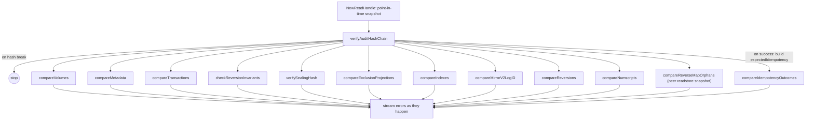

# Checker

## Overview

The checker (`internal/application/check`) verifies that the data persisted in Pebble matches what the [audit hash chain](audit-chain.md) says it should hold. It is invoked **on demand** through the `BucketService.CheckStore` gRPC streaming RPC — there is no built-in cron — and emits a stream of `CheckStoreEvent`s, one per finding, plus periodic `progress` events.

Its job is to enforce the system-wide invariant that the audit log is the only source of truth and every other persisted dataset is a re-derivable projection. Anything the checker doesn't verify is, by definition, an unmonitored tampering vector.

## Surface

`misc/proto/bucket.proto`:

```proto
rpc CheckStore(CheckStoreRequest) returns (stream CheckStoreEvent);

message CheckStoreEvent {
  oneof type {
    CheckStoreError    error    = 1;
    CheckStoreProgress progress = 2;
  }
}
```

The request is empty (the check always runs over the entire cluster state, single-pass). The response is streamed so errors surface immediately and large clusters don't have to wait for completion to see early signal. A single hash mismatch stops the walk for that branch (the chain is irrecoverably broken from that point); all other mismatches are non-fatal and the pass continues.

Entry point: `NewChecker(...).Check(ctx, callback)` (`internal/application/check/checker.go:68-546`). The checker takes a single Pebble read handle (`store.NewReadHandle()`) on the **main store**, so every pass observes a consistent point-in-time snapshot of it. One pass — `compareReverseMapOrphans` — additionally opens a read-only snapshot of the **peer readstore**; it is the single, deliberate exception to the main-store-only scope of invariant #8 and is described in the table below.

## The verification passes

Each pass takes a persisted projection, re-derives the expected value by replaying the audit chain, and emits a `CHECK_STORE_ERROR_TYPE_*` event on divergence.

| # | Pass | What it verifies | Re-derivation source | Error type on divergence |
|---|------|------------------|----------------------|--------------------------|
| 1 | `verifyAuditHashChain` | The audit chain itself (every entry's hash equals the recomputed hash from header + items + prev_hash) | `HashGenerator.Compute` (see [audit-chain.md](audit-chain.md)) | `HASH_MISMATCH`, `SEQUENCE_GAP` |
| 2 | `compareVolumes` | Per-`(ledger, account, asset)` volume rows in the attribute store | `ReplayLedgerLog` + `ApplyPostings` over the audit-chain-bound orders | `VOLUME_MISMATCH` |
| 3 | `compareMetadata` | Account/transaction metadata attribute rows | Replay of `SavedMetadata` / `DeletedMetadata` orders | `METADATA_MISMATCH` |
| 4 | `compareTransactions` | Per-transaction state (postings, timestamp, metadata, reverted flag, fabricated/system) | Replay of `CreatedTransaction` / `RevertedTransaction` / metadata orders, baseline-seeded under archiving (`newLazyTxSeedWriter`) | `TRANSACTION_UPDATE_MISMATCH` |
| 5 | `checkReversionInvariants` | Log-stream consistency: each transaction is reverted at most once, and reverts target transactions that exist | Replay-derived revert flags | `REVERTED_MISMATCH` |
| 6 | `verifySealingHash` | Each closed chapter's sealing hash equals `BLAKE3(chapter_id ‖ close_seq ‖ last_audit_hash ‖ state_hash)` | Recompute from the audit-chain-bound chapter close payload | `HASH_MISMATCH` (chapter-scoped) |
| 7 | `compareExclusionProjections` | `AppliedProposal.TransientVolumes` and `LedgerLog.PurgedVolumes` agree with what `SimulateEphemeralPurge` would have produced | Replay + `SimulateEphemeralPurge` | `EXCLUSION_RECORD_MISMATCH` |
| 8 | `compareIdempotencyOutcomes` | Frozen idempotency outcomes in `SubIdempKeys` match the outcome of the chain-bound `AuditSuccess` / `AuditFailure` that wrote them | Outcome map built during `verifyAuditHashChain` | `IDEMPOTENCY_MISMATCH` |
| 9 | `compareIndexes` | `SubAttrIndex` registry matches the set derived from `CreateIndex` / `DropIndex` / `RemovedMetadataFieldType` / `DeleteLedger` logs (presence + identity only) | Replay of the index-affecting log types | `INDEX_MISMATCH` |
| 10 | `compareMirrorV2LogID` | Stored `LedgerBoundaries.last_mirror_v2_log_id` **equals** the max audited `MirrorIngest.v2_log_id` per ledger (full equality) | Live audit chain (`recordMirrorIngestMutations`) over a baseline floor (`foldBaselineBoundaries`) | `MIRROR_V2LOGID_MISMATCH` (any divergence) |
| 11 | `compareReversions` | Stored reversion bitsets (`ZonePerLedger`/`SubPLReversions`, the rows the already-reverted gate reads) equal the audit-derived reverted set, both ways; stored rows for non-live ledgers and undecodable rows are flagged | Baseline tx-row markers + replayed `RevertedTransaction` logs | `REVERTED_MISMATCH` |
| 12 | `compareNumscripts` | `SubAttrNumscriptContent` immutable version entries and `SubAttrNumscriptVersion` latest pointers (the greatest stored semver) match the saved versions | Replay of `SavedNumscript` / `DeleteLedger` logs | `NUMSCRIPT_MISMATCH` |
| 13 | `compareReverseMapOrphans` | Reverse-map (`0x03`) rows in the **peer readstore** whose `(ledger, target, metadata key)` is in **neither** the stored `SubAttrIndex` registry **nor** the audit-replayed `MetadataSchema`; also rows belonging to a ledger the audit does not list as live, and keys that do not decode | Stored index registry **and** the replayed schema (`CreateLedger.initial_schema` + `SetMetadataFieldType` / `RemovedMetadataFieldType`) | `REVERSE_MAP_ORPHAN` |

Notes:

- **`compareIndexes` covers presence + identity** (`IndexID` match), **not `BuildStatus`** and **not `IndexVersionState`**. `BuildStatus` is informational and per-replica; `IndexVersionState` is by design local and may legitimately differ across nodes mid-rewrite (see [indexer / indexes.md](../indexer/indexes.md)).
- **`compareNumscripts`** re-derives both numscript projections from the audit chain. The library is immutable and append-only: a `SavedNumscript` writes an immutable content entry and advances the per-name latest pointer to the greatest stored semver (versions may be saved out of order). It catches altered/missing/extra content and a latest pointer that is not the greatest saved semver. Unlike `compareIndexes`, the expected state is baseline-seeded under archiving (`foldBaselineNumscripts`), so there is no archive-orphan tolerance — a stored row absent from both baseline and replay is flagged as surplus; only the deferred-cleanup (pending-purge) tolerance remains.
- **`compareIdempotencyOutcomes`** is the one pass that consumes a side-effect of `verifyAuditHashChain` (the expected-outcome map). The two are coupled by design — re-deriving the idempotency outcome means re-walking the chain anyway.
- **`compareMirrorV2LogID` is a full equality check.** The FSM enforces a contiguous applied prefix (`processMirrorIngest` rejects any `v2LogId` gap with `ErrMirrorV2LogIDGap`), so at rest the stored EN-1550 high-water mark must be exactly `max(audited v2_log_id)`. Any divergence is flagged: `stored > max` claims a source log the audit never recorded; `stored < max` means the projection lost applied ground. A never-mirrored ledger has stored `0` and max `0` → equal → clean. There is no legacy/no-backfill leniency — pre-field clusters are unsupported. The audited max is seeded from a baseline floor (the compact baseline snapshot now includes `Boundary` rows) so archived-only mirror ingests are not undercounted. The comparison is driven from the **union** of stored boundary rows and audited-mirror ledgers, so a mirror ledger whose `Boundary` row is absent while it still has audited ingests (audited max > 0, no row) is treated as stored `0` and flagged — not silently skipped. The absent-row branch is suppressed only for a ledger audited as **deleted** (a `DeleteLedger` log replayed in the verified range, `deletedInReplay`): `WriteSet.Absorb` legitimately removes the boundary row on deletion, so its missing row is expected. Present-row equality still applies to every ledger (including one in the pending-cleanup window whose row is still present).
- **`compareReverseMapOrphans` is the only pass that reads a peer store**, and the only exception to invariant #8's main-store scope. The reverse map is the one read-index limb that cannot be range-deleted by field — its metadata key sits *after* a fixed-width 4-byte version block — so field removal has to scan the namespace and point-delete row by row (`purgeReverseMapForKey`), and a row that scan misses is a permanent divergence no other mechanism detects. The `0x01` forward index and `0x02` existence counters are dropped by a range delete, which is atomic and self-healing.
  - **The oracle is a conjunction**: a row is an orphan only when its field is absent from the stored registry **and** absent from the replayed schema. `RemovedMetadataFieldType` is the one log that both removes the schema field type and runs the point-delete scan, so "absent from the replayed schema, still has live rows" means exactly "the scan missed rows". The schema must be the **replayed** one, never stored `LedgerInfo`, or the pass would legitimise a tampered schema row.
  - **`DropIndex` residue is deliberately not flagged, and is not covered by this pass.** `DropIndex` removes the registry entry, leaves the schema field declared, and purges no readstore rows at all. `Check()` has no warning channel — `cmdutil.IntegrityResult` fails on any error event — so a registry-only oracle would leave every cluster that has ever dropped a metadata index permanently red. That leak is tracked as `EN-1621`. Once `EN-1621` makes `DropIndex` purge rows, a regression in that new purge would strand rows while the schema field is still declared, and this oracle would **not** catch it; the oracle must be revisited then.
  - **The encoding version is deliberately not validated.** Current and pending forward-encoding versions legitimately coexist while a per-replica schema rewrite runs, and versions outside that live pair are reclaimed at boot by `purgeOrphanVersions`. Flagging on version would report every in-flight rewrite.
  - **One skip condition**, logged at INFO and never reported as a clean result: no readstore handle is attached to the checker (restore, or the CLI validating a staged main store that has no peer readstore). An empty audit does **not** skip the pass — the read index folds from the log stream, so a reverse-map row over a zero-log store is unaudited by definition.
  - **A verdict requires an exactly aligned peer cursor.** Every oracle term is pinned at the verified log sequence, so the pass only judges rows when the read index has folded exactly that range (`indexedSequence == lastSequence`). Malformed keys need no oracle and are always reported. The two unaligned positions are skips and are not symmetric. *Behind* is the ordinary state on a live cluster — the registry is written at Raft apply while the rmap folds later — so nothing can be concluded. *Ahead* cannot happen by race, because the builder folds from the primary log stream and writes its cursor only for logs it has already read out of the primary store (`progress(t) <= maxLogSeq(t)` at every instant) and **`Check()` pins the peer snapshot strictly before the primary one** so the two pinned values inherit that ordering. That ordering is what removes the need for cross-store atomicity: an ordering that can only leave the peer behind is sufficient, since behind is already a skip. Ahead remains reachable through a primary-store rollback beneath the read-index cursor (`RestoreCheckpoint` on a follower restore), which the index builder — unlike `usagebuilder` — does not reset; that divergence belongs to the missing reset rather than to the purge path this pass audits, so it is logged loudly and skipped.
  - **The unknown-ledger verdict is driven by liveness alone.** A ledger recreated under the same name is live again in the audit-derived set, so its fresh rows are legitimate. Deriving the verdict from a separate append-only "was deleted in the replay" set consulted *before* the live set would report them, and would leave correctness resting on the retained tombstone that makes the lifecycle unreachable rather than on the pass's own structure.
  - Findings are aggregated per `(ledger, namespace, metadata key)` with a row count and one sample entity — a field dropped on a large ledger can strand millions of rows, and the pass must stay `O(distinct fields)` in both memory and emitted events.
- **Order matters**: `verifyAuditHashChain` runs **first**. A broken chain stops the walk before any downstream pass — running them with a tampered chain would produce noise from already-detected corruption.

## Replay machinery

Three building blocks under `internal/domain/replay/`:

| Function | Purpose |
|----------|---------|
| `ReplayLedgerLog` | Forward iteration over `LedgerLog` rows for a single ledger; dispatches each payload to a `Writer` interface that the caller implements per-pass (volumes, metadata, transactions, etc.). |
| `SimulateEphemeralPurge` | Re-runs the ephemeral-purge calculation the FSM applied at proposal time: which volumes that were touched by transient accounts must be purged from the live state and accumulated as exclusions. Used by `compareExclusionProjections`. |
| `partitionVolumes` | Helper used during replay to split per-transaction volume contributions between "persistent" (kept) and "transient" (purged) — mirroring exactly the apply-time split. |

Replay reads from a Pebble-backed `replayStore` with merge operators so a multi-million-row accumulation stays `O(1)` per write rather than `O(log n)`.

The transaction merge operator is associative. On a partial merge — Pebble compacting operands without the base value, `includesBase=false` — it defers the ordered ops as a `txOpBatch` instead of collapsing them into a finalized snapshot: a metadata delete has no snapshot representation, so collapsing would silently drop it and a later fold with the base could not undo it. Only a base-inclusive fold (at read, or the LSM bottom) resolves to a finalized `TransactionState`. Under archiving, each transaction's pre-archive baseline state is seeded lazily on the first post-archive delta that touches it (`newLazyTxSeedWriter`), so the delta merges onto the full state whose create log has been purged; untouched transactions carry no replay entry and fall back to the baseline in `compareTransactions`.

## Pass-by-pass derivation flow


```mermaid
flowchart TB
    A[NewReadHandle: point-in-time snapshot] --> B[verifyAuditHashChain]
    B -->|on hash break| Z((stop))
    B -->|on success: build expectedIdempotency| C[compareIdempotencyOutcomes]
    B --> D[compareVolumes]
    B --> E[compareMetadata]
    B --> F[compareTransactions]
    B --> G[checkReversionInvariants]
    B --> H[verifySealingHash]
    B --> I[compareExclusionProjections]
    B --> J[compareIndexes]
    B --> L[compareMirrorV2LogID]
    B --> M[compareReversions]
    B --> N[compareNumscripts]
    B --> O["compareReverseMapOrphans (peer readstore snapshot)"]
    D & E & F & G & H & I & J & L & M & N & O --> K[stream errors as they happen]
    C --> K
```

All non-chain passes are independent of each other (each replays the subset of orders it needs) and can be reordered without changing semantics — they share only the Pebble snapshot and the `expectedIdempotency` map. `compareReverseMapOrphans` is the one pass whose *data* comes from outside that snapshot: it takes its own read-only snapshot of the peer readstore, and uses the main-store snapshot plus the replay-derived schema and live-ledger sets as its oracle.

## Error event shape

`misc/proto/bucket.proto:699-753`:

```proto
message CheckStoreError {
  CheckStoreErrorType error_type = 1;
  string  message = 2;
  fixed64 log_sequence = 3;
  string  ledger = 4;
  string  account = 5;
  string  asset = 6;
  fixed64 transaction_id = 7;
}

enum CheckStoreErrorType {
  HASH_MISMATCH               = 1;
  SEQUENCE_GAP                = 2;
  VOLUME_MISMATCH             = 3;
  METADATA_MISMATCH           = 4;
  UNKNOWN_LEDGER              = 5;
  TRANSACTION_UPDATE_MISMATCH = 6;
  REVERTED_MISMATCH           = 7;
  EXCLUSION_RECORD_MISMATCH   = 8;
  IDEMPOTENCY_MISMATCH        = 9;
  INDEX_MISMATCH              = 10;
  INVALID_SKIP                = 11;
  MIRROR_V2LOGID_MISMATCH     = 12;
  SCHEMA_MISMATCH             = 13;
  ACCOUNT_TYPE_MISMATCH       = 14;
  MISSING_LEDGER              = 15;
  UNAUDITED_LEDGER            = 16;
  REFERENCE_MISMATCH          = 17;
  BOUNDARY_MISMATCH           = 18;
  NUMSCRIPT_MISMATCH          = 19;
  REVERSE_MAP_ORPHAN          = 20;
}
```

(Names are shown without the `CHECK_STORE_ERROR_TYPE_` prefix the proto carries.)

Adding a new persisted projection requires adding a new pass *and* a new error type — both are part of the same invariant.

## What is **not** verified

A short list, because it matters for the threat model:

- **`IndexVersionState`** (per-replica): legitimately diverges during a rewrite — see [indexer / indexes.md](../indexer/indexes.md).
- **`Index.BuildStatus`**: informational and per-replica.
- **Bloom filters**: a probabilistic cache; correctness is a function of the underlying attribute store, which the checker *does* verify.
- **Read store index *contents* (inverted index for queries)**: rebuildable from scratch by the [indexer](../indexer/), so a divergence is recoverable without an audit — but the *source* attributes the indexer projects from are checked. Whether any index row holds the right *value* is unverified, tracked under `EN-1514` / `EN-1323`. **Not** in this list: reverse-map (`0x03`) row *presence*, which `compareReverseMapOrphans` does detect — see pass 13 above. That pass covers presence in one limb against one oracle, and explicitly does not cover `DropIndex` residue (`EN-1621`).
- **Snapshot files and the spool**: transient transport artefacts, not persisted projections.

## Performance

Single-pass forward iteration over the audit chain and the per-ledger log rows. Replay accumulates into a Pebble-backed scratch. There is no "fast" vs "thorough" mode toggle — the chain check is non-optional, and once you've paid for it, the projection compares are cheap by comparison.

Cost is dominated by Pebble I/O over the audit and ledger-log ranges; expect it to scale linearly with the number of audit entries plus the number of replayed log payloads.

## Adding a new projection

The contract every new persisted projection must satisfy:

1. The orders that produce the projection must already be hash-bound by the audit chain (in practice, this means landing them as Raft proposals that get the standard `AuditEntry`).
2. A pass — typically `compare<X>` — must be added to `Checker.Check` that re-derives the projection from those orders and emits the matching `CHECK_STORE_ERROR_TYPE_*` event on mismatch.
3. A new `CheckStoreErrorType` enum value is reserved for the new pass (extending the proto rather than reusing an existing type).

Skipping any of these makes the projection an unmonitored tampering vector. The rule is enforced by code review and by the [AGENTS.md / invariant #8](../../../../../AGENTS.md) constraint: a projection without a checker pass is the violation.

The contract is scoped to the **primary FSM store**. Data in a peer secondary store (the readstore, the `usagestore`) is out of scope as a rule, and a new pass over one is not a routine extension: `compareReverseMapOrphans` is the only one, admitted because the reverse map is the only read-index limb whose removal path can leave a divergence that no other mechanism detects. A proposed peer-store pass needs that same argument. Note also that such a pass needs its own read handle on the peer store — the main-store snapshot the other passes share does not cover it — and that handle must be pinned by `Check()` **before** the primary snapshot, not next to it and never when the pass runs: the oracle terms are frozen at the primary pin, so a peer view opened after it is judged against state that predates it, while a peer view opened before it can only trail the verified sequence. It must skip loudly (INFO log, no clean result) when the peer store is absent, and it must not treat a peer cursor that differs from the verified sequence as a clean result either — see the reverse-map pass above.
