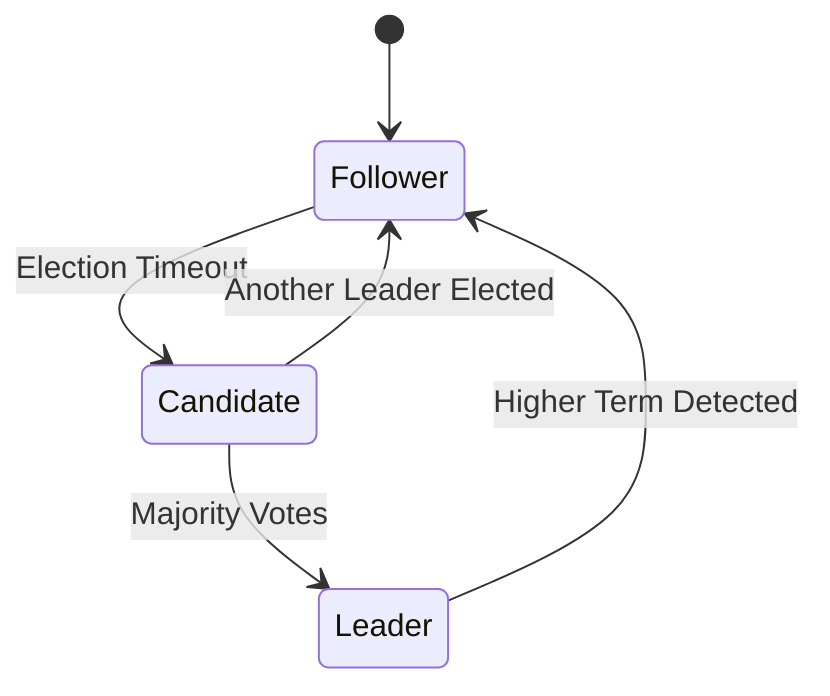
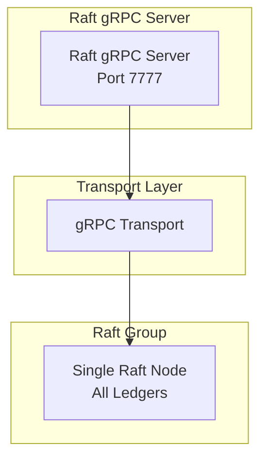
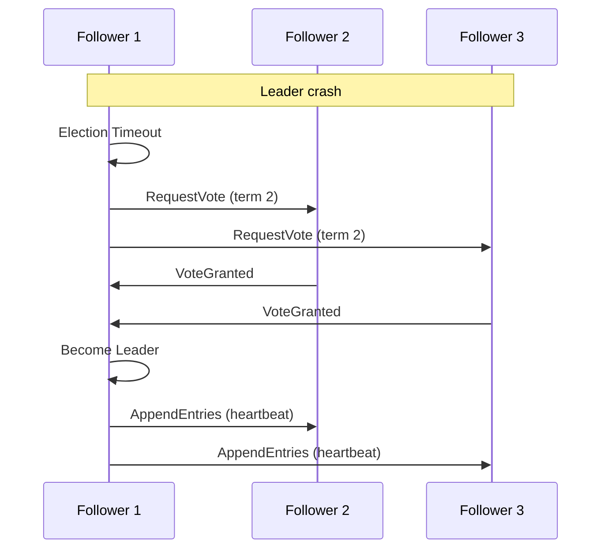
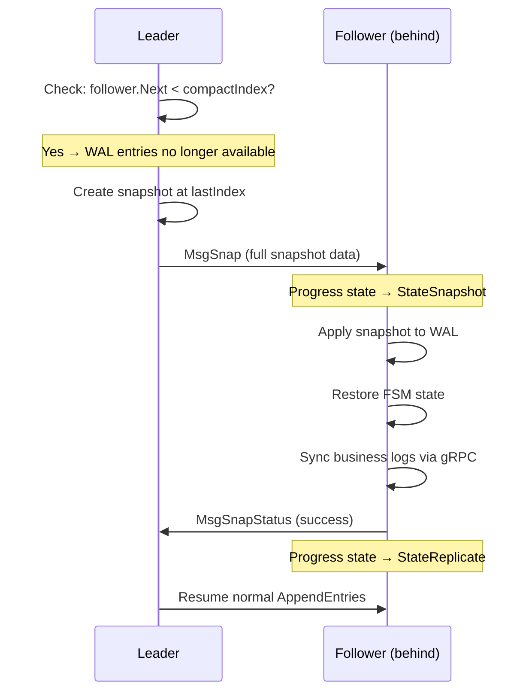

# Raft Consensus

## Introduction

Ledger v3 POC uses the Raft consensus protocol to ensure data consistency across the cluster. The system implements a **single Raft group** architecture where all operations (ledger management and transactions) go through the same consensus layer.

## Raft Overview

Raft is a distributed consensus algorithm designed to be easy to understand and implement. It ensures that all nodes in the cluster maintain a consistent copy of the data.

### Raft Node States

A Raft node can be in one of the following states:

- **Leader**: Handles all write requests and replicates data to followers
- **Follower**: Receives updates from the leader and votes in elections
- **Learner**: Receives updates from the leader but does not vote (non-voting replica)
- **Candidate**: Transient state during leader election
- **PreCandidate**: Transient state before becoming candidate (optional)

Nodes join the cluster as **learners** and are automatically promoted to **voters** (followers) once they catch up. See [Cluster Lifecycle](../../../../ops/cluster-operations.md) for the complete bootstrap/join/promotion flow.



## Single Raft Architecture

### Unified Command Processing

The single Raft group handles all commands through a unified FSM:

**Managed Commands**:
- `CreateLedgerCommand`: Create a new ledger
- `DeleteLedgerCommand`: Delete an existing ledger
- `CreateLogCommand`: Insert a log (transaction, metadata changes, reversions) into any ledger

**FSM**: `internal/infra/state/machine.go`

### State Management

The FSM maintains a unified state for all ledgers via the `Machine` struct (`internal/infra/state/machine.go`) and its `StateRegistry` (`internal/infra/state/registry.go`). The following is a conceptual representation of the state -- these are **not** actual proto definitions but describe the Go struct fields:

```
Machine state (conceptual):
  State *FSMState
    .NextSequenceID         uint64       // Global log sequence number
    .LastAppliedIndex       uint64       // Last Raft entry applied
    .LastAppliedTimestamp   uint64       // HLC timestamp of last applied entry
    // ... and the other recoverable scalars (NextAuditSequenceID,
    // NextLedgerID, LastAuditHash, LastClusterConfig, ...)

  Registry.Ledgers        KeyStore      // Per-ledger LedgerInfo
  Registry.Boundaries     KeyStore      // Per-ledger LedgerBoundaries (next log/tx IDs, counters)
  Registry.Volumes        KeyStore      // Per-ledger per-account per-asset VolumePair
  Registry.AccountMetadata KeyStore     // Per-ledger per-account metadata
  Registry.References     KeyStore      // Per-ledger transaction references
  Registry.Reversions     map[string]*Bitset  // Per-ledger reversion bitsets
  // ... and other attribute KeyStores (Transactions, SinkConfigs, etc.)
```

The recoverable scalars live on `FSMState` (`internal/infra/state/fsmstate.go`); sub-trackers (`Registry`, `KeyStore`, …) stay on `Machine` directly with their own lifecycles.

### Advantages of Single Raft

1. **Simplified Operations**: Only one Raft group to monitor and maintain
2. **Unified Snapshots**: Single snapshot contains all ledger states
3. **Atomic Multi-Ledger Operations**: Easier to implement cross-ledger features in the future
4. **Reduced Resource Usage**: No overhead from multiple Raft leaders and elections

## Technical Implementation

### Library Used

The system uses `go.etcd.io/raft/v3`, the standalone Raft implementation extracted from etcd.

### Main Components

#### Node Wrapper

`internal/infra/node/node.go` provides a wrapper around `raft.RawNode` that:

- Manages node lifecycle (orchestrate loop, transport, proposals)
- Processes incoming Raft messages
- Writes to the WAL and sends messages via transport
- Delegates FSM application to the **Applier**

```go
type Node struct {
    rawNode          *raft.RawNode
    logger           logging.Logger
    fsm              *state.Machine
    wal              wal.WAL
    transport        Transport
    config           NodeConfig
    applier          *Applier   // owns FSM application and gating/spool lifecycle
    // ... and other fields (proposals, metrics, etc.)
}
```

#### Applier

`internal/infra/node/applier.go` decouples WAL writes from FSM application by running as a dedicated goroutine. This provides two levels of pipelining:

1. **WAL ↔ FSM overlap**: WAL write of Ready N+1 overlaps with FSM application of Ready N, reducing each Raft cycle from `WAL_time + FSM_time` to `max(WAL_time, FSM_time)`.

2. **Prepare ↔ Commit pipeline**: Within the FSM, batch processing is split into `PrepareEntries()` (CPU-bound: unmarshal, execute business logic, merge WriteSet, build Pebble batch) and `CommitPreparedBatch()` (I/O-bound: `batch.Commit()` to Pebble). A dedicated committer goroutine (`runCommitter`) reads from a buffered(1) `commitCh` channel, so batch N's commit runs concurrently with batch N+1's prepare. Futures are resolved by the committer immediately after commit completes.

```go
type Applier struct {
    fsm                     *state.Machine
    spool                   spool.Spool
    store                   *dal.Store
    wal                     wal.WAL
    futures                 *SyncMap[uint64, *futures.Future[state.ApplyResult]]
    taskExecutor            *worker.SingleTaskExecutor
    status                  *atomic.Int32       // statusNormal, statusSyncing, etc.
    ch                      chan applyWork       // buffered(1), read by Run goroutine
    commitCh                chan commitWork      // buffered(1), read by committer goroutine
    pending                 *pendingCommit       // at most one in-flight commit
    // ... config, metrics, etc.
}
```

The Applier provides three key methods:

- **`Submit(entries, confState, stop)`**: Asynchronously sends committed entries for FSM application (or spooling)
- **`Drain(stop)`**: Blocks until all previously submitted work is processed, including any in-flight commit (used before snapshot install, barriers, and leadership acquisition)
- **`Run(ctx, stop)`**: The goroutine loop that processes work items, orchestrates the prepare/commit pipeline, and handles gating termination

Drain points ensure the pending commit completes before barriers, checkpoints, status transitions, and shutdown. Replay paths (WAL replay, spool replay) use the synchronous `applyEntriesAndResolveCommands()` which does not pipeline, since they are off the hot path.

#### Storage

`internal/storage/wal/wal.go` implements the WAL storage required by etcd/raft:

- **HardState**: Cluster state (term, vote, commit index)
- **Entries**: Raft log entries
- **Snapshots**: System snapshots

#### Transport

`internal/infra/node/transport.go` manages communication between nodes:

- Send Raft messages
- Receive Raft messages
- Detect unreachable nodes



## Raft Configuration

### Configurable Parameters

The system exposes several configurable Raft parameters:

```go
type NodeConfig struct {
    ElectionTick         int           // Election timeout in ticks (default: 10)
    HeartbeatTick        int           // Heartbeat interval in ticks (default: 1)
    MaxSizePerMsg        uint64        // Maximum size per message in bytes (default: 1MB)
    MaxInflightMsgs      int           // Maximum number of in-flight messages (default: 256)
    TickInterval         time.Duration // Interval between ticks
    MaintenanceInterval  time.Duration // Periodic maintenance interval for snapshots, compaction, and checkpoints (default: 30s)
    CompactionMargin     uint64        // Minimum WAL entries retained after compaction for follower catch-up (default: 1000)
    ProposeQueueCapacity int           // Capacity of the propose queue
}
```

### Timeout Calculation

Raft timeouts are calculated by multiplying ticks by `TickInterval`:

- **Election Timeout**: `ElectionTick * TickInterval` (default: 10 * 100ms = 1s)
- **Heartbeat Interval**: `HeartbeatTick * TickInterval` (default: 1 * 100ms = 100ms)

### Recommendations

For a stable cluster:
- `ElectionTick`: 10-20 (reasonable election timeout)
- `HeartbeatTick`: 1-2 (frequent heartbeat to quickly detect failures)
- `TickInterval`: 50-200ms (balance between responsiveness and CPU load)

## Leader Election

### Election Process

1. A follower detects it hasn't received a heartbeat from the leader for `ElectionTick` ticks
2. It transitions to `Candidate` state and increments its `term`
3. It sends `RequestVote` to all other nodes
4. If a majority votes for it, it becomes `Leader`
5. It immediately sends heartbeats to prevent other elections

### Election Scenarios

#### Normal Election



#### Split Vote

If two nodes become candidates simultaneously, neither can obtain a majority. They wait for a new timeout and retry with a higher term.

## Data Replication

### Replication Process

1. Client sends a write request to the leader
2. Leader adds the entry to its local log
3. Leader sends `AppendEntries` to all followers
4. When a majority confirms, the leader commits the entry
5. Leader applies the entry to its FSM
6. Leader returns the response to the client

### Consistency Guarantees

- **Linearizability**: Committed mutations are seen in the same order by all
  nodes; default live reads routed through `RoutedController.readCtrl` use the
  quorum-backed `ReadIndex` barrier described below
- **Durability**: Once committed, an entry is guaranteed to be persisted
- **Consistency**: All nodes see the same data once synchronized

## Safety and Availability During Partitions

Under normal Raft consensus operations, Ledger v3 is **CP rather than AP** in
the CAP sense. During a network partition, only a partition containing a
majority of the configured voters can elect a leader, commit writes, or
complete the quorum barrier required by a default live read routed through
`RoutedController.readCtrl`. A minority partition does not accept a divergent
committed history; requests that require consensus wait or fail instead.
Availability is therefore preserved on the majority side and deliberately
sacrificed on every side that cannot form a quorum. Endpoint-specific reads
that bypass that controller path are exceptions described below.

The emergency [`remove-node --force`](../../../../ops/cluster-operations.md#force-removing-a-down-node)
path is deliberately outside that guarantee: it changes one node's membership
locally without consensus. Use it only when every removed member is permanently
unreachable and its old state cannot run or rejoin. If an isolated former
leader force-removes voters that remain live, the reduced local configuration
and the original majority can both commit, creating divergent histories.

For normal consensus operations, the guarantee applies to committed state,
which is the boundary visible to a successful write response. A request that
times out while consensus is being lost has an unknown outcome from the
client's perspective. Retrying without duplication is safe only when the
original request carried an idempotency key, the retry uses the same key and
content, and the key has not passed its configured TTL (`0` means no
expiration). Without those preconditions, a retry is a new operation and may
duplicate the original; the client must determine the original outcome before
resubmitting. See [Idempotency Keys](../admission/idempotency.md).

### Why a Partition Cannot Commit Two Histories

A voter grants at most one vote per term, a candidate needs a majority to
become leader, and a log entry needs majority replication to commit. Any two
majorities intersect in at least one voter. Raft's voting and log-matching rules
therefore prevent two conflicting entries at the same log position from both
becoming committed, even if nodes on different sides of a partition temporarily
disagree about who the leader is.

Ledger v3 enables Raft `PreVote` but does not enable `CheckQuorum`. Consequently,
an isolated former leader may continue to report its local role as leader until
it hears from a higher term. It still cannot commit or acknowledge new writes,
and a `ReadOnlySafe` `ReadIndex` cannot complete without quorum confirmation.
That temporary role disagreement is not a split brain at the committed-state
level. Explicit `stale` reads intentionally bypass the quorum barrier and may
return an older local view. An explicit `leader` read can do the same when it
reaches a node that still considers itself leader: the local-leader routing
shortcut serves local state without `ReadIndex`. Neither mode should be used
when quorum-confirmed freshness is required during a partition.

### Quorum and Failure Tolerance

For `N` voters, quorum is `floor(N/2) + 1` and the cluster tolerates at most
`floor((N-1)/2)` unavailable voters while continuing to write:

| Voters | Quorum | Unavailable voters tolerated |
|--------|--------|------------------------------|
| 1 | 1 | 0 |
| 2 | 2 | 0 |
| 3 | 2 | 1 |
| 4 | 3 | 1 |
| 5 | 3 | 2 |

An odd voter count is recommended because adding a voter to move from an odd to
the next even number does not increase failure tolerance. A two-voter cluster
does not create split brain; it simply loses write availability as soon as
either voter is unavailable.

Learners replicate the log but do not vote and cannot become leader. Nodes join
as learners and, by default, are promoted automatically once caught up. A
topology with one voter and two permanent learners can be maintained only by
disabling automatic promotion; it has a fixed writer in practice, but no write
availability after that voter fails. The normal three-node steady state is one
leader plus two follower voters, any caught-up voter being eligible to replace
the leader after a failure.

### Implementation Evidence

- The independent protocol references are the
  [Raft paper](https://raft.github.io/raft.pdf), which defines election safety,
  leader completeness, and state-machine safety, and its
  [TLA+ specification](https://github.com/ongardie/raft.tla).
- Ledger v3 uses [`go.etcd.io/raft/v3`](https://github.com/etcd-io/raft/tree/v3.7.0),
  with its safety properties and deterministic state-machine contract described
  in the [library README](https://github.com/etcd-io/raft/blob/v3.7.0/README.md).
- The [routed controller](../../../../../internal/bootstrap/controller_routed.go)
  sends writes to the current leader. The
  [Raft node configuration](../../../../../internal/infra/node/node.go) enables
  `PreVote` and leaves `CheckQuorum` disabled.
- Default live reads routed through `RoutedController.readCtrl` use
  `ReadOnlySafe` `ReadIndex`, wait for the returned commit index to be applied
  locally, and only then read Pebble. See
  [Linearizable Reads via ReadIndex](#linearizable-reads-via-readindex).
- Cluster bootstrap, learner registration, automatic voter promotion, and the
  safeguards preventing a syncing node from becoming leader are detailed in
  [Cluster Lifecycle](../../../../ops/cluster-operations.md).

## Snapshots

### Why Snapshots?

Raft logs grow indefinitely. Snapshots allow:
- Compacting old logs
- Reducing recovery time after a failure
- Limiting disk usage

### Snapshot Creation

Snapshots are created automatically by a periodic background maintenance timer (`--maintenance-interval`, default 30s). On each tick, if `lastPersistedIndex` has advanced since the last snapshot, a new snapshot is created, followed by WAL compaction and Pebble checkpoint creation.

### Snapshot Contents

A snapshot contains:
- Complete FSM state at a given index (all ledgers and their states)
- Metadata necessary to restore the state

### Restoring from a Snapshot

When a node joins the cluster or recovers after a failure:
1. It loads the most recent snapshot
2. It restores the FSM state from the snapshot
3. It applies log entries after the snapshot index
4. For each ledger, it syncs missing logs from the leader via gRPC streaming

## Failure Management

### Failure Types

#### Leader Failure

1. Followers detect the absence of heartbeat
2. A new election is triggered
3. A new leader is elected
4. The cluster continues to function

#### Follower Failure

1. The leader continues to function with other followers
2. The missing follower is marked as unreachable
3. When the follower returns, it synchronizes automatically

### Desynchronized Follower Detection

The Raft leader maintains a **progress tracker** for each follower that tracks:
- `Match`: The highest log index known to be replicated on this follower
- `Next`: The next log index to send to this follower

#### Detection Mechanism

```
Leader Progress Tracker:
┌────────────────────────────────────────────────────────────────────┐
│ Follower 2:  Match=950   Next=951   State=Replicate               │
│ Follower 3:  Match=100   Next=101   State=Probe       ← Behind!   │
└────────────────────────────────────────────────────────────────────┘
```

1. **Normal operation**: When a follower successfully receives `AppendEntries`, it returns success and the leader advances `Match` and `Next`

2. **Follower behind**: When `AppendEntries` fails (term mismatch or log inconsistency), the leader decreases `Next` and retries with earlier entries. The follower enters `StateProbe`.

3. **Follower too far behind**: If the required entries have been compacted from the WAL (index < compactIndex), the leader **cannot** send the missing entries.

During a process lifetime, snapshot creation does not itself make older retained
entries unavailable. The WAL exposes compaction index `C` as the matching point
at `FirstIndex()-1`: `Term(C)` remains readable and entries after `C` remain
available even when the latest snapshot index is newer. A follower at `C` must
therefore be caught up with `MsgApp`; `MsgSnap` is reserved for followers older
than the running leader's retained boundary. This separation is the operational
purpose of `CompactionMargin` and prevents routine maintenance from forcing a
full business-log synchronization for a follower that is only a few entries
behind (EN-1925). On restart, the latest durable snapshot becomes the new
compacted boundary; the previous process's catch-up margin is not reconstructed.

#### Snapshot Transfer (MsgSnap)

When a follower is too far behind for log replay, the leader sends a **MsgSnap** (InstallSnapshot) message:



#### Progress States

The leader tracks each follower's state:

| State | Description |
|-------|-------------|
| `StateProbe` | Follower's `Match` is unknown, sending one entry at a time |
| `StateReplicate` | Normal operation, pipeline enabled |
| `StateSnapshot` | Snapshot is being sent, waiting for confirmation |

#### Code Reference

In `internal/infra/node/node.go`, the follower receives and applies the snapshot through a two-phase process. The Applier is drained first to ensure no concurrent FSM access:

```go
// Phase 1: Install snapshot to FSM (in-memory state)
if !raft.IsEmptySnap(rd.Snapshot) {
    node.logger.Infof("Applying snapshot sent by leader")

    // Drain the Applier to ensure no concurrent FSM access
    node.applier.Drain(stop)

    // Write snapshot to WAL
    node.wal.ApplySnapshot(rd.Snapshot)

    // Install snapshot state in FSM (fast, in-memory)
    node.fsm.InstallSnapshot(ctx, rd.Snapshot)

    // Report success to Raft
    node.rawNode.ReportSnapshot(rd.Snapshot.Metadata.Index, raft.SnapshotFinish)

    // Start async synchronization with leader
    node.applier.SyncSnapshot(ctx, node.lastSoftState.Load().Lead)
}
```

#### Snapshot Synchronization Flow

The `SynchronizeWithLeader` method handles the complex task of bringing the store up to date:

1. **Ledger reconciliation**: Compare FSM ledgers with store ledgers
   - Delete ledgers that exist in store but not in FSM
   - Register new ledgers that exist in FSM but not in store
2. **Log synchronization**: For each ledger, stream missing logs from the leader
3. **Store update**: Apply logs to bring balances and metadata up to date

#### Why Two-Level Synchronization?

The snapshot contains only the **FSM state** (ledger metadata, next IDs). After receiving a snapshot, the follower must also sync **business logs** from the leader's Store:

1. **Snapshot** → FSM state (lightweight, ~KB)
2. **gRPC StreamLogs** → Transaction logs per ledger (can be large, ~GB)

This two-level approach avoids embedding large transaction data in Raft snapshots.

See [Follower Synchronization](../../data-flows.md#follower-synchronization) for the detailed synchronization flow

#### Network Partition

If the cluster is partitioned:
- Under normal consensus membership, the partition with the majority continues to function
- Under normal consensus membership, the minority partition cannot elect a leader
- When the partition is resolved, nodes synchronize

Emergency force-removal bypasses this model; see
[Safety and Availability During Partitions](#safety-and-availability-during-partitions).

### Recovery

Recovery after failure is automatic:
- Nodes reconnect automatically
- Synchronization happens via logs or snapshots
- No manual intervention is required

## Performance and Optimizations

### Batching

Commands can be batched to improve throughput:
- Multiple commands in a single `AppendEntries`
- Reduction in the number of network messages
- Overall throughput improvement

### Pipeline

The system can pipeline requests:
- Send multiple `AppendEntries` before receiving confirmations
- Limited by `MaxInflightMsgs`

### Linearizable Reads via ReadIndex

Default live reads routed through `RoutedController.readCtrl` use the etcd/raft
**ReadIndex** mechanism to establish a linearizable applied-state horizon on any
node that can reach a quorum. Reads served directly from the FSM-backed Pebble
state are linearizable at that horizon; independently asynchronous secondary
indexes need their own progress barrier:

1. The caller invokes `Node.ReadIndexAndWait(ctx)`.
2. `ReadIndex` sends a `ReadIndex` request through the Raft orchestrate loop. The leader confirms it is still the leader by exchanging heartbeats with a quorum of peers (the `ReadOnlySafe` mode, which is the default).
3. The leader responds with the current **commit index** via `rd.ReadStates`.
4. `WaitForApplied` blocks until the local FSM has applied entries up to that commit index (using a `sync.Cond` that broadcasts after each `lastPersistedIndex.Store()`).
5. The caller reads from the local Pebble store, which is now guaranteed to
   reflect all writes committed before the ReadIndex call. This does not by
   itself advance independently asynchronous secondary indexes.

**Benefits**:
- **Linearizable reads on leaders, followers, and caught-up learners** that can reach quorum
- **Read load distributed** across the cluster in the normal local path
- **No gRPC forwarding in the normal local path** (lower latency than routing to the leader)
- **No stale FSM-backed results in linearizable mode** for reads whose serving
  data and indexes are aligned with the applied-state horizon

**Consistency and routing exceptions**:
- `x-consistency: stale` bypasses `ReadIndex` and reads the local store directly;
  it may return an older view.
- `x-consistency: leader` routes the read to the node currently considered
  leader. A call forwarded to a remote node does not propagate the consistency
  metadata, so the remote call defaults to linearizable mode and performs its
  quorum barrier. However, if the receiving node already considers itself
  leader, `getLeaderCtrl` returns the local controller directly and skips
  `ReadIndex`. Because `CheckQuorum` is disabled, an isolated former leader can
  therefore serve stale local state in this mode.
- If a non-leader node is syncing or cannot complete its local barrier,
  `RoutedController` can transparently retry the read against the leader. The
  forwarded attempt can still fail when the leader is unavailable. If
  leadership moves local between the failed barrier and leader resolution, the
  router returns the barrier failure rather than serving the newly local
  controller without a successful `ReadIndex`.
- A second forwarding trigger fires after the barrier: when the local replica
  refuses a read as `INDEX_BUILDING` (an index mid-build — initial backfill,
  activation-pending, or a rewound read store re-walking a retype chain),
  `RoutedController` re-runs the read on the leader, since a converged replica
  can serve what this one cannot yet. The leader itself never forwards,
  explicitly-stale reads keep the local refusal (they ask for this node's
  view), and a read that already ran on the remote leader is not re-sent. A
  query profile can therefore report `forwarded=true` with a successful local
  barrier: the barrier passed, the index gate refused, and the leader served.
- A `ListAuditEntries` filter that contains any field other than `seq` resolves
  through the independently asynchronous audit index. With the default
  `minLogSequence = 0`, its handler does not wait for audit-index progress, so
  it can temporarily omit entries that are already committed even though the
  ReadIndex barrier completed. A non-zero `minLogSequence` makes each gRPC node
  that receives the live request wait for that log sequence, sample its live
  audit head, and wait for its own audit index to reach that head. The bound is
  propagated when routing selects another node, so the node that actually
  serves the indexed query repeats the wait against its own independently
  maintained index. Unfiltered listings and conjunctions made only of `seq`
  bounds scan the audit zone directly and do not have this secondary-index lag;
  they still honor a non-zero log-sequence wait. Checkpoint reads ignore the
  bound, and an index-backed checkpoint filter can retain audit-index lag frozen
  at checkpoint creation.
- `GetLedgerStats` has mixed provenance. `transactionCount` and `logCount` are
  FSM-backed, while `postingCount`, `revertCount`,
  `numscriptExecutionCount`, `referenceCount`, `ephemeralEvictedCount`,
  `transientUsedCount`, and `volumeCount` come from the per-replica asynchronous
  usagestore. `GetTemplateUsage` is entirely usagestore-backed. A completed
  ReadIndex does not advance either usage projection, so those values may lag;
  see the [usagebuilder pipeline](../usage/usagebuilder.md).
- `Apply` is a write rather than a read and is always routed to the node
  currently considered leader; successful completion still requires Raft
  consensus.

**Fallback during sync**:
- If the node is still syncing (restoring a snapshot or replaying spool), `ReadIndexAndWait` returns `ErrNodeSyncing`.
- The `RoutedController` catches this and transparently forwards the read to the leader via gRPC; if the leader cannot be reached, the request returns an error.

**Error handling**:
- On leadership loss, all pending ReadIndex requests are failed immediately.
- Context cancellation is respected throughout the ReadIndex+WaitForApplied pipeline.

**Key files**: `internal/infra/node/read_index.go`, `internal/infra/state/machine.go` (`WaitForApplied`), `internal/bootstrap/controller_routed.go`.

## Next Steps

To deepen your understanding:

1. [Cluster Lifecycle](../../../../ops/cluster-operations.md) - Bootstrap, join, synchronization, and learner promotion
2. [Ledgers](../../data-model.md) - How ledgers are managed
3. [Storage and Persistence](../storage/storage.md) - Raft storage implementation
4. [Data Flows](../../data-flows.md) - Detailed Raft operation flows
5. [gRPC Connections](../api/grpc-connections.md) - Transport layer, reconnection strategies, and rolling deployment optimizations
