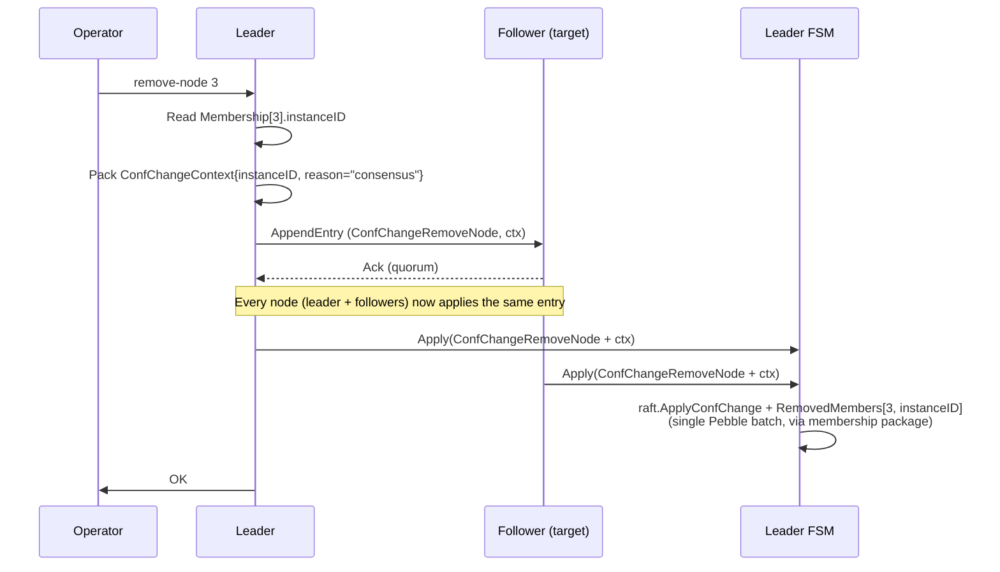
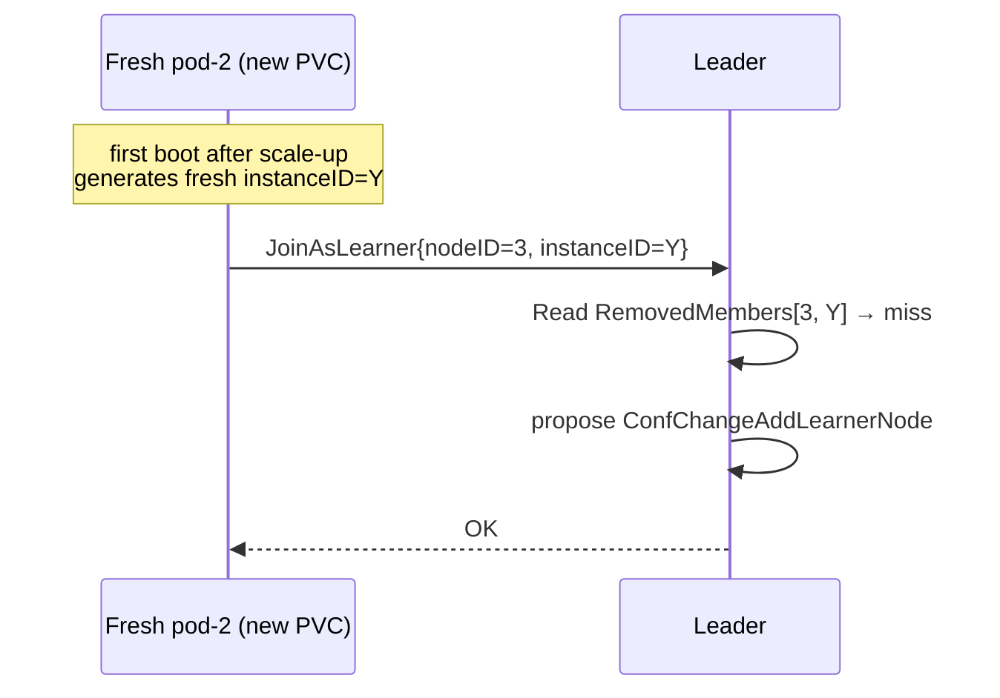

# Removed-Member Registry

## Introduction

The cluster must be able to remove a Raft member with the guarantee that the removed member cannot silently rejoin. Today it can: `checkAndPromoteLearners` re-promotes any learner that catches up, without knowing whether the operator meant to remove that node. During a scale-down, the removed pod is still alive (the StatefulSet has not shrunk yet), reconnects, is added back as a learner by the leader, and is auto-promoted within ~100 ms. From the operator's perspective the scale-down silently fails, and the cluster oscillates between configurations.

This document specifies the **removed-member registry**: a replicated set of `(nodeID, instanceID)` tuples that identifies members explicitly removed from the cluster, checked at every rejoin attempt.

The bug this addresses is tracked as [EN-1045](https://formance-team.atlassian.net/browse/EN-1045).

## Design Goals

- A member that **joined via `JoinAsLearner`** and was later removed via `ConfChangeRemoveNode` (consensus or force) never rejoins under the same identity. This is the scale-down case the bug report addresses. Bootstrap-seed voters (pod-0 under `--bootstrap`) are outside this guarantee — see "Bootstrap Seed and the Guarantee Boundary" below.
- A **new** pod at the same ordinal (e.g. after scale-down then scale-up) rejoins normally without operator intervention.
- The guarantee is authoritative on the leader side — it does not rely on the removed peer behaving correctly (which is precisely the trust we are revoking).
- The check is deterministic across leader changes (any elected leader enforces the same registry).
- No new coupling from the ledger to Kubernetes — the operator does not need to inform the leader of intent beyond the existing `remove-node` call.
- `instance_id` is a **mandatory** field on every `JoinAsLearner` RPC. Mixed-version joins (old-binary peer talking to a new-binary leader) are rejected by design — this is not a compat concern for `release/v3.0` since a peer's `INSTANCE_ID` marker is written before its first RPC and survives restarts alongside the WAL.

## Non-Goals

- Not a general access-control mechanism. The registry only tracks members removed via the normal removal paths; it is not a policy engine for who may join.
- Not a replacement for `--unsafe-skip-config-validation`. An operator can still clear the registry manually via `ledgerctl` if they know what they are doing.
- Not a fix for the operator scale-down deadlock (companion issue, tracked separately). This document is scoped to the auto-promote loop.

## Core Mechanism

### Peer Identity

A member's identity is extended from `nodeID uint64` to the tuple `(nodeID, instanceID)`:

- **`nodeID`** — kept as today: `pod-ordinal + 1`. Stays ergonomic for `ledgerctl`, logs, and dashboards.
- **`instanceID`** — a 16-byte random UUID **generated once at the very first boot** of a node and persisted alongside the WAL. It is stable across restarts of the same pod (same WAL, same PVC) and different across pods that have been reprovisioned (fresh WAL, fresh PVC).

The `instanceID` discriminates the exact case EN-1045 confuses today:

| Scenario | Same `nodeID`? | Same `instanceID`? | Should rejoin? |
|---|---|---|---|
| Removed pod still alive, tries to reconnect | Yes | Yes | **No** (bug today: yes) |
| Fresh pod at reused ordinal after scale-up | Yes | No | **Yes** |
| Fresh pod after PVC reprovision (chaos, GitOps drift) | Yes | No | Yes (surfaces the WAL-loss to the operator via [EN-1436](https://formance-team.atlassian.net/browse/EN-1436)'s fail-fast path — orthogonal to this design) |

### The Registry

The FSM keeps a replicated `RemovedMembers` set under a new sub-key of the `Global` zone. Entries are of shape:

```
RemovedMemberEntry {
    NodeID       uint64
    InstanceID   [16]byte
    RemovedAt    uint64    // wall-clock microseconds since epoch — audit trail only; force path only, consensus path leaves it 0
    Reason       string    // "consensus" | "force" | manual override
}
```

The set is keyed by `(NodeID, InstanceID)`. Reads are done at `JoinAsLearner` admission and at `checkAndPromoteLearners`; writes happen atomically with the `ConfChangeRemoveNode` that produces them (see below).

### Propagation Path

Two paths lead to a `RemovedMembers` entry, with different atomicity mechanisms.

#### Storage layout reminder

Ledger has two independent durable stores. This design must not conflate them:

- **WAL** (`internal/storage/wal/`) — Raft's write-ahead log. Persists log entries, snapshots, HardState, ConfState. Its transactions do not span into Pebble.
- **Pebble** (`internal/storage/dal/`) — the FSM state store. All `Registry.*` KeyStores live here, including `RemovedMembers`. So does the per-peer row that `membership.Register` / `membership.Unregister` maintains.

Cross-store atomicity is impossible. Today's `ForceRemoveNode` already reasons about a crash window between WAL and Pebble (see the block comment at `node.go:2229`, established by EN-1413). This design extends that reasoning to also cover the blacklist write.

`internal/infra/membership/` owns both the peer row and the `RemovedMembers` entry — they share the same per-peer lifecycle (the blacklist entry is effectively the tombstone of the peer row) and it is natural for a single package to manage both mutations in a single Pebble batch.

#### Consensus path (normal `RemoveNode`)

The `ConfChangeV2` carries an opaque `Context` field. We reuse the existing `membership.ConfChangeContext` JSON struct (the one AddLearner already uses to carry `RaftAddress` / `ServiceAddress`) and populate only its `InstanceID` field for RemoveNode:

```go
// internal/infra/membership/confchange.go
type ConfChangeContext struct {
    RaftAddress    string
    ServiceAddress string
    InstanceID     []byte // 16 bytes on RemoveNode; also populated on Add/AddLearner
}
```

The leader reads the peer's `instanceID` from its Membership state before proposing (leader-only path, not FSM hot path — no preload constraint). The proposal is then replicated normally.

When the target peer's row exists but has no `instanceID` — a *phantom learner*, added via the admin `cluster.AddLearner` RPC before the pod ever booted — the leader proposes the removal with an empty Context. The FSM apply then just deletes the peer row without writing a blacklist entry: there is nothing to blacklist, since no instance ever ran under that (nodeID, ?) tuple.

Every node applies the same log entry through the FSM apply path. The apply batch performs two mutations inside a single `dal.WriteSession`:

1. Delegate the ConfChange to raft's own state machine (unchanged from today).
2. Write `RemovedMembers[nodeID, instanceID]` to Pebble via `membership`.

Both mutations belong to the same Pebble transaction, so they are atomic. Cross-node convergence is guaranteed by [invariant #2](../../../../CLAUDE.md#invariants) (FSM determinism): same input log entry on every node → same `RemovedMembers` on every node.

No crash window on this path.

#### Force path (`ForceRemoveNode`)

This path is intentionally leader-local: `rawNode.ApplyConfChange` mutates only the leader's raft state; followers (if any survive) will learn about it via the next snapshot they receive to catch up. The design extends the existing two-write sequence to atomically embed the blacklist write in the second one:

1. `wal.UpdateSnapshotConfState(cs)` — WAL write, ordered first per EN-1413 (unchanged).
2. **Extended** `membership.Unregister(nodeID)` — Pebble batch, atomic between:
   - Delete of the peer row.
   - Put of `RemovedMembers[nodeID, instanceID]`.

The `instanceID` is read from the peer's Membership row just before the delete, so no explicit parameter needs to travel on the ledgerctl RPC. `membership.Unregister` reads from its own in-memory cache (populated at boot from Pebble), which is outside the FSM hot path and therefore not subject to invariants #3/#6/#9.

`internal/infra/node/` and `internal/infra/membership/` are added to the `forbidigo` exception list of [invariant #4](../../../../CLAUDE.md#invariants), justified as *"cluster-topology lifecycle path: force-remove writes ConfState (WAL) + peer tombstone (Pebble) outside the FSM hot path by necessity — see docs/technical/architecture/subsystems/consensus/removed-member-registry.md"*. The node/membership exception already exists de facto for the WAL/peer-row writes; the new Pebble mutation reuses the same exception scope.

#### Crash windows (force path only)

| Crash between... | Resulting state on reboot | Impact |
|---|---|---|
| in-memory `ApplyConfChange` and WAL write | ConfState unchanged; peer still voter. | Statu quo, no harm. |
| WAL write and Pebble batch | ConfState says "removed"; peer row still present (harmless per EN-1413); `RemovedMembers` empty. | Peer is out of quorum but not blacklisted. If the pod is still alive and rejoins **within this window**, EN-1045 loop briefly possible until the operator retries `remove-node`. |
| After Pebble batch | Nominal. | — |

The middle window is bounded by two fsyncs (~single-digit milliseconds on healthy disks) — strictly no worse than today, and orders of magnitude tighter than a Raft follow-up proposal would have been.

#### Follower learning about a force-remove

Followers do not apply the leader's local `ApplyConfChange` — force is leader-local by design. They receive the new ConfState AND the updated FSM state (including `RemovedMembers`) via the next Raft snapshot they get, using the same channel that today already propagates the force-remove ConfState. No new propagation mechanism is introduced.

### Enforcement Points

Two paths must consult the registry:

1. **`JoinAsLearner` admission** (`internal/adapter/grpc/server_bootstrap.go`): the RPC now carries the caller's `instanceID`. Before proposing `ConfChangeAddLearnerNode`, the leader checks `RemovedMembers[nodeID, instanceID]`. On a match → return `codes.FailedPrecondition` with a message pointing at the manual override procedure.

2. **`checkAndPromoteLearners`** (`internal/infra/node/node.go`): before proposing `ConfChangeAddNode` for a caught-up learner, the promotion loop checks the same registry. Belt-and-suspenders — a learner should never be present in the ConfState if it was blacklisted at `JoinAsLearner`, but if for any reason it slipped in through an unforeseen path, promotion still refuses.

Both checks are leader-only, outside the FSM hot path, so they read straight from Pebble via `NewDirectReadHandle`. There is no in-memory cache for the registry: the read cost is a single point lookup per admission / promotion tick, and the registry is small (bounded by the number of scale-down events over the cluster's lifetime, in practice tens to hundreds of entries). Invariants #6 and #9 (preload + coverage gate on FSM cache reads) do not apply — the check runs before any proposal is emitted, not from inside a hot-path apply.

### Peer-Side Behavior

The peer stores its `instanceID` next to the WAL, in a small file `INSTANCE_ID` (16 raw bytes). Lifecycle:

- **First boot** (no WAL, no marker): `bootstrap/module.go` generates a random UUID and writes `INSTANCE_ID` **before** calling `JoinAsLearner`. The join RPC carries the freshly written value.
- **Subsequent boot** (WAL present, `INSTANCE_ID` present): value is read from disk and used for any RPC that identifies the peer (currently just `JoinAsLearner`; extended for the followup rejoin path from EN-1436).
- **Subsequent boot** (WAL present, `INSTANCE_ID` missing): impossible under normal operation — the marker is written before `JoinAsLearner`; if it disappears (manual delete, disk corruption) the peer boots without an identifier and the leader rejects it at admission. Fixing the marker is a manual operator action.

Persistence uses the same directory as the existing `CLUSTER_JOINED` marker (`cfg.RaftConfig.WalDir`), colocated because the two markers share the same lifetime property: they identify a specific `(pod, PVC)` incarnation. Reprovisioning the PVC drops both markers together, which is the correct behavior — a wiped PVC is a genuinely new instance.

Note on directionality: the `instanceID` is generated once on the peer and communicated to the leader via `JoinAsLearner`. The leader persists it in the peer's Membership row, which is part of the FSM state and therefore Raft-replicated to all nodes — every future leader knows the `instanceID` of every current member. The peer is never sent an `instanceID` back; it holds the authoritative copy on its own disk.

### Bootstrap Seed and the Guarantee Boundary

Voters that become cluster members via the initial bootstrap `ConfState` (typically pod-0 under `--bootstrap`) never carry an `instanceID` on the other nodes' peer rows: the `PeerInfo` discovery message has no `instance_id` field and pod-0 never goes through an `AddLearner` ConfChange, so `registerInitialPeers` on the *other* nodes writes pod-0's row with an empty `InstanceID`. On the bootstrap node itself, the row is populated from `cfg.InstanceID` at boot.

Practical consequence: `RemoveNode` on a bootstrap-seed voter (from another node's leader vantage) proposes without a Context and no `RemovedMemberEntry` is written. The blacklist guarantee therefore applies only to nodes that joined via `JoinAsLearner`.

This is acceptable in practice for the EN-1045 scale-down scenario:

- Operator scale-down removes the highest-ordinal pod first (never pod-0).
- `Node.RemoveNode` refuses self-removal (`ErrCannotRemoveSelf`), so pod-0 cannot remove itself.
- A future scale-down that actually reaches the seed voter would already require operator intervention on pod-0 first.

If a stricter guarantee is later needed, the fix is to add `instance_id` to `PeerInfo` so the seed's identity propagates on discovery and the "never rejoins" guarantee becomes universal. Deferred as follow-up.

### Known Limitations

Two secondary gaps in the "never rejoins" guarantee, kept out of this PR's scope but documented so the failure modes are visible:

**Pre-EN-1045 rows on an upgraded cluster** — for a cluster that ran a pre-EN-1045 build and is upgraded in place, existing peer rows have `instance_id = nil`. Each pod writes its `INSTANCE_ID` marker locally at first boot on the new binary, but because `CLUSTER_JOINED` is already present, `tryAddLearner` short-circuits and never re-registers with the leader — so the leader's peer store keeps the `nil` identity. A subsequent `RemoveNode` on such a member takes the empty-identity path and writes no tombstone. In practice this is not a concern for `release/v3.0` — the branch is not yet on any long-lived production cluster, and the design position is "instance_id mandatory, no compat" (see PR description). A follow-up would add a lightweight "instance_id refresh" RPC or a per-boot check that proposes `ConfChangeUpdateNode` when the leader's row is empty.

**Async tombstone visibility across a leadership change** — the `postApplyFn` barrier in `Node.RemoveNode` only guarantees the tombstone is durable on the leader that handled the `RemoveNode` RPC. Followers apply the same log entry via their own async applier; if leadership transfers to a follower between raft commit and its FSM apply of the tombstone, the new leader can miss the blacklist on its next `JoinAsLearner` check. The window is bounded by follower applier catch-up (single-digit ms in normal operation), and requires an unusual sequence: leadership loss + immediate rejoin attempt against the new leader. A proper fix — block admission on any leader until its FSM has caught up to the current commit index — is orthogonal to EN-1045 and out of scope.

## Data Model

### FSM State Additions

New attribute on `Machine.Registry`:

```
Registry.RemovedMembers   KeyStore    // Global zone, sub-key SubRemovedMembers
```

Key format: `nodeID || instanceID` (uint64 big-endian || 16 bytes). Value: `RemovedMemberEntry` (protobuf).

The `RemovedMembers` KeyStore participates in:

- **Snapshots**: serialized alongside other Global-zone keys — no special-case handling.
- **Cache preload**: the consensus-path FSM apply *writes* to `RemovedMembers` but does not read from it, so [invariant #6](../../../../CLAUDE.md#invariants) does not require a `preload.Needs` read declaration. The `JoinAsLearner` admission and `checkAndPromoteLearners` reads happen on the leader-only code path (before the FSM apply of any downstream proposal), so they are not subject to invariants #6 or #9 — they read `RemovedMembers` directly from the leader's in-memory KeyStore.
- **Not covered by invariant #8**: `RemovedMembers` is a projection of Raft topology events, **not** of the hash-chained business audit. It cannot be reconstructed by replaying `AuditItem`s (ConfChanges never enter the audit chain). Its integrity relies on:
  - Consensus path: [invariant #2](../../../../CLAUDE.md#invariants) (FSM determinism) — every node applies the same `ConfChangeRemoveNode`, produces the same entry.
  - Force path: leader-local Pebble batch (see [Crash windows](#crash-windows-force-path-only) for the bounded gap); followers converge via the next snapshot.

  A cross-node consistency check (dump `RemovedMembers` from each replica via an admin RPC and compare) is a possible future enhancement, out of scope here.

- **Peer identity on the leader side**: the `Membership` row (per-peer, persisted in Pebble via EN-1413) is extended with an `instance_id` field. It is written once, when the leader admits the peer via `JoinAsLearner`, and read later by both consensus `RemoveNode` (to pack into `ConfChangeContext`) and `ForceRemoveNode` (to build the `RemovedMembers` entry). Storing it there — rather than re-carrying it on every removal RPC — keeps `ledgerctl cluster remove-node <id>` a single-argument command.

### Proto Additions

`misc/proto/raft_cmd.proto` gains one new message:

```proto
message RemovedMemberEntry {
  uint64 node_id     = 1;
  bytes instance_id  = 2;
  uint64 removed_at  = 3;
  string reason      = 4;
}
```

`PeerAddress` (raft_cmd.proto) and `JoinAsLearnerRequest` (cluster_bootstrap.proto) both gain a `bytes instance_id` field. The proto layer is per `docs/technical/contributing/protobuf.md` — vtprotobuf regenerates, field numbers are sequential.

The consensus-path `ConfChangeV2.Context` payload is the pre-existing `membership.ConfChangeContext` JSON struct (see "Consensus path" above) — no new proto message for that. Reusing the AddLearner JSON keeps the on-the-wire ConfChange context format consistent across add / remove types.

## Flow Diagrams

### Consensus RemoveNode



### Rejoin Attempt from Blacklisted Peer

```mermaid
sequenceDiagram
    participant P as Removed pod (still alive)
    participant L as Leader

    Note over P: process restart or network hiccup<br/>triggers bootstrap re-join
    P->>L: JoinAsLearner{nodeID=3, instanceID=X}
    L->>L: Read RemovedMembers[3, X]
    alt entry exists
        L-->>P: FailedPrecondition: nodeID 3 (instance X) was removed at t;<br/>if this is intentional run: ledgerctl cluster forget-removed 3 X
    else no entry
        L->>L: propose ConfChangeAddLearnerNode
        L-->>P: OK
    end
```

### Rejoin from Fresh Pod at Reused Ordinal



## `ledgerctl` Additions

Two new subcommands under `ledgerctl cluster`:

- **`list-removed`** — dumps the registry for auditing. Output: `nodeID  instanceID  removedAt  reason`.
- **`forget-removed <nodeID> <instanceID>`** — proposes a `RemovedMemberEntryDelete` FSM entry that removes the given tuple from the registry. Intended for exceptional operator recovery (e.g., a WAL was accidentally wiped and the peer needs to rejoin under the same identity). Requires the same auth as `remove-node`.

Both commands are documented in `docs/ops/cli.md`.

## Testing

### Unit

- `ConfChangeContext` (JSON) encoding/decoding round-trip with `InstanceID` populated for RemoveNode.
- `RemovedMembers.Contains` matches on `(nodeID, instanceID)` and misses on partial matches.
- `checkAndPromoteLearners` refuses to promote a blacklisted learner.
- `JoinAsLearner` returns `FailedPrecondition` for a blacklisted peer, `OK` for a fresh instance at the same ordinal.
- `ForceRemoveNode` schedules the follow-up `MarkNodeRemoved` proposal.

### E2E

New test in `tests/e2e/`:

- Boot a 3-node cluster.
- Simulate the EN-1045 sequence: pause STS scale-down, issue `remove-node 3`, keep pod-2 alive, verify the leader refuses to re-add it as learner.
- Then let the STS shrink, then scale back up: verify the fresh pod-2 with a new PVC joins normally.

### Antithesis

New singleton driver `tests/antithesis/workload/bin/cmds/singleton_driver_scaledown_alive/main.go`:

- Fault: keep the removed pod's process alive for N seconds after `remove-node`.
- Assertion: within a bounded window, `voters` equals the operator-desired set.
- Reproduces the exact trace from the ticket; must fail on `release/v3.0` before the fix and pass after.

## Alternatives Considered

### Blacklist by `nodeID` Only

Rejected. Pod ordinals (and therefore `nodeID`s) are reused on scale-down/scale-up cycles, so a pure `nodeID` blacklist would permanently block a legitimately-fresh pod after a single scale-down. `instanceID` is the discriminator that makes reuse safe.

### TTL-Based Blacklist

Rejected. No sensible TTL exists: too short → the removed pod is still alive and rejoins (bug re-surfaces); too long → next scale-up is blocked. The value depends on kubelet timing, operator reconcile cadence, and StatefulSet shrink speed, none of which the ledger knows.

### Operator-Coordinated Explicit Unblacklist

An alternative where the operator, on scale-up, calls `forget-removed` before letting new pods boot. Rejected as the **primary** mechanism because:

- Adds a new coordination step on every scale-up.
- External tools (fctl, GitOps direct) that bypass the operator would need to remember this step; forgetting it leaves pods in `CrashLoopBackOff` at boot.
- The `instanceID` mechanism achieves the same result with zero operator changes.

Kept as an **operational escape hatch** under the `ledgerctl cluster forget-removed` command, for manual recovery.

### Change the Identity Model Entirely (etcd-style random `memberID`)

Rejected as too invasive. etcd derives `memberID` from a hash of `(cluster-name, peer URLs, timestamp)`, making IDs globally unique across time. This is the mathematically cleanest solution but would require rewriting `nodeID` derivation, `ledgerctl` commands, dashboards, log tooling, and the operator's ordinal-based reasoning. The `(nodeID, instanceID)` tuple achieves the same discrimination property at the identity check, without touching any of the ergonomic layers.

## Related

- [EN-1045](https://formance-team.atlassian.net/browse/EN-1045) — the ticket this design closes.
- [EN-1436 / PR #1478](https://github.com/formancehq/ledger/pull/1478) — orthogonal fail-fast path for `JoinAsLearner` when the leader's Progress carries a stale nodeID after WAL reprovisioning. This design and EN-1436 both extend `JoinAsLearner` admission; the two checks compose (blacklist check first, stale-Progress check second).
- [EN-1413](https://formance-team.atlassian.net/browse/EN-1413) — Pebble-persisted membership, whose ordering guarantees this design relies on (`ForceRemoveNode` persisting ConfState before peer delete).
- [`raft-consensus.md`](raft-consensus.md) — the surrounding consensus mechanics.
