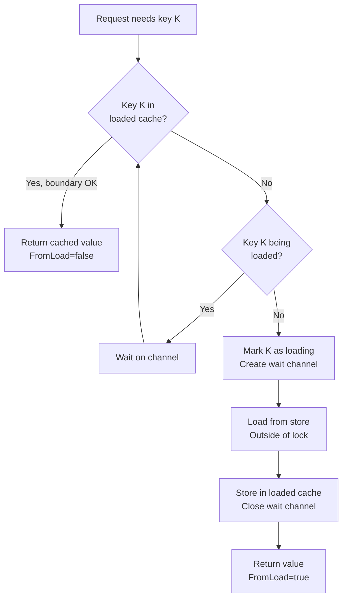
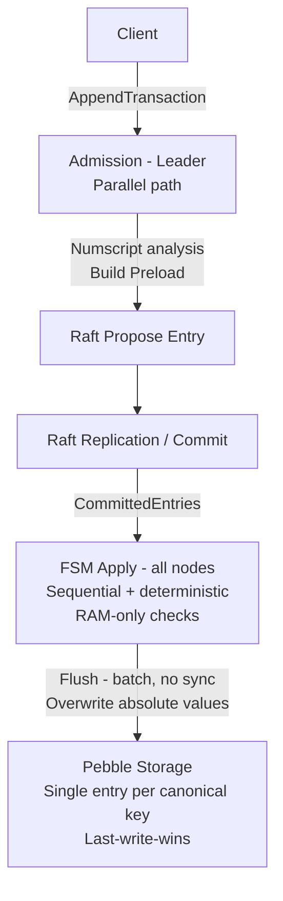
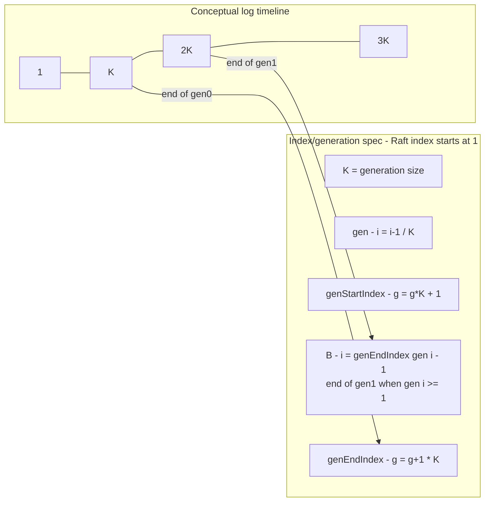

# RFC: Deterministic FSM Cache + Preload (Raft Ledger + Pebble)

**Status:** Implemented
**Scope:** Raft FSM apply determinism, cache strategy, admission + Preload, AttributeLoader for concurrent loads, storage layout, snapshots, backpressure
**Non-goals:** consensus algorithm changes, networking, client API semantics beyond admission/preload requirements

---

## 0. Executive Summary

We need to enforce ledger invariants (e.g. `balance >= threshold`) deterministically on **all Raft nodes** while keeping the FSM apply loop **RAM-only** (no `Pebble.Get()` in `Apply()`).

We achieve this with:

1. A **deterministic working set** based on Raft log **generations** (`gen0/gen1`) derived only from Raft indexes.
2. An **Admission** path (leader-side, parallel) that builds a **Preload** payload at a **canonical generation boundary** `B(i)` and attaches it to the Raft entry.
3. A storage model that persists **absolute values** (single-entry, last-write-wins per canonical key), enabling Admission to read the latest known values for Preload.

Snapshots are **not synchronized** across nodes (etcd/raft), therefore snapshots must include `gen0 + gen1`.

---

## 1. Problem

We operate a Raft-based ledger (3 nodes):

- Leader proposes transaction entries.
- Entries replicate, commit, and apply on **all nodes**.

### 1.1 The bug class we are preventing

During in-flight replication/apply:

- Pebble may return an **older** balance than what is logically implied by already-committed / soon-to-be-applied entries.
- Followers may not have required accounts in RAM.
- We must prevent a scenario where:
  - the leader accepts a transaction,
  - but a follower cannot apply it deterministically (or “rejects” it) due to local cache state.

### 1.2 Workload patterns

- **Hot accounts:** frequently reused (wallets, clearing accounts)  
  → should remain in RAM nearly always.

- **Cold / one-shot accounts:** touched once (or twice) then never again  
  → often absent from RAM, but must not degrade apply correctness.

- **Mixed:** a few hot accounts + many cold accounts  
  → this is the primary motivation for deterministic cache + Preload to avoid Pebble Get storms and follower divergence.

---

## 2. Goals and Non-Goals

### 2.1 Goals

- **Deterministic apply:** every committed Raft entry is applicable on every node.
- **Checks on all nodes:** invariants like `balance >= threshold` run during apply on every node.
- **Apply is RAM-only:** no blocking I/O in `Apply()`.

### 2.2 Non-goals

- Forcing snapshots to occur at generation boundaries.
- Achieving identical *timing* of persistence across nodes.
- Eliminating all Pebble reads: Admission can read Pebble; Apply must not.

---

## 3. Definitions

### 3.1 FSM (Finite State Machine)

The **FSM** is the deterministic state transition function:

- Consumes committed Raft entries sequentially (strict index order).
- Updates ledger state (volumes, metadata, internal indexes, etc.).
- Maintains the deterministic working set (in-memory cache).

**FSM constraints:**

- deterministic
- single-threaded in order
- no blocking I/O in `Apply()`

### 3.2 Admission

**Admission** is the leader-side phase executed before proposing an entry to Raft.

- runs on a parallel path (not in the apply loop)
- uses optimistic, fine-grained locking (per-account locks, canonical ordering)
- builds and embeds Preload to guarantee apply determinism

### 3.3 Preload

**Preload** is data attached to the Raft entry so that Apply can execute decisions without store reads.

Preload provides **base values** (volumes and optionally metadata) aligned to a **canonical boundary index**.

---

## 4. Deterministic Cache via Generations

We use a deterministic cache rule derived only from Raft indexes (not time, not LRU).

### 4.1 Generation definition

A **generation** is a fixed-size block of the Raft log.

Pick a constant `K` entries per generation.

All nodes see identical Raft indexes → identical generations.

### 4.2 Functions (spec)

Raft indexes start at 1.

- `gen(i) = (i - 1) / K`
- `genStartIndex(g) = g*K + 1`
- `genEndIndex(g) = (g + 1)*K`

### 4.3 Working set

We keep two generations:

- `gen0`: accounts touched in the current generation
- `gen1`: accounts touched in the previous generation

Guarantee:

```
Cache(i) = gen0 ∪ gen1
```

Any account touched in the last `~2K` entries is guaranteed in RAM at apply time.

### 4.4 Rotation (deterministic)

On apply of entry `i`:

- if `gen(i) != currentGen`:
  - `gen1 = gen0`
  - `gen0 = empty`
  - `currentGen = gen(i)`

Rotation depends only on the index.

---

## 5. Canonical Boundary for Preload (Borne)

Admission forges Preload at a canonical boundary index `B(i)` that depends only on the index being applied.

Let `g = gen(i)`.

- If `g >= 1`:

```
B(i) = genEndIndex(g - 1)   // end of gen1
```

- If `g = 0`:

```
B(i) = 0   // initial state
```

**Key property:** Preload may embed a volume that is older than the latest value, as long as it is correct at boundary `B(i)`. All Raft entries since `B(i)` have already been applied in the in-memory cache (absolute volume updates), so the preloaded value is only used to seed the cache for accounts not yet present.

Correctness model:

```
Volume@apply(i) = absolute VolumePair in cache (seeded from Preload@B(i) if not yet present, then updated in place by each Apply)
```

---

## 6. Preload

### 6.1 Contents

A Raft entry includes:

- `preload_index = B(i)` (canonical boundary for this entry)
- `preload_volumes[acct]` (absolute `VolumePair {input, output}` at `preload_index`)
- optional `preload_meta[acct]` (metadata required for decisions)
- optionally: additional base material needed for deterministic script execution

### 6.2 Why “older volume” is OK

Preload is a consistent snapshot at boundary `B(i)`. All nodes will apply the same Raft entries after `B(i)` in the same order, updating volumes in place identically, producing identical final state.

---

## 7. Admission (Leader-side, Parallel)

Admission must ensure that the entry is applyable everywhere.

### 7.1 Parallel path and locking

Admission runs outside FSM apply:

- It may lock accounts to avoid race conditions between concurrent requests.
- Locking is optimistic:
  - fine-grained locks per account
  - canonical ordering to avoid deadlocks
  - short duration
- Admission must not block global FSM state.

### 7.2 Numscript requirements

To decide Preload correctly, Admission needs **ahead-of-time** information about which accounts require base values and metadata.

The dependency discovery uses an **emulation-based approach** via `DiscoverNumscriptDependencies` (in `internal/domain/processing/numscript/emulate.go`). Rather than static analysis, the script is executed against a `discoveryStore` that returns infinite balances, allowing the full script to run and recording which accounts/assets are queried.

#### 7.2.1 Discovery Approach

The `discoveryStore` implements the Numscript `Store` interface:
- `GetBalances` returns `MaxForceBalance` (2^256) for every account/asset, and records each queried `VolumeKey`
- `GetAccountsMetadata` is rejected with `ErrMetaNotSupported` (scripts using `meta()` cannot be preloaded)
- A determinism check ensures `GetBalances` is called at most once; a second call indicates a non-deterministic script

```go
func DiscoverNumscriptDependencies(
    cache *NumscriptCache,
    script string,
    vars map[string]string,
    ledger string,
) (*DiscoveryResult, error)
```

The `DiscoveryResult` contains:
- `SourceVolumes`: accounts queried via `GetBalances` (posting sources)
- `DestinationVolumes`: accounts that only appear as posting destinations
- `Metadata`: account metadata keys read during execution (**note:** this field exists in the struct but is currently never populated by `DiscoverNumscriptDependencies` -- scripts using `meta()` are rejected with `ErrMetaNotSupported` before any metadata keys can be recorded)
- `WrittenMetadata`: account metadata keys written via `set_account_meta`

**Known limitation:** With infinite balances, `oneof` may only query the first source, since the first source always has sufficient funds.

### 7.3 Deterministic Preload decision rule

For each account with volume or metadata needs:

- if it is not guaranteed in `Cache(nextIndex)` (i.e., outside `gen0 ∪ gen1` at `nextIndex`)  
  → include the required volumes/metadata in Preload.

This rule is deterministic (index-based) and must not depend on best-effort caches.

### 7.4 Admission algorithm (recommended)

1) Extract accounts and their requirements from Numscript analysis  
2) Sort accounts canonically and lock them  
3) Read `nextIndex` (serialize via an append mutex if needed)  
4) Compute `B(nextIndex)` and cache-guaranteed set `Cache(nextIndex)`  
5) For each account outside cache with volume or metadata needs:
   - read absolute value from Pebble (`Get` on canonical key) for required assets/keys  
6) Propose Raft entry embedding:
   - `preload_index = B(nextIndex)`
   - `preload_payload` for required accounts (volumes per asset, metadata per key)

### 7.5 Admission invariants

- Apply must never need `Pebble.Get()`
- required base/meta must be available in RAM (`gen0/gen1`) or in Preload
- otherwise: invariant violation `MISSING_PRELOAD` (bug)

### 7.6 Concurrent Load Coordination (AttributeLoader)

When multiple concurrent requests need the same attribute (e.g., same account balance), we avoid duplicate store loads using an `AttributeLoader` per attribute type.

#### Problem

Without coordination:
- Request A needs balance for account X, starts loading from store
- Request B needs balance for account X, also starts loading from store
- Both requests read the same data redundantly

#### Solution: AttributeLoader

Each attribute type (Volumes, References, Ledgers, Boundaries, SinkConfigs, AccountMetadata, etc.) has a dedicated `AttributeLoader[T]` that:

1. **Tracks loading keys**: When a goroutine starts loading a key, it's marked as "loading"
2. **Wait on pending loads**: Other goroutines needing the same key wait for the ongoing load
3. **Cache loaded values**: Once loaded, the value is cached with its boundary
4. **Cleanup after apply**: Values are removed from the loader after the command is applied (data is then in the FSM cache)

The `AttributeLoader` uses 256-shard partitioning (`loaderShards = 256`) keyed by `U128.Lo()` to reduce contention under high concurrency. Each shard has its own `sync.RWMutex` and independent loading/loaded maps, with cache-line padding to prevent false sharing. Located in `internal/infra/preload/loader.go`.

```go
type loaderShard[T any] struct {
    mu      sync.RWMutex
    loading map[attributes.U128]chan struct{}
    loaded  map[attributes.U128]*loadedEntry[T]
    _       [64]byte // cache-line padding
}

type AttributeLoader[T any] struct {
    shards [loaderShards]loaderShard[T]
}

type loadedEntry[T any] struct {
    boundary uint64  // Boundary at which value was computed
    value    T
}
```

#### Loading Flow



#### RWMutex Optimization

The loader uses `sync.RWMutex` for optimal concurrency:

| Operation | Lock Type | Allows |
|-----------|-----------|--------|
| Check loaded cache (fast path) | `RLock` | Concurrent reads |
| Check if loading | `RLock` | Concurrent reads |
| Add to loading map | `Lock` | Exclusive |
| Update loaded cache | `Lock` | Exclusive |
| Remove from cache | `Lock` | Exclusive |

#### Cleanup with CleanupToken

The `CleanupToken` tracks which keys were loaded for each attribute type during a preload build. It pairs each loader with the keys loaded through it:

```go
type trackedLoader struct {
    loader LoaderOps
    keys   []attributes.U128
}

type CleanupToken struct {
    tracked []trackedLoader
}
```

> **Note:** Reversions do not use an `AttributeLoader` — they are stored as an in-memory `bitset.Bitset` (from `internal/pkg/bitset/bitset.go`) that is always authoritative. No preloading or Pebble lookups are needed. See [Attributes - Reversions](../attributes/attributes.md#reversions) for details.

After the command is applied (success or error), `CleanupToken.Release()` removes the keys from their respective loaders. This is safe because:
- On success: The FSM cache now has the values
- On error: The values should not be retained (stale boundary)

---

## 8. FSM Apply (All nodes)

FSM Apply is deterministic and RAM-only.

### 8.1 Apply checks

For each account requiring base/meta:

1. If present in RAM → OK  
2. Else must exist in Preload → materialize it in RAM  
3. Else → invariant violation (`MISSING_PRELOAD`)

Then:

- execute checks (`balance >= threshold`, etc.)
- update absolute volumes in place (increase Output for sources, Input for destinations)
- touch accounts into `gen0`

### 8.2 Rejections

Business rejection (e.g., insufficient funds) is a deterministic outcome of apply and must be encoded as a deterministic result of the command execution (response semantics outside scope).

---

## 9. Absolute Volumes in RAM Cache

The in-memory cache stores **absolute volumes** (`VolumePair {input, output}`), not deltas.

Model:

```
Volume@apply(i) = absolute VolumePair in gen0/gen1 cache, updated in place by each Apply
Balance = Volume.Input - Volume.Output
```

When a previously uncached account is needed at apply time:

- seed the cache entry from the Preload value (absolute volume at `B`)
- subsequent applies update the cached volume in place (add to Input or Output)
- the account is touched into `gen0`

---

## 10. Snapshots (etcd/raft)

Snapshots are not synchronized across nodes. We do not force snapshots at generation boundaries.

Therefore, replay alone cannot reconstruct the same working set reliably.

### 10.1 Snapshot content (robust)

Include:

- `K`
- `currentGen`
- `gen0` and `gen1` (presence, and values if materialized)
- other FSM state required for deterministic continuation

Restore:

- restore `gen0/gen1`
- resume replay from `lastIncludedIndex + 1`

---

## 11. persistedIndex + Backpressure (rare)

### 11.1 persistedIndex definition

`persistedIndex` is the last Raft index whose effects are visible in Pebble after successful `Batch.Commit()`.

Used for:

- observability: persistence lag
- admission guardrail: ensure the store is up-to-date enough for reading values at boundary `B`
- restart diagnostics

It must never drive rotation/eviction.

### 11.2 Backpressure condition

If the store is too far behind to provide coherent values for accounts not in the cache:

- condition: `storeIndex < baseIndex(gen1)` (equivalently: cannot read values at `B(i)`)
- Admission must apply backpressure (queue/retry) until catch-up

In practice: expected negligible with continuous Pebble flush (batch + no sync).

---

## 12. Storage model (Pebble): single-entry last-write-wins

### 12.1 Data model

Each canonical key has **exactly one Pebble entry**, overwritten in place on every apply. There is no Raft index in the key and no per-index history.

All volumes are always preloaded (sources AND destinations) before processing, so the FSM always has absolute values. Admission reads the latest persisted value via a simple `Get` on the canonical key.

### 12.2 FSM writes

FSM flushes at apply time (batch, no sync):

- overwrite the absolute volume value for each touched canonical key (a single `Set` per key)
- no cleanup needed: `Set` overwrites the previous value in place

### 12.3 Backup preparation (backup only)

There is exactly one entry per canonical key, so there is no attribute compaction. Backup preparation (`PrepareForBackup`) leaves the attribute zone byte-for-byte intact and only resets cluster-local and checkpoint-era state: applied index → 0, persisted config deleted, cluster-transient zone wiped, persisted bloom blocks and Raft peers dropped, and the cache zone cleared (checkpoint-era cache rows predate the replayed delta and would otherwise serve stale CacheHits on the restored node).

### 12.4 Pebble key layout

All attributes use a unified key format:

```
[KeyPrefixAttributes(1B)][attr type(1B)][canonical key(NB)]
```

Each canonical key has exactly one Pebble entry, overwritten in place. Reads are simple point lookups via `Get`.

---

## 13. Future optimization: internal compact account IDs

Account IDs may be long strings (e.g. 64 chars). This increases RAM/snapshot overhead.

Future improvement:

- introduce internal `accountKey = hash128(accountID)` (or assigned compact ID)
- reduce map/set overhead in `gen0/gen1` and snapshots

Collision mitigation options are out-of-scope here but should be considered in implementation.

---

## 14. Mermaid diagrams

### 14.1 Global flow (Admission → Raft → FSM → Pebble)



### 14.2 Generations and canonical boundary



---

## 15. Checkpoint orders and the "single committer" invariant

The Pebble main store has exactly one writer: the `runCommitter` goroutine
owned by the applier. Every write goes through `Machine.CommitPreparedBatch`,
which `runCommitter` calls sequentially — one batch in flight at any time.

To preserve this invariant in the presence of orders that require a Pebble
**physical checkpoint** to be created (currently `CreateQueryCheckpoint` and
`CloseChapter`), we enforce:

1. **Admission constraint.** A `raftcmdpb.Proposal` may carry N orders, but
   if any order is a checkpoint trigger (`CreateQueryCheckpoint` or
   `CloseChapter`), it **must be the last order** in `proposal.Orders`.
   `internal/application/admission` rejects bulk requests that violate this
   with `ErrCheckpointOrderNotLast`.

2. **FSM safety net.** `PrepareEntries` calls
   `state.ValidateCheckpointEntryPositions` upfront — before taking the lock
   or mutating any in-memory state — and `applyProposal` re-validates the
   per-proposal ordering with `state.ClassifyCheckpointOrderPosition`. Any
   proposal slipping past admission (replay of pre-fix proposals, hand-crafted
   bypass) makes the FSM return a fatal error rather than silently committing,
   and the upfront placement check guarantees no partial state mutation
   occurs before rejection.

3. **Applier pre-split.** Before passing a `[]raftpb.Entry` slice to
   `PrepareEntries`, the applier scans for checkpoint triggers and splits
   the slice so any trigger entry is always the LAST in its sub-batch
   (`findCheckpointBoundary`). Entries past the trigger go to the spool
   and are replayed once the maintenance window clears.

Result: every `PrepareEntries` → `CommitPreparedBatch` pair commits exactly
one Pebble batch, and the post-commit sentinel reads a snapshot pinned to
that commit. There is no concurrent commit path on the main store; any
cache/pebble divergence reported by the sentinel is a genuine FSM bug.

See issue [#424 / EN-1235](https://github.com/formancehq/ledger/issues/424)
for the race this design eliminated.

## 16. Summary

- Deterministic cache uses `gen0/gen1`, derived only from Raft index.
- Admission (leader, parallel) builds Preload aligned to canonical boundary `B(i)`.
- Apply is RAM-only and enforces checks on every node deterministically.
- Preload may include an "older" volume at `B(i)`; subsequent applies update absolute volumes in place, ensuring correctness.
- Snapshots are not aligned across nodes → snapshot must embed `gen0 + gen1`.
- Pebble stores one entry per canonical key (last-write-wins, overwritten in place).
- `persistedIndex` is an operational guardrail and backpressure signal (rare), not a rotation input.
- Checkpoint-triggering orders are always the last in their proposal AND the last in their PrepareEntries slice, keeping `runCommitter` the sole writer to the main store.
- `AttributeLoader` coordinates concurrent attribute loads to prevent duplicate store reads.
