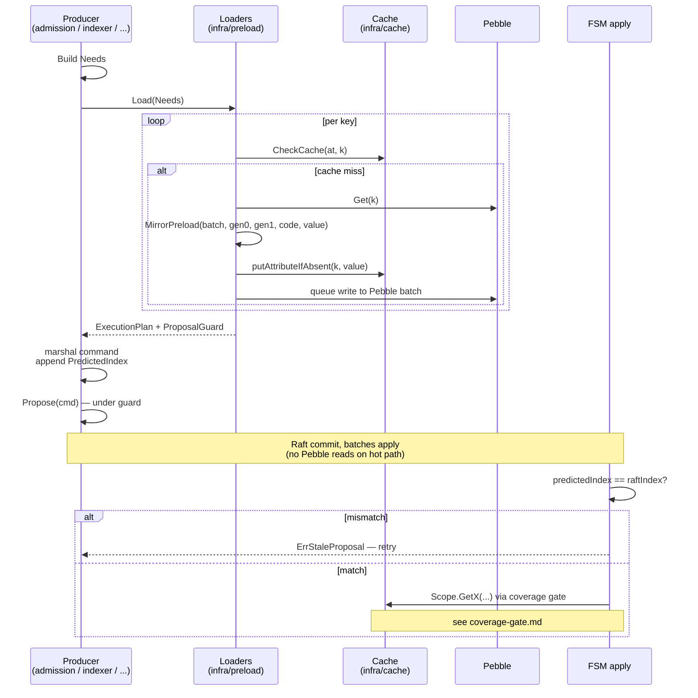

# Preload

## Overview

The FSM apply path is forbidden from reading Pebble (see [CLAUDE.md invariant #3](../../../../../AGENTS.md)). Every attribute it consults during apply must already be in the in-memory **attribute cache** by the time the proposal lands. The job of preload is to make that true.

Preload runs at **propose time**, before the proposer takes the cache-rotation guard. It reads from the cache first, falls back to Pebble for cache misses, and **mirrors** what it fetched back into the cache via `MirrorPreload` — so the FSM, on every replica, sees the same value when it later does `Scope.GetX(...)`.

The contract has three load-bearing parts: the **`Needs` declaration** (who owns what), the **`MirrorPreload` write** (how values land in the cache deterministically), and the **`PredictedIndex` field** (how a mid-flight mutation between propose and apply is detected).

## The `Needs` struct

`internal/infra/plan/needs.go:9-23` defines what a component is asking for:

```go
type Needs struct {
    Ledgers           []string
    Boundaries        []BoundaryKey
    Volumes           []VolumeKey
    IdempotencyKeys   [][]byte
    References        []ReferenceKey
    Metadata          []MetadataKey
    Transactions      []TransactionKey
    SinkConfigs       []string
    NumscriptVersions []NumscriptVersionKey
    NumscriptContents []NumscriptContentKey
    PreparedQueries   []PreparedQueryKey
    LedgerMetadata    []LedgerMetadataKey
    Indexes           []IndexKey
}
```

Every keyed access the FSM apply path might perform has a dedicated field. The shape is intentionally flat and concrete — no introspection, no generic "look up whatever you might need", just an enumeration declared by the caller.

## Component owns its `Needs`

The rule is in [`feedback_component_owns_its_preload`](../../../../../AGENTS.md): **each component that produces a proposal declares its own `Needs`.** Concretely:

| Producer | Where its `Needs` are built |
|----------|----------------------------|
| Admission (incoming write requests) | `extractPreloadNeeds()` per order type, in `internal/application/admission` |
| Index builder mirror (`IndexReady`-style technical updates) | `internal/application/indexbuilder` |
| Idempotency-eviction scheduler | `internal/application/admission/idempotency_eviction` (uses an empty `Needs` — nothing to preload) |
| Metadata converter | `internal/infra/state/metadata_converter` |
| Cluster-config reconciler | `internal/bootstrap/cluster_config` (uses an empty `Needs`) |
| Mirror worker (external ingest) | `internal/application/mirror` |

There is **no central registry** mapping proposal types to `Needs`. Such a registry was rejected on the grounds that it couples the preload package to every proposal type and tends to fall behind reality. Instead, every producer carries its own declaration, next to the code that knows what the apply path will read.

The shared helper `proposeTechnical(ctx, builder, proposer, cmd, operations)` (`internal/bootstrap/propose_technical.go:40-65`) takes the operations + their `Needs` as a parameter — never inspects the command body. Callers with no cache-keyed reads pass `nil` or an empty `Needs` (cluster config, idempotency eviction).

## `MirrorPreload` — how values land in the cache

`internal/infra/state/cache_snapshotter.go:162-242` and signature at `375-390`:

```go
func (s *CacheSnapshotter) MirrorPreload(
    batch *dal.WriteSession,
    gen0Byte, gen1Byte byte,
    attrCode AttributeCode,
    value RawValue,
)
```

The function does two things atomically in the propose-time batch:

1. **Writes to the cache** — both generation 0 and generation 1 receive the value via `putAttributeIfAbsent` (no-op if the cache already has a newer value at that key). This is what makes `Release()` a perf optimisation rather than a correctness primitive: the FSM cache holds the *committed* state under its own primitive, independent of the loader lifecycle.
2. **Writes to Pebble** — the same value is queued in the `dal.WriteSession`, so even if a replica crashes between mirror and FSM apply, the next boot's recovery rebuilds the cache from Pebble exactly as the leader saw it.

Tombstones (deleted keys) follow the same path with a sentinel value; the cache then knows the key is "confirmed absent" rather than "unknown" — which matters because the coverage gate distinguishes them.

## The `PredictedIndex` field — catching mid-flight mutations

Between the moment a producer preloads `(key=K, value=V)` and the moment the FSM applies the proposal at Raft index `I`, **another proposal at index < I might mutate K**. The preloaded `V` would then be stale by the time apply runs.

The fix: the producer stamps the proposal with the **predicted Raft index** at which it expects to land (`internal/infra/plan/predicted_index.go:5-20` — raw wire bytes for proto field 7, a `fixed64`). The FSM checks at apply time that the actual index matches the predicted index. If they differ — meaning the cache state observed at predict time may not be the cache state at apply time — the FSM rejects with `ErrStaleProposal` and the proposer rebuilds.

`proposeTechnical` retries `ErrStaleProposal` up to a small bound (~5) before giving up.

## The cache layers consumed by the FSM

The attribute cache (`internal/infra/cache/cache.go`) holds two generations:

- **Gen0** — the active generation, populated on every preload.
- **Gen1** — the previous generation, kept for `--cache-rotation-threshold` Raft indices after rotation.

`CheckCache(at, k)` (`cache.go:157-198`) returns one of three states:

| State | Meaning |
|-------|---------|
| `CacheGuaranteed` | Cache is authoritative for `k` at Raft index `at`. |
| `CacheNeedsTouch` | Cache may have rotated; the loader must re-verify against Pebble. |
| `CacheMiss` | Cache does not hold a value for `k`. The FSM treats this as `ErrNotFound`. |

The FSM apply path **never** reads Pebble on a `CacheMiss` — the call is a silent no-op for that read. This is enforced structurally: the apply path holds a `*dal.WriteSession`, which deliberately has no `Get`/`NewIter` methods. Only Pebble's `dal.Store.OpenWriteSession()` produces a session, and only declared lifecycle paths may call it (see [CLAUDE.md invariant #4](../../../../../AGENTS.md)).

## Loaders — the propose-time scaffolding

`internal/infra/preload/loader.go:161-174` defines a `Loaders` struct that groups one loader per `Needs` field (Volumes, References, Ledgers, Boundaries, SinkConfigs, AccountMetadata, NumscriptVersions, Transactions, NumscriptContents, PreparedQueries, LedgerMetadata, Indexes).

Each loader:

1. Resolves the requested keys against the cache (Gen0 → Gen1) — sharded 256 ways (`loader.go:40-65`) to avoid contention.
2. On miss, opens a Pebble read snapshot and fetches.
3. Calls `MirrorPreload` to write the value back into the cache + Pebble batch.
4. Returns the value to the caller.
5. Holds an in-flight refcount on the key so concurrent proposals at the same Raft index see the same value.

`Release()` decrements the refcount when the proposal completes. The naming is misleading — `Release` does **not** evict anything from the cache; it only ends the loader's hold. The cache entry itself stays for as long as the rotation policy allows ([`project_loaders_release_is_optimization`](../../../../../AGENTS.md)).

## Putting it together



The contract that makes this all work: **what admission preloaded** == **what the FSM is allowed to read**. That second half is enforced by the [coverage gate](coverage-gate.md).
