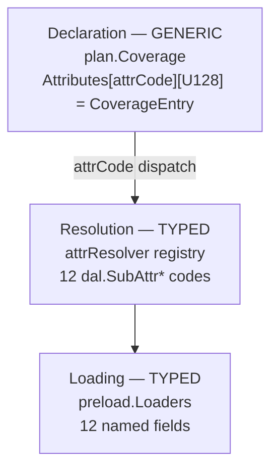
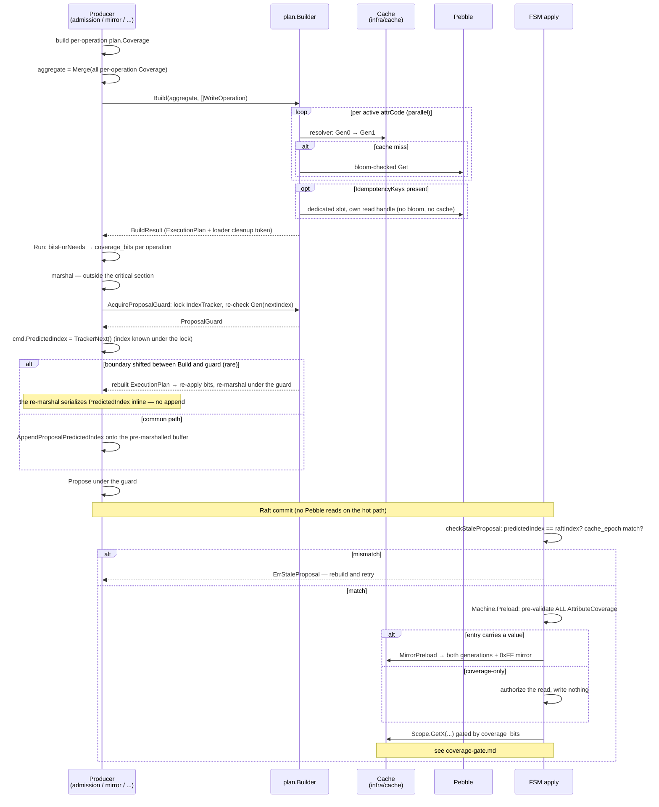

# Preload

## Overview

The FSM apply path is forbidden from reading Pebble (see [CLAUDE.md invariant #3](../../../../../AGENTS.md)). Every attribute it consults during apply must therefore already be resident in the in-memory **attribute cache** by the time the proposal lands. The job of preload is to make that true.

Preload **resolves** at propose time, before the proposer acquires the proposal guard: it reads the cache first and falls back to Pebble on a miss. What it produces is not a cache mutation but a set of `AttributeCoverage` entries carried on the proposal's `ExecutionPlan` (`internal/infra/plan/resolve.go` only appends values). Those entries come in two kinds — **seeds**, carrying a value the resolver had to fetch from Pebble, and **coverage-only**, carrying no value because the cache already holds the key or it is confirmed absent. Only seeds are written into the cache; coverage-only entries just authorise the gated read. The distinction is spelled out under [seed vs coverage-only](#attributecoverage--seed-vs-coverage-only).

The cache write happens later, on the **FSM apply path**: `CacheSnapshotter.MirrorPreload`, called from `Machine.Preload` strictly after `checkStaleProposal` has passed. That ordering is what makes the mechanism deterministic — every replica seeds from the same committed bytes, and a stale proposal is rejected before it can touch the cache — so the FSM sees the same value on every replica when it later does `Scope.GetX(...)`.

**Scope of this page.** It owns the propose side: how a producer *declares* what its apply path will read, how those declarations are *resolved* and *loaded*, and how the result is handed to the FSM through `ExecutionPlan`. It does **not** own:

- apply-time enforcement of the declaration → [coverage gate](coverage-gate.md)
- generation rotation, bloom filters and cache internals → [cache layers](cache-layers.md)
- rejection of proposals whose target index is out of cache reach → [admission cache horizon](../admission/admission-cache-horizon.md)

## The three layers

The single most important thing to internalise: **declaration is generic; resolution and loading stayed typed.**

An earlier design carried one typed field per attribute kind all the way from the producer down to the loader. Only the *declaration* layer was collapsed into a generic map keyed by attribute code. Below it, `internal/infra/plan/attribute_resolvers.go` still holds a typed resolver per code, and `preload.Loaders` still has one named field per attribute type. Reading a generic shape at the top and concluding that the whole pipeline went generic is the mistake to avoid.


```mermaid
flowchart TB
    D["Declaration — GENERIC<br/>plan.Coverage<br/>Attributes[attrCode][U128] = CoverageEntry"]
    R["Resolution — TYPED<br/>attrResolver registry<br/>12 dal.SubAttr* codes"]
    L["Loading — TYPED<br/>preload.Loaders<br/>12 named fields"]
    D -->|"attrCode dispatch"| R --> L
```

## Layer 1 — declaring coverage (generic)

`Coverage` (`internal/infra/plan/coverage.go`) is what a producer fills in:

```go
type CoverageEntry struct {
    Canonical []byte // canonical bytes, retained for the resolver's Pebble Get
    Tag       uint64 // XXH3-64 collision detector, precomputed at Add time
}

type Coverage struct {
    Attributes      map[byte]map[attributes.U128]CoverageEntry
    IdempotencyKeys map[domain.IdempotencyKey]struct{}
    collision       error // first XXH3-128 collision, surfaced at Build via Err()
}
```

The map-of-maps shape collapses **12** of the 13 former typed key fields into a single generic dispatch keyed by attribute code — the same code the FSM uses to route through `AttributeCoverage.attr_code`. The 13th, idempotency, did **not** collapse: it survives as the separate `IdempotencyKeys` field and is never routed by `attr_code`. See [idempotency keys are a separate channel](#idempotency-keys-are-a-separate-channel) for why.

**`Coverage.Add(attrCode byte, canonical []byte)`** records one key. `attributes.MakeKey(canonical)` returns `(id attributes.U128, tag uint64)`; the `id` becomes the map key and the `tag` is stored alongside the canonical bytes. `Add` is **idempotent** — a repeat `Add` for the same key is a no-op, so duplicate declarations within one proposal deduplicate for free. The caller **transfers ownership** of the slice: it must not mutate `canonical` afterwards.

**Why `CoverageEntry.Tag` exists.** The map holds exactly one entry per 128-bit `id`. If two genuinely distinct canonical keys collide on that id (~2^-128), the second would be **silently dropped**, and the order would reach apply without its Pebble seed — a silent cache miss, which is precisely the failure mode preload exists to prevent. The stored `Tag` makes that case detectable: same `id`, different `tag` means a real collision. `Add` then fails loudly rather than quietly — `assert.Unreachable(...)` plus a recorded, returnable `attributes.ErrCollisionDetected` that `Build` picks up through `Coverage.Err()` and turns into a hard proposal failure. This is [invariant #7](../../../../../AGENTS.md): never silently skip a branch that is impossible by design.

**`Coverage.AddIdempotencyKey(key string)`** allocates the `IdempotencyKeys` map lazily. Most proposals — system-scoped orders, index management, chapter operations — carry none, so paying an empty-map header per order would be waste.

**`Coverage.Merge(src *Coverage)`** unions every key set from `src` into the receiver. Admission uses it to fold per-operation coverage into a single proposal-wide aggregate while keeping the per-operation `Coverage` values available for `coverage_bits` computation. `Merge` performs the same collision check as `Add`, and propagates a collision already recorded on the source.

**`WriteOperation`** (`internal/infra/plan/write_operation.go`) pairs a declaration with where its bitset must land:

```go
type WriteOperation struct {
    Coverage *Coverage // nil or empty == "no reads"
    Target   *[]byte   // address of the []byte field the bitset is written into; nil == discard
}
```

The two fields are independent, and the common no-read case is **not** "both nil". Every technical-update producer whose handler reads no cache state — the events emitter, the backup proposer, cluster config, idempotency eviction — still sets `Target` to the technical update's `CoverageBits` and leaves only `Coverage` nil, so the empty bitset is always stamped:

```go
operations := []plan.WriteOperation{{
    Coverage: nil, // apply reads no FSM cache state
    Target:   &proposal.GetTechnicalUpdates()[0].CoverageBits,
}}
```

`Target` is nil only when the bitset is genuinely to be discarded. A nil `Coverage` contributes nothing to the fast-path decision on its own: `Builder.Run` gates on the **aggregate** across the whole proposal (`build.aggregate.AttributeKeysCount() == 0`), so one operation's nil `Coverage` does not select the fast path if another operation contributes cache-attribute keys. Either way it says nothing about where the bits land.

## The producer owns its declaration

Every component that emits a proposal declares its own `Coverage`, next to the code that knows what the apply path will read:

| Producer | Where it builds `Coverage` |
|----------|----------------------------|
| Admission | `extractPreloadNeeds`, `extractLedgerScopedNeeds`, `extractSystemScopedNeeds`, `addTransactionTargetNeeds`, `resolveScriptsAndEnrichNeeds` — `internal/application/admission/admission.go` |
| Mirror worker | `extractMirrorNeeds` — `internal/application/mirror/worker.go` |
| Events emitter | `internal/application/events/emitter.go` — empty `Coverage` |
| Backup proposer | `internal/bootstrap/backup_proposer.go` |
| Cluster-config reconciler | `proposeClusterConfigIfNeeded` — `internal/bootstrap/module.go` — empty `Coverage` |
| Idempotency-eviction scheduler | `internal/infra/state/idempotency_eviction_scheduler.go`, wired in `internal/bootstrap/module.go` — empty `Coverage` |

There is **no central proposal-type → `Coverage` registry**. Such a registry was rejected: it couples the preload package to every proposal type and reliably falls behind reality. The component knows what it reads, so the component declares it.

That is a different thing from the `attrCode` → resolver registry described in the next section, which **is** central. Conflating the two is what made the older wording confusing:

- **no** central mapping from *proposal type* to *which keys it needs* — that lives with each producer;
- **one** central mapping from *attribute code* to *how to resolve a key of that kind* — that lives in `internal/infra/plan/attribute_resolvers.go`.

The shared helper for technical proposals is:

```go
func proposeTechnical(
    ctx context.Context,
    builder *plan.Builder,
    proposer plan.Proposer,
    cmd *raftcmdpb.Proposal,
    operations []plan.WriteOperation,
) error
```

in `internal/bootstrap/propose_technical.go`. It never inspects the command body — the caller supplies the `WriteOperation` slice, coverage included. Callers whose apply path performs no cache-keyed reads pass an empty `Coverage` (or a nil one). It retries `domain.ErrStaleProposal` up to `maxTechnicalStaleRetries` (5) before giving up. Note the package: the sentinel lives in `internal/domain`. The `plan` package exports no `ErrStaleProposal` — its own errors are `ErrCacheHorizonExceeded`, `ErrMarshalProposal` and `ErrAcquireProposalGuard`.

## Layers 2 and 3 — resolution and loading (typed)

`internal/infra/plan/attribute_resolvers.go` holds a `map[byte]attrResolver`, with **12** registered `dal.SubAttr*` codes:

`SubAttrLedger`, `SubAttrBoundary`, `SubAttrVolume`, `SubAttrReference`, `SubAttrSinkConfig`, `SubAttrNumscriptVersion`, `SubAttrNumscriptContent`, `SubAttrTransaction`, `SubAttrMetadata`, `SubAttrPreparedQuery`, `SubAttrLedgerMetadata`, `SubAttrIndex`.

Each is a `protoAttrResolver[T]` carrying its `attrCode`, `typeName`, `cache`, `loader`, `getValue` and `bloom`. The generic `Coverage.Attributes` key — the `attrCode` byte — is what selects the resolver, and from there everything is typed again.

The bloom filter is consulted **here**, at the resolution layer, not below it: `bloom` is a field on the resolver, and it is held as a closure rather than a captured pointer because `bloom.FilterSet` is swappable across the ledger's lifetime.

`internal/infra/preload/loader.go` defines the typed loading layer. `Loaders`, built by `preload.NewLoaders()`, has **12 named fields** — one per attribute type, each an `*AttributeLoader[T]`:

`Volumes`, `References`, `Ledgers`, `Boundaries`, `SinkConfigs`, `AccountMetadata`, `NumscriptVersions`, `Transactions`, `NumscriptContents`, `PreparedQueries`, `LedgerMetadata`, `Indexes`.

This is the surviving typed shape, and `loader.go` (plus its test) is the entire package — the loaders are the only thing `internal/infra/preload` contains. Everything upstream of them, including the parallel resolution that drives them, lives in `internal/infra/plan`.

The division of labour between the two layers is easy to get wrong: **the loader never touches the attribute cache.** The hit/miss verdict is taken above it, in the `plan` package — `resolveCoverage` asks `AttributeCache.CheckCache(nextIndex, id)` (`internal/infra/plan/resolve.go`) and only on a miss hands the loader a Pebble-`Get` closure. `loader.go` holds no cache reference at all; the only cache-derived thing it sees is a `cacheEpoch` scalar.

Each loader then:

1. **single-flights** the load per key (`loading map[attributes.U128]chan struct{}`), so concurrent proposals resolving the same key perform one Pebble read and observe the same value;
2. **memoizes** the loaded value (`loaded map[attributes.U128]*loadedEntry[T]`), validity keyed by `validFor(boundary, cacheEpoch)`, so a later proposal in the same generation reuses it;
3. **shards its own two maps** 256 ways, keyed by `U128.Lo()`, to avoid mutex contention — the sharding is over the loader's maps, not over the cache.

`Release()` deletes the memoized entry — it does **not** decrement a refcount, and it **evicts nothing** from the attribute cache, whose entry survives for as long as the rotation policy allows.

### `MirrorPreload` — two functions, one name

The **FSM-facing** entry point is on `CacheSnapshotter` (`internal/infra/state/cache_snapshotter.go`):

```go
func (s *CacheSnapshotter) MirrorPreload(
    batch *dal.WriteSession,
    gen0Byte, gen1Byte byte,
    attrID *raftcmdpb.AttributeID,
    attrCode byte,
    value *raftcmdpb.AttributeValue,
) error
```

It populates **both** in-memory generations and mirrors to `0xFF` at both byte positions. `attrCode` picks the slot; `value.raw_value` carries the vtproto-marshalled bytes; `attrID` carries the U128 plus the xxh3 collision tag.

There is **also** a slot-level `MirrorPreload` on `protoSnapshotSlot[V]` — the inner call the `CacheSnapshotter` method dispatches to once `attrCode` has selected the slot. It takes the two generation bytes, the `attrID` and the marshalled bytes directly, with no `attrCode` and no `*raftcmdpb.AttributeValue`, because the slot already knows its own type.

The discriminator between them: **only the `CacheSnapshotter` method takes `attrCode`.** A signature without `attrCode` is the slot-level call, and it is not what `Machine.Preload` invokes.

## The `ExecutionPlan` handoff

`Builder.Build(aggregate *Coverage, operations []WriteOperation) (*BuildResult, error)` (`internal/infra/plan/builder.go`) resolves the aggregate and produces the `ExecutionPlan` the proposal carries. `Builder.Run(...)` (`internal/infra/plan/runner.go`) drives the whole propose sequence around it.

`ExecutionPlan` (`misc/proto/raft_cmd.proto:761`):

| Field | Meaning |
|-------|---------|
| `fixed64 lastPersistedIndex = 1` | cache-generation boundary index computed at propose time from the *predicted* next Raft index (`cache.BoundaryIndex(nextIndex, GenerationThreshold)`, `internal/infra/plan/builder.go`); `Machine.Preload` requires it to equal the base index of Gen0 or Gen1, else the seeds would target a generation that no longer exists (hard error + `assert.Unreachable`). Despite the name it is **not** a persistence cursor — that is `Machine.LastPersistedIndex()`, an unrelated value. |
| `fixed64 cache_epoch = 4` | cache epoch at admission time; the FSM rejects on mismatch |
| `repeated AttributeCoverage attributes = 6` | the resolved coverage entries |
| `repeated ReloadIdempotencyKey idempotency_keys = 7` | the separate idempotency channel |
| `reserved 2, 3, 5, 8` | former `preloads`, `touches`, `declared`, `productions` |

### `AttributeCoverage` — seed vs coverage-only

`AttributeCoverage` (`misc/proto/raft_cmd.proto:793`) carries `AttributeID id = 1`, `uint32 attr_code = 2` and an **optional** `AttributeValue value = 3`. That optionality is the whole distinction:

- **`value` set ⇒ seed.** The key was a cache miss at admission and the Pebble load hit, so the entry carries the value and the FSM seeds the cache through `MirrorPreload`.
- **`value` nil ⇒ coverage-only.** The entry authorises the read but writes nothing. No preemptive promote pass is needed: `AttributeCache.Get`'s gen0→gen1 fallback handles the read, and `AttributeCache.Del`'s lazy Gen0-tombstone fabrication handles the delete.

`AttributeValue` holds a single `bytes raw_value = 1` — the value is type-erased on the wire, and the FSM dispatches the typed unmarshal via the parent entry's `attr_code`.

### `coverage_bits`, computed per operation at marshal time

`bitsForNeeds(needs *Coverage, plans []*raftcmdpb.AttributeCoverage) []byte` and `bitsForNeedsWithIndex(...)` (`internal/infra/plan/coverage_bits.go`) turn one operation's `Coverage` into a packed bitset over `ExecutionPlan.attributes`.

`Builder.Run` assigns the result onto each operation's `Target` **immediately before every marshal** — the happy path and the rare rebuild under the proposal guard alike. Bit positions must be re-resolved at marshal time because the `ExecutionPlan` is only finalised after `Build` and may be swapped out on a rebuild; a bitset computed once and reused would index into the wrong plan.

The bitset lives on `OrderTechnical` (`misc/proto/raft_cmd.proto:64`) and `TechnicalUpdate` (`misc/proto/raft_cmd.proto:486`) — **not** on the order body. That move was EN-1558: technical execution data is kept out of the audit hashes, so stamping `coverage_bits` does not disturb the business-intent bytes the audit chain binds.

### `PredictedIndex` and the proposal guard

Between the moment a producer resolves `(key=K, value=V)` and the moment the FSM applies the proposal at Raft index `I`, another proposal may mutate `K`. The preloaded `V` would then be stale at apply.

`AppendProposalPredictedIndex(data []byte, index uint64) []byte` (`internal/infra/plan/predicted_index.go`) stamps the expected index onto the already-marshalled proposal by appending the raw wire encoding of `Proposal.predicted_index` (a `fixed64`, under the field number read from the descriptor at init rather than a hardcoded literal); it is a no-op when the index is 0. Appending raw bytes avoids re-marshalling a possibly-megabyte `Proposal` while holding the proposal lock. That is the common path only: when the guard finds the boundary shifted it must re-marshal the rebuilt proposal anyway, and the fresh marshal serializes `PredictedIndex` inline, so the append is skipped (`internal/infra/plan/runner.go` — the index is assigned to `cmd` before the branch, then either re-marshalled or appended, never both).

At apply, the FSM compares the predicted index against the actual one. A mismatch means the observed cache state may no longer hold, so the proposal is rejected with `ErrStaleProposal` and the producer rebuilds and retries.

## Idempotency keys are a separate channel

Idempotency keys are declared through `Coverage.AddIdempotencyKey` but are **not** a cache attribute:

- They are **loaded** in `Builder.Build` as a dedicated slot running in parallel with the per-`attrCode` resolver slots. That slot opens its own `store.NewReadHandle()` and reads Pebble directly — **no bloom filter, no dual-generation cache**.
- They are emitted as `[]*raftcmdpb.ReloadIdempotencyKey` and ride on `ExecutionPlan.idempotency_keys`, deliberately outside the `AttributeCoverage` list so the wire makes the distinction visible.
- At apply they go to the dedicated `IdempotencyStore`, not the attribute cache — hence "Reload" rather than pre-load — and the coverage gate does not track them.

`Builder.Run`'s **no-preload fast path** (`runWithoutPreload`, taken whenever `AttributeKeysCount() == 0`) strips `attributes` and `cache_epoch` from the plan but deliberately keeps `IdempotencyKeys`. This is the path an **idempotency-only proposal** actually takes, not the proposal-guard rebuild: `AttributeKeysCount` excludes idempotency keys (`internal/infra/plan/coverage.go`), so a proposal declaring no cache reads has a zero count and never reaches the guard's revalidation at all. Treating "no attribute coverage" as "no plan to apply" would drop the keys and let a duplicate order apply twice.

## Cache horizon and cache epoch

`ExecutionPlan.cache_epoch` is stamped at admission time on any plan that carries attribute coverage. The FSM rejects such a proposal when its epoch does not match the current one — a mismatch means the cache was reset in between, so nothing the plan resolved can be trusted.

The gate is therefore scoped, not universal: a proposal that reads nothing from the cache carries no `cache_epoch` at all, because `runWithoutPreload` strips it along with `attributes` (see the no-preload fast path above). That is deliberate — an idempotency-only proposal resolved nothing the reset could invalidate, so letting a cluster-config cache reset between `Build` and apply reject it would fail a proposal that is still perfectly valid.

The related question of whether the proposal's target index is still within cache reach at all is answered on the admission side; see [admission cache horizon](../admission/admission-cache-horizon.md) rather than duplicating the rules here.

## Putting it together


```mermaid
sequenceDiagram
    participant P as Producer<br/>(admission / mirror / ...)
    participant B as plan.Builder
    participant C as Cache<br/>(infra/cache)
    participant Peb as Pebble
    participant FSM as FSM apply

    P->>P: build per-operation plan.Coverage
    P->>P: aggregate = Merge(all per-operation Coverage)
    P->>B: Build(aggregate, []WriteOperation)
    loop per active attrCode (parallel)
        B->>C: resolver: Gen0 → Gen1
        alt cache miss
            B->>Peb: bloom-checked Get
        end
    end
    opt IdempotencyKeys present
        B->>Peb: dedicated slot, own read handle (no bloom, no cache)
    end
    B-->>P: BuildResult (ExecutionPlan + loader cleanup token)
    P->>P: Run: bitsForNeeds → coverage_bits per operation
    P->>P: marshal — outside the critical section
    P->>B: AcquireProposalGuard: lock IndexTracker, re-check Gen(nextIndex)
    B-->>P: ProposalGuard
    P->>P: cmd.PredictedIndex = TrackerNext() (index known under the lock)
    alt boundary shifted between Build and guard (rare)
        B-->>P: rebuilt ExecutionPlan → re-apply bits, re-marshal under the guard
        Note over P: the re-marshal serializes PredictedIndex inline — no append
    else common path
        P->>P: AppendProposalPredictedIndex onto the pre-marshalled buffer
    end
    P->>P: Propose under the guard
    Note over P,FSM: Raft commit (no Pebble reads on the hot path)
    FSM->>FSM: checkStaleProposal: predictedIndex == raftIndex? cache_epoch match?
    alt mismatch
        FSM-->>P: ErrStaleProposal — rebuild and retry
    else match
        FSM->>FSM: Machine.Preload: pre-validate ALL AttributeCoverage
        alt entry carries a value
            FSM->>C: MirrorPreload → both generations + 0xFF mirror
        else coverage-only
            FSM->>FSM: authorize the read, write nothing
        end
        FSM->>C: Scope.GetX(...) gated by coverage_bits
        Note over FSM,C: see coverage-gate.md
    end
```

The phase order in the diagram is load-bearing, and the code calls it out: `checkStaleProposal` runs **before** `Preload` (`internal/infra/state/machine.go`, with an explicit *"Phase ordering matters"* comment). A stale proposal must be rejected before it can seed the cache. Note also that `checkStaleProposal` gates **both** `predicted_index` and `cache_epoch` — the two are one gate, not two.

`Machine.Preload(executionPlan *raftcmdpb.ExecutionPlan, batch *dal.WriteSession, genByte byte) error` (`internal/infra/state/machine.go`) validates **every** `AttributeCoverage` entry before performing the first `MirrorPreload`. Doing it up front is deliberate: a malformed entry or an unknown `attr_code` discovered halfway through would leave the batch half-applied, and an unvalidated entry would otherwise silently zero-pad its way through `MirrorPreload`.

## Where enforcement happens

Preload only establishes the declaration; it does not police it. The contract that makes the whole mechanism sound — **what the producer declared is exactly what the FSM is allowed to read** — is enforced at apply time by `Scope.CheckCoverage(kind byte, key CoverageKey) error` (`internal/domain/processing/store.go`), backed by `gatedScope` (`internal/infra/state/scope.go`), whose dense `coverageSlots` array is indexed by the precomputed `coverageSlotIndex` lookup. `NewScope(coverage_bits)` yields the per-operation read horizon; `NewProposalScope()` yields the proposal-wide one that `ValidateTransientVolumes` needs. See the [coverage gate](coverage-gate.md) for the full rules.
