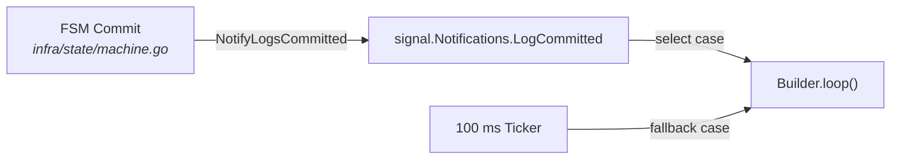
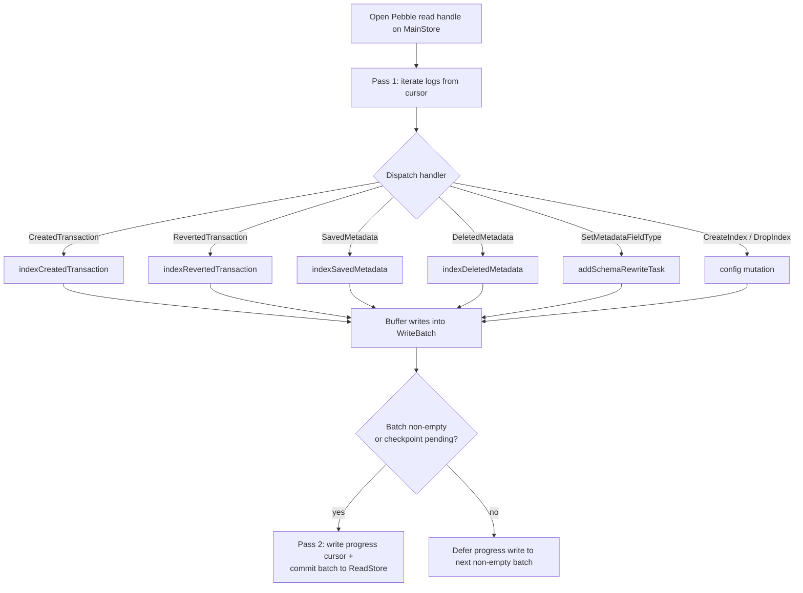

# Indexer Pipeline

## Overview

The **indexer** (`internal/application/indexbuilder`) is the background goroutine that turns committed audit logs into the inverted, queryable keyspaces consumed by the read API. It runs on every node — leader and followers alike — and is intentionally **decoupled from the FSM hot path**: the FSM commits the main store + audit log, then signals the indexer; the indexer reads from its own Pebble read handle and writes to the **read store**, a separate Pebble database with WAL disabled.

This page covers the pipeline mechanics. For the **what** of indexes (definition proto, version state, on-demand statistics, checker coverage), see [indexes.md](indexes.md).

## Builder Lifecycle

### Wake-up



| Trigger | Source |
|---------|--------|
| FSM commit signal | `signal.Notifications.LogCommitted.C()` — fired by the FSM committer via `NotifyLogsCommitted(lastSeq)` (`internal/pkg/signal/notifications.go`). |
| 100 ms fallback ticker | `time.NewTicker(100 * time.Millisecond)` in `Builder.loop()`. Guarantees progress even if the signal layer is starved. |
| Cancellation | `ctx.Done()` (wired through `worker.Worker`). |

The ticker is intentional: an indexer that wakes only on signal would stall on signal-channel loss or under heavy GC pressure. The 100 ms cap bounds query-staleness even in the worst case.

### Goroutine ownership

`Builder.Start()` wraps `Builder.loop(ctx)` in a `worker.New().RunCtx(...)` (`internal/pkg/worker`). The worker owns goroutine lifetime; `Builder.Stop()` cancels the worker's context and waits for the loop to drain. There is **no panic recovery** inside the loop — an indexer panic is a non-recoverable invariant violation (see `feedback_no_soft_wall_crash_on_invariant`).

### Boot

On `Start()`, the builder:

1. Reads the persisted progress cursors (main + AppliedProposal) — see [Progress Cursors](#progress-cursors).
2. Reads all `IndexVersionState` rows under `SubInternalIndexVersion` into an in-memory map.
3. Performs an **initial catch-up pass** with a larger batch size, stripping `BUILDING` indexes from the dispatch set so partially-built keyspaces do not get half-populated rows before backfill resumes.

## `processLogs` — Two-Pass Commit



`internal/application/indexbuilder/process_logs.go`.

### Pass 1 — iterate + dispatch

- Opens a direct Pebble read handle on the **main store** (`query.ReadLogsSince(ctx, handle, cursor, ...)`).
- Iterates committed logs starting at `cursor + 1`.
- For each log entry, calls `b.indexPayload(kb, cfg, ledger, payload, excludedVolumes)`, which switches on the payload type and dispatches to the matching handler.
- Handlers buffer their key/value writes into a single `readstore.WriteBatch` (`b.wb`) that wraps an underlying `dal.WriteSession`; they never `Commit()` themselves.
- An `AppliedProposal` cursor is advanced in lock-step so the next pass can filter transient-account postings deterministically.

### Pass 2 — commit (or skip)

- If the batch is non-empty (or a checkpoint action is pending), the progress cursor is **written into the same batch** and the batch is committed in one `batch.Commit()`. This makes "index writes" and "indexer progress" atomic — a crash mid-pass cannot leave the progress ahead of the data.
- If the batch is **empty** (no log type in the range produced index writes), the Pebble batch is skipped entirely and the progress cursor is persisted lazily on the next non-empty batch (or via a small dedicated batch at loop exit). This reduces fsyncs to `O(1)` per active batch instead of `O(1)` per tick.
- Query-checkpoint create/delete operations force a batch boundary so the checkpoint state is never persisted across two passes.

## Handlers

`internal/application/indexbuilder/process_logs.go` — the `indexPayload` dispatcher and every per-payload handler live in this single file.

| Log type | Handler | What it writes |
|----------|---------|---------------|
| `CreatedTransaction` | `indexCreatedTransaction` | Postings-address mappings (any / source / destination via `WriteAccountTxMapping` + `WriteSourceAccountTxMapping` + `WriteDestinationAccountTxMapping`), reference / timestamp / inserted-at builtin indexes, account-metadata via `dualWriteMetadataIndex`, transaction-metadata via `dualWriteMetadataIndex`. Existence rows are written by `dualWriteMetadataIndex` *only* for entities that carry an indexed metadata key — there is no standalone transaction-existence or account-existence write. |
| `RevertedTransaction` | `indexRevertedTransaction` | Inverse adjustments to the postings mappings; the revert link is kept (not deleted) so revert lookups stay queryable. |
| `SavedMetadata` | `indexSavedMetadata` → `dualWriteMetadataIndex` | New `(value, entity)` row in the metadata index, plus a reverse-map row for later schema rewrites. |
| `DeletedMetadata` | `indexDeletedMetadata` → `dualDeleteMetadataEntry` | Removes the metadata index row and the reverse-map row. |
| `SetMetadataFieldType` | `addSchemaRewriteTask` | Schedules a deferred rewrite that re-encodes the existing values under a new type tag (see [Schema Rewrite](#schema-rewrite)). |
| `CreateIndex` / `DropIndex` | `handleCreatedIndexLog` / `handleDroppedIndexLog` | Mutates the in-memory `indexVersions` map and writes the initial / cleared `IndexVersionState`. |

### Dual-write while a rewrite is in flight

When `IndexVersionState.PendingVersion != 0`, metadata-index handlers go through `dualWriteMetadataIndex` (`builder.go:194-226`) and write the **same encoded value** to **both** `v_current` and `v_pending` keyspaces. The encoding always uses the **current declared type** in `LedgerInfo` — which, during a `SetMetadataFieldType` rewrite, is already the *new* type (the FSM has applied the schema change before the indexer dispatches the log). The two versions differ only by the version embedded in their keys, not by the encoding of the value.

This is what allows the atomic switch (see below) to flip the served version with zero rebuild cost at the moment of the switch — `v_pending` is already fully consistent with live writes by the time the rewrite cursor reaches the head. See the [Changing a Metadata Key's Type](#changing-a-metadata-keys-type-setmetadatafieldtype) section for the transient query semantics this design produces during the rewrite window.

## Read Store Key Layout

`internal/storage/readstore/keys.go`.

The read store partitions its keyspace by a single leading byte:

| Prefix | Purpose | Helper |
|--------|---------|--------|
| `0x01` | Metadata index (forward) | `MetadataIndexPrefixV` / `MetadataIndexKeyV` |
| `0x02` | Entity existence (null / non-null counters) | `EntityExistsKeyV`, `EntityExistsNonNullPrefixV`, `EntityExistsNullPrefixV` |
| `0x03` | Reverse map (entity → metadata values, for rewrites) | `AccountReverseMapKeyV`, `TransactionReverseMapKeyV` |
| `0x04` | Account → transaction mapping | `AccountTxKey` |
| `0x05` | Source-account → transaction | dedicated key builder |
| `0x06` | Destination-account → transaction | dedicated key builder |
| `0x07` | Transaction reference index | dedicated |
| `0x08` | Transaction timestamp index | dedicated |
| `0x09` | Per-ledger logs | dedicated |
| `0x0A` | Per-ledger log date index | dedicated |
| `0x0B` | Transaction inserted-at index | dedicated |
| `0xFE` | Internal | sub-prefix below |

Internal sub-prefixes (`0xFE` + 1 B):

| Sub | Purpose | Helper |
|-----|---------|--------|
| `0x01` | Last-indexed log sequence (main progress cursor) | `ProgressKey` |
| `0x02` | Last-indexed AppliedProposal sequence | `AppliedProposalProgressKey` |
| `0x03` | Backfill cursors (per index) | `BackfillCursorKey` |
| `0x04` | Per-replica `IndexVersionState` (per index) | `IndexVersionStateKey` |

### The versioned metadata-index key

```
[0x01] [ledger 64B] [ns:] [metadataKey \x00] [version 4B BE] [typedValue] [entityID]
```

`ledger` is fixed-width (`dal.LedgerNameFixedSize` = 64B, zero-padded). `ns:` is the entity namespace — currently `"a:"` for accounts and `"t:"` for transactions; not a fixed width, but always followed by `\x00` after `metadataKey`.

Two adjacent versions share the same prefix up to the `version` field, so a single Pebble `DeleteRange` over `MetadataIndexPrefixV(..., v)` cleanly drops a whole version in one operation (used by GC after an atomic switch).

### Value encoding

`internal/storage/readstore/encoding.go` — a single-byte type tag plus a sort-preserving encoding:

| Tag | Type | Encoding note |
|-----|------|---------------|
| `S` | string | raw bytes + `\x00` terminator |
| `I` | int64 | XOR-flipped sign bit so byte-order matches numeric order |
| `U` | uint64 | big-endian |
| `B` | bool | one byte |
| `N` | null | original raw string + `\x00` terminator — preserved so a re-encoded null row keeps its source value visible through `NullValue.Original` (`encoding.go:73-81`) |

`DecodeValue` reads the tag and dispatches. The `SetMetadataFieldType` rewrite path is the *only* place where two different tags coexist for the same `(entity, metadataKey)` — and only briefly, across `v_current` / `v_pending`.

## Progress Cursors

Two cursors live under the internal prefix:

| Cursor | Key | Encoding |
|--------|-----|----------|
| Main log progress | `[0xFE][0x01]` | `uint64` big-endian — the highest log sequence whose effects are fully written to the read store. |
| AppliedProposal progress | `[0xFE][0x02]` | `uint64` big-endian — paired cursor used for transient-account filtering. |

Both are written **inside the same Pebble batch** as the index writes they certify. `LastIndexedSequence()` reads the main cursor on boot; `NotifyProgress()` broadcasts the new value to readers waiting on a `min_log_sequence` barrier.

## Backfill — Atomic Switch

Two distinct backfill paths share the same atomic-switch primitive:

| Path | When | Cursor |
|------|------|--------|
| Index backfill | `CreateIndex` for a new index, or a fresh replica catching up | A log-sequence cursor (replay history from 0 to head). |
| Schema rewrite | `SetMetadataFieldType` for an existing index | A reverse-map cursor (iterate live entities, re-encode under the new type tag). |

**Index backfill** (initial `CreateIndex`): `IndexVersionState = {Current: 0, Pending: 1}` and queries return `ErrIndexBuilding` until the switch — there is no served `v_current` yet. `effectiveCurrentVersion` promotes `0 → 1` for live writes, so the dual-write call site degenerates to a single write at `v=1` (the pending version), which is also where the backfill replays history. No real dual-write occurs.

**Schema rewrite** (`SetMetadataFieldType` on an already-built index): `IndexVersionState = {Current: N, Pending: N+1}` with `N ≥ 1`. Queries continue to serve `v_current = N` while live writes are dual-written to both `v_current` and `v_pending` (see [Dual-write while a rewrite is in flight](#dual-write-while-a-rewrite-is-in-flight)), and the rewrite scan re-encodes pre-existing rows into `v_pending`.

### `completeBackfill` — the switch

The two paths use the **same** switch primitive but write **different** batches.

**Index backfill path** (`internal/application/indexbuilder/backfill.go:1197+`, `completeBackfill`). There is no `v_old` keyspace to reclaim — the index has never been served before, the previous "version" is the empty sentinel `v=0`. The batch performs a single operation:

1. `WriteIndexVersionState(batch, ledger, canonicalID, {Current: pending, Pending: 0, RewriteProgress: nil})` — flips the served version.
2. `batch.Commit()`.

No `gcVersionAt` call is needed (and none is made — see the explicit comment in `backfill.go:1193-1196`).

**Schema-rewrite path** (in `processSchemaRewrite`, around `backfill.go:855-864` and the deferred-switch path at `backfill.go:931-937`). The batch additionally reclaims the old keyspace:

1. `WriteIndexVersionState(batch, ledger, canonicalID, {Current: pending, Pending: 0, RewriteProgress: nil})`.
2. `gcVersionAt(batch, old)` — `DeleteRange` over `MetadataIndexPrefixV(..., old)` and `EntityExistsKey…PrefixV(..., old)`, plus per-key reverse-map cleanup at `gcReverseMapVersion`. Immediate, in-batch, **not deferred**.
3. `batch.Commit()`.

The single-batch commit is what makes the version flip + old-version GC atomic from a query's point of view: there is no instant at which a query could observe `Current = new` and still see live keys at `v_old`.

### Deferred switch (`scanComplete` gate)

If the rewrite's scan cursor has reached the head **but** `LastIndexedSequence < requiredIndexedSeq` (i.e. the FSM has committed logs past what the indexer has applied), the switch must be deferred: flipping early would expose `v_new` keys that do not yet contain the late writes. The builder sets `task.scanComplete = true`, commits the `v_pending` writes alone, and the next loop tick calls `tryCommitScanCompleteSwitch()`, which re-checks the gate and fires the switch as a small standalone batch once the indexer catches up. See `backfill.go:889-959`.

## Changing a Metadata Key's Type (`SetMetadataFieldType`)

Re-typing a metadata key (e.g. `category: string → int`) is the most subtle path the indexer handles. It is the operation that **re-encodes all live entities at a new type tag** while continuing to serve queries against the old encoding — and it is the original motivation for the dual-write + versioned-keyspace machinery described above. (A second `SetMetadataFieldType` arriving while a previous rewrite is still in flight is the only other trigger: it resets the in-flight task's cursor to start over under the new target type, see `addSchemaRewriteTask` → `backfill.go:310-324`.)

### Order flow

1. **Admission** receives a `SetMetadataFieldTypeRequest` and emits a `SetMetadataFieldTypeOrder(target, key, type)` (`internal/application/admission/admission.go:1391-1405`). The admission layer preloads the current `MetadataID` (READY or BUILDING) so the FSM can read the prior schema state (`admission.go:995-1002`). **There is no pre-validation of value convertibility** — admission only validates the metadata key shape via `ValidateMetadataKey`.
2. **FSM apply** updates the per-ledger schema in `LedgerInfo` and emits a `SetMetadataFieldType` audit log. The corresponding `Index.forward_encoding_version` is bumped (cluster-wide).
3. **Indexer**, on the next tick, sees the log in `processLogs` and dispatches to `addSchemaRewriteTask` (`internal/application/indexbuilder/backfill.go:247+`). Two transitions happen in the same Pebble batch as the indexer's progress write:
   - `bumpPendingVersion(ledger, indexID)` — sets `IndexVersionState.PendingVersion = max(pending, current) + 1` and persists it. In steady state this is `current + 1`; the `max(pending, …)` only matters when a second `SetMetadataFieldType` lands during an in-flight rewrite, in which case the version keeps climbing rather than being recycled.
   - A `schemaRewriteTask` is registered in memory with the target type, an empty reverse-map cursor, and `requiredIndexedSeq = 0`. The gate watermark is **not** sampled at task creation — it is sampled per batch later, see [below](#atomic-switch--and-why-it-is-gated).

### What runs during the rewrite — a state scan, not a log replay

`processSchemaRewrite` (`backfill.go:545-887`) is the workhorse. The important framing: the rewrite is a **scan of derived state**, not a replay of logs. There is **no log-sequence upper bound** — the iterator runs from the persisted cursor to the EOF of the reverse-map keyspace under a Pebble snapshot. Each indexer tick runs one budget-bounded slice:

1. **Iterate the reverse map** for `(ledger, namespace, key)` between the persisted cursor and the prefix upper bound (`backfill.go:597-650`). The iterator runs on a read-store snapshot taken at the start of the batch. Reverse-map entries that already live at `v_pending` are skipped — they were written by the dual-write path while the rewrite was running, and re-touching them would be wasted work (`backfill.go:727-735`).
2. **Fetch the raw value** from the FSM-side canonical attribute store (`fetchStoredMetadataValue`) — *not* from the forward index, not from a log. This is the load-bearing design choice: the FSM is the source of truth for stored values, so the rewrite is a pure function of stored state and is safe to cancel-and-restart on a new `SetMetadataFieldType`. **Convert** through `commonpb.ConvertMetadataValue` to the new type. Notable behaviour: **conversion failures silently downgrade to `NullValue`** with the original payload preserved in `value.Original` (`internal/proto/commonpb/metadata_convert.go:221-260`). There is no error returned, no `LastError` set on the `Index` — a "category" field that was numeric strings retyped to `int` will lose its non-numeric rows to `null`. This is a known limitation of the current path.
3. **Write to `v_pending`** via `ReplaceMetadataIndexV` (`backfill.go:781-787`): delete any prior `v_pending` forward-index + existence keys for that entity, write the new ones, update the reverse-map row at the pending version.
4. **Persist the cursor** in the same batch as the writes, so a crash resumes from exactly the same reverse-map position.

While this loop runs, new `SavedMetadata` / `DeletedMetadata` logs continue to land in `processLogs`. The handlers detect `PendingVersion != 0` and dual-write the **same encoded value** to both `v_current` and `v_pending` — the encoding always uses the current declared type, which by the time the indexer sees these logs is already the *new* type. The rewrite never has to "catch up" to live writes — they keep `v_pending` fresh autonomously.

> **Consequence — transient query semantics during a rewrite.** Queries continue to scan `v_current` (the gate `requireIndexReady` at `query/compile.go:1319+` returns `CurrentVersion`), and the query parameter is encoded under the *current* declared type. Pre-existing rows in `v_current` that the rewrite has not yet touched are still encoded under the *old* type, so they are **invisible to queries** during the rewrite window. New writes post-`SetMetadataFieldType` land in `v_current` under the new type (via the dual-write) and remain visible. After the atomic switch, queries land on `v_pending`, which is fully re-encoded under the new type — visibility is restored uniformly. This is the only window where queries can see a degraded view of an index, and it is the price the design pays to avoid log-replay machinery in the rewrite path.

> **Design note — why not bound the rewrite to the log that triggered it?**
> A possible alternative design is to bound the scan at the log sequence of the `SetMetadataFieldType` log itself and rely entirely on the dual-write path for everything that comes after. The current code does *not* do that: because step 2 reads the **latest** stored value from the FSM rather than reconstructing the value at the triggering sequence, a row written to `v_pending` may reflect a state newer than the triggering log. This trades off an extra consistency gate at the end (next section) for a much simpler scan loop — no per-row "what was this value at sequence S?" reconstruction, no replay machinery. The gate makes that trade safe.

### Atomic switch — and why it is gated

Once the reverse-map iterator hits EOF, the rewrite *could* fire the switch. But there is a hazard introduced by step 2 above: because the rewrite reads FSM-latest values, a row in `v_pending` may correspond to a log sequence the **read store has not yet applied to its non-versioned keyspaces**. Flipping `Current = pending` early would expose `v_pending` rows whose log sequence is past `LastIndexedSequence()`, breaking the contiguous-prefix invariant that `min_log_sequence` queries rely on.

The fix is the **`requiredIndexedSeq` gate**. It is *not* the bound of the rewrite — it is a post-scan consistency gate:

- **It is sampled per batch, not at task creation.** At the start of every batch of `processSchemaRewrite`, the builder calls `query.ReadLastSequence(fsmHandle)` (`backfill.go:633-637`) and **accumulates the result as a max** into `task.requiredIndexedSeq`. The longer the rewrite takes, the higher the watermark climbs — it tracks the freshest FSM state that any of this task's batches could possibly have observed and encoded into `v_pending`.
- **It is checked at the switch attempt.** Once the scan is exhausted, the switch tries to fire (`backfill.go:821-864`):
  - If `readStore.LastIndexedSequence() >= task.requiredIndexedSeq`, fire immediately: `{Current: pending, Pending: 0}` + `gcVersionAt(old)` in one Pebble batch.
  - Otherwise, set `task.scanComplete = true`, commit the `v_pending` writes alone, and the next loop tick calls `tryCommitScanCompleteSwitch()` (`backfill.go:901-948`), which re-checks the gate and fires the switch as a small standalone batch once the indexer catches up. Note: under steady write load, `requiredIndexedSeq` will *not* keep climbing during this phase because no further `processSchemaRewrite` batches run for this task — `scanComplete` short-circuits the scan setup (`backfill.go:591-593`).

The GC step (`gcVersionAt` → `gc.go:30-95`) reclaims the old forward-index range, the old existence ranges, and walks the reverse map to delete per-key rows at the old version. **For the schema-rewrite path this GC is part of the same atomic batch as the switch** — unlike the index-backfill path where there is no `v_old` to reclaim.

### Cancellation: `RemovedMetadataFieldType`

If the field type is removed mid-rewrite (`RemovedMetadataFieldType`), the indexer purges every versioned namespace for that key (`process_metadata_field_removal.go:37-111`) and `removeSchemaRewriteTaskByField` (`backfill.go`) drops the in-flight task. Any orphan `v_pending` rows are reclaimed by the same purge. No special end-state is needed: the entire key is gone.

### Recovery and observability

| Failure mode | What survives | What replays |
|--------------|---------------|--------------|
| Indexer crashes mid-scan | `IndexVersionState.PendingVersion`, reverse-map cursor (`SubInternalBackfill`), partial `v_pending` writes | The task is re-registered on boot from `IndexVersionState`; the loop resumes from the persisted cursor. |
| Crash *after* `v_pending` writes but *before* the switch | Everything in step 3 above | The next tick re-evaluates the gate and fires the switch. `v_pending` rows already in place are idempotent (`ReplaceMetadataIndexV` deletes-then-writes). |
| Conversion error on a row | `Null` row in `v_pending` with `Original` payload | Nothing — the row is converted once and not retried. **No `LastError` is surfaced**; operators who care must inspect via `InspectIndex` to spot unexpected null counts. |

Queries that need to know whether a rewrite is in flight can read `IndexVersionState` for the target index — `PendingVersion != 0` signals an active rewrite. There is no dedicated wire-level "rewrite progress" endpoint today.

## `min_log_sequence` — Read Barrier

The query API accepts a `min_log_sequence` in the request metadata. It is enforced at the read entry point:

- The controller calls `node.ReadIndexAndWait()` to confirm the FSM has applied at least that sequence (Raft linearizability barrier).
- It then waits for `readStore.LastIndexedSequence() >= min_log_sequence` so the read store has caught up too.

Important nuance: `min_log_sequence` **pins log application on this replica, not local rewrite completion**. A client that needs a value to be visible *under the new type tag* after a `SetMetadataFieldType` must wait for the corresponding atomic switch to land — there is no per-rewrite barrier on the wire today. See [api-comparison.md](../../../contributing/api-comparison.md) for the contract.

## No Cluster-Wide `IndexReady`

There is **no audit-bound `IndexReady` order** in v3. Each replica builds its own indexes independently against the same hash-bound log:

- `CreateIndex` (cluster-bound) defines the index.
- Each replica replays history through its own indexer and decides locally when to flip its `IndexVersionState.CurrentVersion`.
- The query path always reads the **local** `CurrentVersion`. A replica that has not yet completed its local backfill simply reports "index not built locally" and the client retries or contacts another replica.

This is by design: a cluster-wide `IndexReady` would force the slowest replica to gate all readers, defeating the point of building indexes locally. The asymmetry is bounded by the audit log being deterministic — every replica eventually reaches the same `CurrentVersion`.

## Summary

| Concern | Mechanism | File |
|---------|-----------|------|
| Wake-up | `signal.LogCommitted` + 100 ms ticker | `builder.go` |
| Atomicity | Two-pass commit: writes + progress cursor in one Pebble batch | `process_logs.go` |
| Cost control | Empty-batch elision — skip fsync when nothing to write | `process_logs.go` |
| Live dual-write | `v_current` + `v_pending` while a rewrite is in flight | `dualWriteMetadataIndex` |
| Atomic switch | Single batch: `CurrentVersion ← Pending` + `gcVersionAt(old)` | `backfill.go` |
| Deferred switch | `scanComplete` flag + `tryCommitScanCompleteSwitch` gate | `backfill.go` |
| Per-replica readiness | Local `IndexVersionState`, no cluster `IndexReady` order | `readstore/store.go` |
