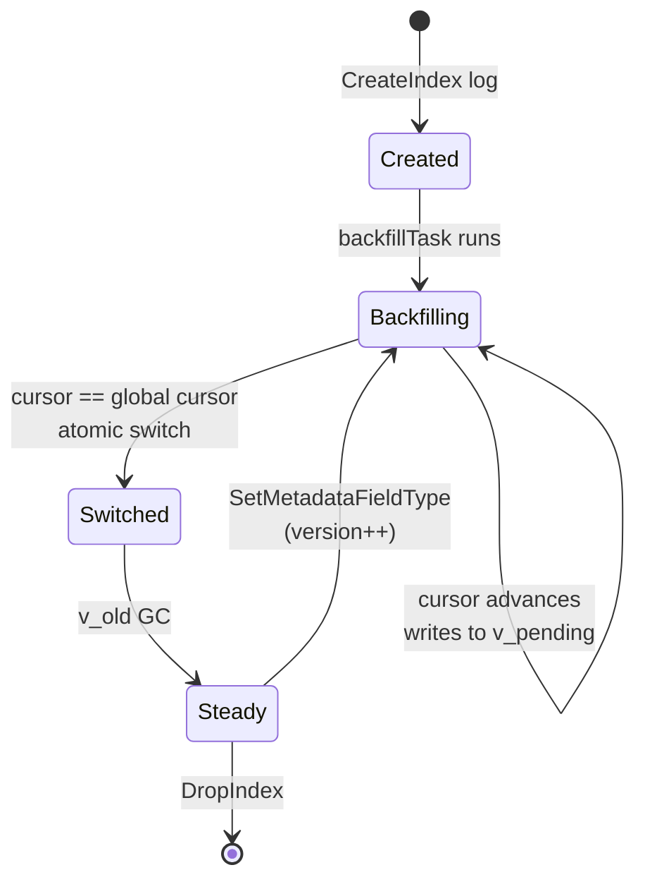

# Indexes

## Overview

Indexes accelerate read queries over per-ledger attributes (notably metadata-keyed lookups on accounts and transactions). Their lifecycle, on-wire definition, and the statistics exposed through the inspection API are decoupled by design:

- The **`Index` proto** is the cluster-wide definition stored in the `SubAttrIndex` registry — what an index is, when it was created, what its current cluster-wide forward-encoding version is. It is a *projection* of the underlying `CreateIndex` / `SetMetadataFieldType` / `RemovedMetadataFieldType` / `DropIndex` / `DeleteLedger` audit logs (which are the only hash-bound records) and is re-derivable by replaying them — see [Checker Coverage](#checker-coverage).
- The **`IndexVersionState`** is the per-replica local view of the rewrite — which version is actually served by queries on this node.
- The **index statistics** (cardinality, min/max, existence counts) are **not persisted**. They are recomputed on demand by scanning Pebble whenever a client calls the inspect API.
- The **bloom filter counters** that show up in monitoring are *not* index statistics — they belong to the bloom layer described in [storage/attributes.md](../attributes/attributes.md).

This page describes how the three layers fit together, and where the checker verifies them.

## Index Definition

Each index is described by a `common.Index` proto, persisted in the `SubAttrIndex` registry. The relevant fields:

| Field | Role |
|-------|------|
| `id` (`IndexID`) | Tagged identifier — built-in (txn/log/account) or `Metadata(target, key)`. |
| `build_status` | **Informational only**, set by the FSM at `CreateIndex` / `SetMetadataFieldType`. NOT consulted by the query path. |
| `created_at`, `last_built_at`, `last_error` | Bookkeeping. |
| `ledger` | Empty for bucket-scoped indexes (e.g. address ranges); set for ledger-scoped indexes. |
| `forward_encoding_version` | **Cluster-wide** version bumped on every audit event that requires the indexer to rewrite the forward index (`CreateIndex`, `SetMetadataFieldType`). |

Source: `internal/proto/commonpb/common.pb.go:2527-2550`.

The comment on `build_status` is the load-bearing one: queries do not look at `BuildStatus == READY`. They consult the per-replica `IndexVersionState.CurrentVersion` instead. `BuildStatus` is a UI/operator signal, not a correctness gate.

## Per-Replica Version State

`readstore.IndexVersionState` is the only state that decides which keyspace queries scan on this replica. It lives under `SubInternalIndexVersion` in Pebble and is **not part of the audit chain** — it is a projection (a per-replica view of cluster-wide rewrite progress).

```go
type IndexVersionState struct {
    CurrentVersion  uint32 // version actually served by queries; 0 = not built locally
    PendingVersion  uint32 // target of an in-flight rewrite; 0 = no rewrite running
    RewriteProgress []byte // opaque cursor for the in-flight rewrite
}
```

Source: `internal/storage/readstore/store.go:339-353`.

### Storage encoding

Fixed 4 B big-endian for each version, followed by the variable-length opaque progress cursor:

```
[ current_version (4B BE) ][ pending_version (4B BE) ][ rewrite_progress … ]
```

`encodeIndexVersionState` / `decodeIndexVersionState`: `internal/storage/readstore/store.go:364-391`.

### Versioned keyspace

Every metadata-index key is prefixed by `MetadataIndexPrefixV(..., version)`, and the same is true for the existence counters (`EntityExistsNonNullPrefixV`, `EntityExistsNullPrefixV`). Two adjacent versions coexist in Pebble while a rewrite is in flight:

```
v_current → served by queries
v_pending → populated by the backfill / rewrite task
```

The atomic switch is a single Pebble batch commit that flips `Pending → Current`. Old-version keys are garbage-collected **in the same batch as the switch for the schema-rewrite path only** — the `CreateIndex` backfill path has no `v_old` to reclaim because the index was never served before. See [indexer.md — `completeBackfill`](indexer.md#completebackfill--the-switch) for the per-path detail.

## Build / Rewrite Lifecycle

A rewrite is driven by `indexbuilder.Builder` (`internal/application/indexbuilder/`). The relevant entry points:

- `handleCreatedIndexLog` — initialises `BuildStatus=BUILDING`, `PendingVersion=1`, `CurrentVersion=0`, persists the version-state row, then registers a `backfillTask` (`internal/application/indexbuilder/index_config.go`).
- `backfillTask` — opaque cursor that replays historical logs into `v_pending`, persisting progress in Pebble so a node restart resumes mid-rewrite (`internal/application/indexbuilder/backfill.go:21-32`).
- `completeBackfill` — when the cursor reaches the global indexer cursor, the **atomic switch** runs: `CurrentVersion ← PendingVersion`, `PendingVersion ← 0`, `RewriteProgress ← nil`, all in one Pebble batch (`backfill.go:1197+`).
- `handleDroppedIndexLog` — removes the index from the in-memory config, cancels any in-flight backfill / schema-rewrite task, and deletes the `IndexVersionState` row (`index_config.go:421-436`). **It does NOT purge the read-store keyspaces** (`0x01` / `0x02` / `0x03`) — those rows are reclaimed only on `RemovedMetadataFieldType` (`process_metadata_field_removal.go`) or `DeleteLedger`.

A `SetMetadataFieldType` order bumps the cluster-wide `forward_encoding_version` and triggers a **schema rewrite** — a distinct code path (`schemaRewriteTask` / `processSchemaRewrite`, see [indexer.md](indexer.md#changing-a-metadata-keys-type-setmetadatafieldtype)) that reuses the same versioning strategy: queries continue to serve `v_current` until each replica completes its local rewrite and flips its own switch. Synchronisation across nodes is client-driven through `min_log_sequence` on the read API (note: that pins **log application**, not local rewrite completion — see `api-comparison.md`).



### Initial indexes vs. later indexes

An index gets a fast path when it is declared in the **same atomic apply batch** as the `CreateLedger` that creates its ledger, before any indexable data log for that ledger. The FSM classifies this per-proposal — a ledger is treated as "born empty" until it emits its first indexable data log — and stamps the result on a new `CreatedIndexLog.initial` boolean.

- **Initial index** (`CreatedIndexLog.initial == true`): there is no history to replay, so the indexbuilder promotes the index straight to live on applying the log — it seeds `IndexVersionState{CurrentVersion: 1, PendingVersion: 0}` and schedules **no** historical backfill. `GetIndexStatus` immediately reports `current_version > 0` and carries no backfill cursor.
- **Later index** (`CreatedIndexLog.initial == false`): the unchanged path described above. This covers an index added to a ledger that already holds data, **and** an index created in a separate apply batch even if the ledger is still empty. It is seeded `IndexVersionState{CurrentVersion: 0, PendingVersion: 1}`, backfilled from cursor `0`, and gated by `current_version == 0` (queries get `ErrIndexBuilding`) until the backfill completes and the atomic switch flips the served version.

The classification is deliberately conservative: only the same-atomic-batch-before-any-data case qualifies as initial. A separate-batch index on a still-empty ledger backfills exactly as before — safe (it replays an empty history and completes immediately), just not routed through the zero-cost promotion.

## Statistics (computed on demand)

There is **no persisted statistics structure**. The figures returned by `InspectIndex` are recomputed by scanning the live Pebble keyspace at the version the caller asks for.

`readstore.InspectParams` accepts a `Version` (always `IndexVersionState.CurrentVersion` from the controller — `0` is an invariant the caller must short-circuit), a mode, and pagination parameters. Three modes are supported (`internal/storage/readstore/inspect.go`):

| Mode | Output | Cost |
|------|--------|------|
| `InspectDistinctValuesMode` | Paginated set of distinct values for the metadata key. | One Pebble seek to the cursor, then linear iteration over the forward index — entries with the same value as the previous one are skipped (`bytes.Equal` check). For a key with many entities per value, walking enough rows to fill a `page_size` worth of *distinct* values can iterate over significantly more than `page_size` keys. |
| `InspectFacetsMode` | `(value, count)` pairs. | Linear scan of the value range. |
| `InspectSummaryMode` | `Cardinality`, `Min`, `Max`, `EntitiesWithKey`, `EntitiesWithNull`. | Full scan (metadata index + two existence prefixes). |

### `InspectResult`

```go
type InspectResult struct {
    Values           []*commonpb.MetadataValue
    Facets           []InspectFacetEntry
    Cardinality      uint64
    Min              *commonpb.MetadataValue
    Max              *commonpb.MetadataValue
    EntitiesWithKey  uint64
    EntitiesWithNull uint64
    HasMore          bool
    NextCursor       []byte
}
```

Source: `internal/storage/readstore/inspect.go:42-52`.

### How `inspectSummary` works

1. Iterate `MetadataIndexPrefixV(..., version)` and count **distinct** value-encoded suffixes — that gives `Cardinality`, `Min`, `Max`.
2. Count keys under `EntityExistsNonNullPrefixV(...)` → `EntitiesWithKey`.
3. Count keys under `EntityExistsNullPrefixV(...)` → `EntitiesWithNull`.

Source: `internal/storage/readstore/inspect.go:228-296`.

The scan is unbuffered — each call rereads the full prefix. This is fine because inspect is a low-frequency operator/UI tool, not a query-planner input: the v3 query path uses **prepared queries** ([prepared-queries draft](../../../../drafts/prepared-queries.md)) rather than a cost-based planner over statistics.

## API Surface

| Layer | Entry point |
|-------|-------------|
| gRPC | `BucketService.InspectIndex` (and `GetIndexStatus` / `GetIndexEntryStatus` / `GetIndex` / `ListIndexes` for the registry + version-state view). |
| HTTP | `GET /v3/{ledger}/indexes/{canonicalId}/inspect` with `?mode=distinct-values|facets|summary`. Sibling per-ledger routes: `GET /v3/{ledger}/indexes` (list), `GET /v3/{ledger}/indexes/{canonicalId}` (single entry), `.../status` (IndexEntry), `POST /v3/{ledger}/indexes` (create), `DELETE .../indexes/{canonicalId}` (drop). Bucket-wide / cluster-wide reads live under the reserved system segment `/v3/_/indexes/…`: `GET /v3/_/indexes` (list, `?scope=all\|bucket`), `GET /v3/_/indexes/status` (aggregated status), `GET /v3/_/indexes/{canonicalId}` (single bucket-scoped entry), `GET /v3/_/indexes/{canonicalId}/status`. All responses serialize the protobuf message in protobuf-JSON camelCase, wrapped in the `{data:…}` envelope. |
| CLI | `ledgerctl indexes inspect --ledger … --key … --mode summary` — see [ops/cli.md §indexes inspect](../../../../ops/cli.md). |

The controller (`internal/application/ctrl/controller_default.go`) gates the inspect call on `state.CurrentVersion != 0` — a replica that has never built the index locally returns "not built locally" rather than scanning an empty keyspace.

## Bloom Filter Metrics (Not Index Stats)

Bloom filters are a separate optimisation that lives in front of the attribute caches. They expose OTel counters (`internal/infra/bloom/bloom.go:641-659`):

| Counter | Meaning |
|---------|---------|
| `bloom.lookups` | Total `MayContain` calls. |
| `bloom.negatives` | Certain misses (skipped Pebble fetch). |
| `bloom.adds` | Insertions. |
| `bloom.false_positives` | `MayContain` said maybe; Pebble said no. |

These are **monitoring signals**, not persisted state and not visible through any inspect endpoint. See [storage/attributes.md](../attributes/attributes.md) for the bloom layer.

## Checker Coverage

Because the index registry and the per-replica version state are projections (only the originating audit logs — `CreateIndex`, `SetMetadataFieldType`, `RemovedMetadataFieldType`, `DropIndex`, `DeleteLedger` — are hash-bound), the checker re-derives the expected set of indexes from the audit chain and compares it to the stored `SubAttrIndex` registry.

- `compareIndexes` (`internal/application/check/checker.go:667+`) verifies **presence + identity** (the `IndexID` matches).
- `BuildStatus` is **intentionally excluded** from the comparison. It is a cluster-wide field on the `commonpb.Index` registry entry but is purely informational — queries gate on the per-replica `IndexVersionState.CurrentVersion`, not on `BuildStatus`. (There used to be a cluster-wide `IndexReadyUpdate` TechnicalUpdate driving the `BUILDING → READY` flip; it has been removed — see [No Cluster-Wide `IndexReady`](indexer.md#no-cluster-wide-indexready) in the indexer page.)
- Mismatches emit `CHECK_STORE_ERROR_TYPE_INDEX_MISMATCH`.

In-flight `IndexVersionState` is NOT checked: by design it is per-replica and may legitimately differ across nodes while a rewrite is propagating.

## Summary

| Concern | Where it lives | Persisted? | Hash-bound? |
|---------|---------------|------------|-------------|
| Index definition (presence + `IndexID`) | `commonpb.Index` in `SubAttrIndex` | Yes | No — projection of `CreateIndex` / `DropIndex` / `RemovedMetadataFieldType` / `DeleteLedger` logs (re-verified by `compareIndexes` — presence + identity only). |
| Cluster-wide rewrite version | `Index.forward_encoding_version` | Yes (with the definition) | No — **not** re-verified by the checker. The version is informational at the registry level; the per-replica `IndexVersionState.CurrentVersion` is what queries gate on, and is also not checked across replicas (legitimately per-local). |
| Per-replica rewrite state | `IndexVersionState` in `SubInternalIndexVersion` | Yes | No — purely local; not compared across replicas. |
| Cardinality / Min / Max / null counts | Computed by `inspectSummary` on demand | **No** | N/A — derived from the live keyspace. |
| Bloom counters | OTel | No | N/A — monitoring only. |
