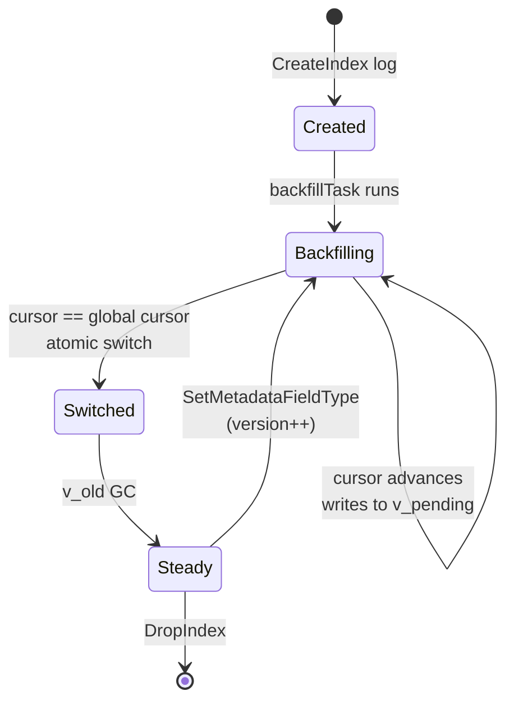

# Indexes

## Overview

Indexes accelerate read queries over per-ledger attributes (notably metadata-keyed lookups on accounts and transactions). Their lifecycle, on-wire definition, and the statistics exposed through the inspection API are decoupled by design:

- The **`Index` proto** is the cluster-wide definition stored in the `SubAttrIndex` registry — what an index is, when it was created, what its current cluster-wide forward-encoding version is. It is a *projection* of the underlying `CreateIndex` / `SetMetadataFieldType` / `RemovedMetadataFieldType` / `DropIndex` / `DeleteLedger` audit logs (which are the only hash-bound records) and is re-derivable by replaying them — see [Checker Coverage](#checker-coverage).
- The **`IndexVersionState`** is the per-replica local view of the rewrite — which version is actually served by queries on this node.
- The **index statistics** (cardinality, min/max, existence counts) are **not persisted**. They are recomputed on demand by scanning Pebble whenever a client calls the inspect API.
- The **bloom filter counters** that show up in monitoring are *not* index statistics — they belong to the bloom layer described in [storage/attributes.md](../attributes/attributes.md).

This page describes how the three layers fit together, and where the checker verifies them.

## Index Definition

Each index is described by a `common.Index` proto, persisted in the `SubAttrIndex` registry. The relevant fields:

| Field | Role |
|-------|------|
| `id` (`IndexID`) | Tagged identifier — built-in (txn/log/account) or `Metadata(target, key)`. |
| `created_at` | Bookkeeping. |
| `ledger` | Empty for bucket-scoped indexes (e.g. address ranges); set for ledger-scoped indexes. |
| `forward_encoding_version` | **Cluster-wide** version bumped on every audit event that requires the indexer to rewrite the forward index (`CreateIndex`, `SetMetadataFieldType`). |

Source: `internal/proto/commonpb/common.pb.go:2527-2550`.

Build progress is deliberately absent from the registry row: it is a per-replica concern. Queries consult the per-replica `IndexVersionState.CurrentVersion`, and the status API derives its display from that state next to the row's cluster-wide `forward_encoding_version`.

## Per-Replica Version State

`readstore.IndexVersionState` is the only state that decides which keyspace queries scan on this replica. It lives under `SubInternalIndexVersion` in Pebble and is **not part of the audit chain** — it is a projection (a per-replica view of cluster-wide rewrite progress).

```go
type IndexVersionState struct {
    CurrentVersion     uint32 // version actually served by queries; 0 = not built locally
    PendingVersion     uint32 // target of an in-flight rewrite; 0 = no rewrite running
    ActivationSequence uint64 // log sequence CurrentVersion's keyspace became complete at; 0 = resolvable at any pin
    RewriteProgress    []byte // opaque cursor for the in-flight rewrite
    HighWater          uint32 // highest version ever allocated locally — version numbers are single-use; survives a drop as the tombstone

    CurrentType         commonpb.MetadataType // declared type CurrentVersion's rows are encoded under (EN-1724)
    CurrentTypeDeclared bool                  // false = bound to no declared type; rows keep each value's natural encoding
    PendingType         commonpb.MetadataType // the retype's target: the type PendingVersion's rows are encoded under
    PendingTypeDeclared bool
}
```

Source: `type IndexVersionState` in `internal/storage/readstore/store.go`.

The type bindings are what keep a retype invisible until the atomic switch: the
declared schema flips at FSM apply, but a query serves `CurrentVersion` and
must validate and encode its conditions under the type those rows actually
carry. The switch promotes `PendingType` into `CurrentType` together with the
version — binding and keyspace flip as one.

### Storage encoding

Fixed 22 B header, followed by the variable-length opaque progress cursor:

```
[ current_version (4B BE) ][ pending_version (4B BE) ][ activation_sequence (8B BE) ][ high_water (4B BE) ][ current_type (1B) ][ pending_type (1B) ][ rewrite_progress … ]
```

A type byte holds `0` for "no declared type bound" and `1 + MetadataType`
otherwise, keeping undeclared distinct from `METADATA_TYPE_STRING` (enum
value 0).

`encodeIndexVersionState` / `decodeIndexVersionState`: `internal/storage/readstore/store.go`.

### Versioned keyspace

Every metadata-index key is prefixed by `MetadataIndexPrefixV(..., version)`, and the same is true for the existence counters (`EntityExistsNonNullPrefixV`, `EntityExistsNullPrefixV`). Two adjacent versions coexist in Pebble while a rewrite is in flight:

```
v_current → served by queries
v_pending → populated by the backfill / rewrite task
```

The atomic switch is a single Pebble batch commit that flips `Pending → Current`. Old-version keys are garbage-collected **in the same batch as the switch for the schema-rewrite path only** — the `CreateIndex` backfill path has no `v_old` to reclaim because the index was never served before. See [indexer.md — `completeBackfill`](indexer.md#completebackfill--the-switch) for the per-path detail.

## Build / Rewrite Lifecycle

A rewrite is driven by `indexbuilder.Builder` (`internal/application/indexbuilder/`). The relevant entry points:

- `handleCreatedIndexLog` — initialises `PendingVersion=1`, `CurrentVersion=0`, persists the version-state row, then registers a `backfillTask` (`internal/application/indexbuilder/index_config.go`).
- `backfillTask` — opaque cursor that replays historical logs into `v_pending`, persisting progress in Pebble so a node restart resumes mid-rewrite (`internal/application/indexbuilder/backfill.go:21-32`).
- `completeBackfill` — when the cursor reaches the global indexer cursor, the **atomic switch** runs: `CurrentVersion ← PendingVersion`, `PendingVersion ← 0`, `RewriteProgress ← nil`, all in one Pebble batch (`backfill.go:1197+`).
- `handleDroppedIndexLog` — removes the index from the in-memory config, cancels any in-flight backfill / schema-rewrite task, and deletes the `IndexVersionState` row (`index_config.go:421-436`). **It does NOT purge the read-store keyspaces** (`0x01` / `0x02` / `0x03`) — those rows are reclaimed only on `RemovedMetadataFieldType` (`process_metadata_field_removal.go`) or `DeleteLedger`. Rows stranded this way survive indefinitely on an otherwise healthy cluster; the leak is tracked as `EN-1621`. It is **not** reported by the checker's reverse-map pass, which deliberately excludes `DropIndex` residue — see [Checker Coverage](#checker-coverage) below.

A `SetMetadataFieldType` order bumps the cluster-wide `forward_encoding_version` and triggers a **schema rewrite** — a distinct code path (`schemaRewriteTask` / `processSchemaRewrite`, see [indexer.md](indexer.md#changing-a-metadata-keys-type-setmetadatafieldtype)) that reuses the same versioning strategy: queries continue to serve `v_current` until each replica completes its local rewrite and flips its own switch. Synchronisation across nodes is client-driven through `min_log_sequence` on the read API (note: that pins **log application**, not local rewrite completion — see `api-comparison.md`).


```mermaid
stateDiagram-v2
    [*] --> Created: CreateIndex log
    Created --> Backfilling: backfillTask runs
    Backfilling --> Backfilling: cursor advances<br/>writes to v_pending
    Backfilling --> Switched: cursor == global cursor<br/>atomic switch
    Switched --> Steady: v_old GC
    Steady --> Backfilling: SetMetadataFieldType<br/>(version++)
    Steady --> [*]: DropIndex
```

### Initial indexes vs. later indexes

An index gets a fast path when it is declared in the **same atomic apply batch** as the `CreateLedger` that creates its ledger, before any indexable data log for that ledger. The FSM classifies this per-proposal — a ledger is treated as "born empty" until it emits its first indexable data log — and stamps the result on a new `CreatedIndexLog.initial` boolean.

- **Initial index** (`CreatedIndexLog.initial == true`): there is no history to replay, so the indexbuilder promotes the index straight to live on applying the log — it seeds `IndexVersionState{CurrentVersion: 1, PendingVersion: 0}` and schedules **no** historical backfill. `GetIndexStatus` immediately reports `current_version > 0` and carries no backfill cursor.
- **Later index** (`CreatedIndexLog.initial == false`): the unchanged path described above. This covers an index added to a ledger that already holds data, **and** an index created in a separate apply batch even if the ledger is still empty. It is seeded `IndexVersionState{CurrentVersion: 0, PendingVersion: 1}`, backfilled from cursor `0`, and gated by `current_version == 0` (queries get `ErrIndexBuilding`) until the backfill completes and the atomic switch flips the served version.

The classification is deliberately conservative: only the same-atomic-batch-before-any-data case qualifies as initial. A separate-batch index on a still-empty ledger backfills exactly as before — safe (it replays an empty history and completes immediately), just not routed through the zero-cost promotion.

## Restore Lifecycle

The index registry (the bucket-scoped `Index` rows under `SubAttrIndex`) is a persisted projection of the audited order stream, so a cross-cluster restore must reproduce it the same way the live apply path built it: the checkpoint's attribute zone carries the rows as of the checkpoint, and `RebuildDelta` (`internal/infra/backup/rebuild.go`, shared with `ledgerctl store bootstrap`) folds every post-checkpoint ledger log into them. The replay evidence is the exported logs themselves — each registry mutation is derived from a log payload alone, never from state the source cluster held outside the export:

- **`CreateIndex`** writes the same fresh registry row the live `processCreateIndex` writes, at `forward_encoding_version` 1, stamped with the enclosing `LedgerLog`'s date (the apply-time effective date). A duplicate `CreateIndex` overwrites the row, matching the live handler.
- **`SetMetadataFieldType`** applies the retype cascade: when a registry row covers the retyped `(target, key)`, its `forward_encoding_version` is bumped, mirroring the live `processSetMetadataFieldType`. A field with no covering index is a registry no-op.
- **`DropIndex`** deletes the registry row.
- **`RemovedMetadataFieldType`** carries the removal cascade in the log itself: the payload names the index the removal dropped (`dropped_index`), and the row is deleted from the log alone — the replay never re-derives which index a removal covered.

Same-window visibility follows the pattern of the other replayed projections (cf. volumes): replay-touched rows — including deletions, kept as explicit markers — are read back from the in-flight overlay, untouched rows from the committed checkpoint store. The deletion markers are what keep a later read in the same replay window from resurrecting a checkpoint row the replay already deleted (drop-then-recreate folds to exactly one live row).

What is deliberately **not** restored: the per-replica `IndexVersionState` rows and the read-store keyspaces. Both live in each node's read store, outside the checkpoint. A restored node boots with an empty read store against the restored registry, so `loadIndexRegistry` schedules a fresh backfill for every registry entry (no local `CurrentVersion` yet) and the normal build lifecycle repopulates the keyspaces. A data directory whose `read-indexes/` survived an offline restore of an *older* backup is the classic corruption shape the checker's cursor pass reports — see [Checker Coverage](#checker-coverage).

## Statistics (computed on demand)

There is **no persisted statistics structure**. The figures returned by `InspectIndex` are recomputed by scanning the live Pebble keyspace at the version the caller asks for.

`readstore.InspectParams` accepts a `Version` (always `IndexVersionState.CurrentVersion` from the controller — `0` is an invariant the caller must short-circuit), a mode, and pagination parameters. Three modes are supported (`internal/storage/readstore/inspect.go`):

| Mode | Output | Cost |
|------|--------|------|
| `InspectDistinctValuesMode` | Paginated set of distinct values for the metadata key. | One Pebble seek to the cursor, then linear iteration over the forward index — entries with the same value as the previous one are skipped (`bytes.Equal` check). For a key with many entities per value, walking enough rows to fill a `page_size` worth of *distinct* values can iterate over significantly more than `page_size` keys. |
| `InspectFacetsMode` | `(value, count)` pairs. | Linear scan of the value range. |
| `InspectSummaryMode` | `Cardinality`, `Min`, `Max`, `EntitiesWithKey`, `EntitiesWithNull`. | Full scan (metadata index + two existence prefixes). |

### `InspectResult`

```go
type InspectResult struct {
    Values           []*commonpb.MetadataValue
    Facets           []InspectFacetEntry
    Cardinality      uint64
    Min              *commonpb.MetadataValue
    Max              *commonpb.MetadataValue
    EntitiesWithKey  uint64
    EntitiesWithNull uint64
    HasMore          bool
    NextCursor       []byte
}
```

Source: `internal/storage/readstore/inspect.go:42-52`.

### How `inspectSummary` works

1. Iterate `MetadataIndexPrefixV(..., version)` and count **distinct** value-encoded suffixes — that gives `Cardinality`, `Min`, `Max`.
2. Count keys under `EntityExistsNonNullPrefixV(...)` → `EntitiesWithKey`.
3. Count keys under `EntityExistsNullPrefixV(...)` → `EntitiesWithNull`.

Source: `internal/storage/readstore/inspect.go:228-296`.

The scan is unbuffered — each call rereads the full prefix. This is fine because inspect is a low-frequency operator/UI tool, not a query-planner input: the v3 query path uses **prepared queries** ([prepared-queries draft](../../../../drafts/prepared-queries.md)) rather than a cost-based planner over statistics.

## API Surface

| Layer | Entry point |
|-------|-------------|
| gRPC | `BucketService.InspectIndex` (and `GetIndexStatus` / `GetIndexEntryStatus` / `GetIndex` / `ListIndexes` for the registry + version-state view). |
| HTTP | `GET /v3/{ledger}/indexes/{canonicalId}/inspect` with `?mode=distinct-values|facets|summary`. Sibling per-ledger routes: `GET /v3/{ledger}/indexes` (list), `GET /v3/{ledger}/indexes/{canonicalId}` (single entry), `.../status` (IndexEntry), `POST /v3/{ledger}/indexes` (create), `DELETE .../indexes/{canonicalId}` (drop). Bucket-wide / cluster-wide reads live under the reserved system segment `/v3/_/indexes/…`: `GET /v3/_/indexes` (list, `?scope=all\|bucket`), `GET /v3/_/indexes/status` (aggregated status), `GET /v3/_/indexes/{canonicalId}` (single bucket-scoped entry), `GET /v3/_/indexes/{canonicalId}/status`. All responses serialize the protobuf message in protobuf-JSON camelCase, wrapped in the `{data:…}` envelope. |
| CLI | `ledgerctl indexes inspect --ledger … --key … --mode summary` — see [ops/cli.md §indexes inspect](../../../../ops/cli.md). |

The controller (`internal/application/ctrl/controller_default.go`) gates the inspect call on `state.CurrentVersion != 0` — a replica that has never built the index locally returns "not built locally" rather than scanning an empty keyspace.

## Bloom Filter Metrics (Not Index Stats)

Bloom filters are a separate optimisation that lives in front of the attribute caches. They expose OTel counters (`internal/infra/bloom/bloom.go:641-659`):

| Counter | Meaning |
|---------|---------|
| `bloom.lookups` | Total `MayContain` calls. |
| `bloom.negatives` | Certain misses (skipped Pebble fetch). |
| `bloom.adds` | Insertions. |
| `bloom.false_positives` | `MayContain` said maybe; Pebble said no. |

These are **monitoring signals**, not persisted state and not visible through any inspect endpoint. See [storage/attributes.md](../attributes/attributes.md) for the bloom layer.

## Checker Coverage

Because the index registry and the per-replica version state are projections (only the originating audit logs — `CreateIndex`, `SetMetadataFieldType`, `RemovedMetadataFieldType`, `DropIndex`, `DeleteLedger` — are hash-bound), the checker re-derives the expected set of indexes from the audit chain and compares it to the stored `SubAttrIndex` registry.

- `compareIndexes` (`internal/application/check/checker.go:667+`) verifies **presence + identity** (the `IndexID` matches).
- Build progress is **not part of the comparison** — it is not registry state. Queries gate on the per-replica `IndexVersionState.CurrentVersion` (see [No Cluster-Wide `IndexReady`](indexer.md#no-cluster-wide-indexready) in the indexer page).
- Mismatches emit `CHECK_STORE_ERROR_TYPE_INDEX_MISMATCH`.

In-flight `IndexVersionState` is NOT checked: by design it is per-replica and may legitimately differ across nodes while a rewrite is propagating.

### Reverse-map rows are checker-visible

The read store is a peer secondary store, and its index **contents** stay out of the main-store checker's scope (`EN-1514` / `EN-1323`). One limb is an exception: `compareReverseMapOrphans` (`internal/application/check/reverse_map_orphans.go`, EN-1458) opens a read-only snapshot of the read store and scans the reverse map (`0x03`) for rows whose `(ledger, target, metadata key)` is in **neither** the stored `SubAttrIndex` registry **nor** the audit-replayed `MetadataSchema`. Findings emit `CHECK_STORE_ERROR_TYPE_REVERSE_MAP_ORPHAN`, aggregated per `(ledger, namespace, metadata key)` with a row count and one sample entity.

Why only this limb: `0x01` and `0x02` are keyed so that a whole field is covered by a prefix and can be dropped with one `DeleteRange`, which is atomic. In `0x03` the metadata key sits *after* the fixed-width version block, so no prefix covers "every row of this field" — removal has to scan the namespace and point-delete row by row (`purgeReverseMapForKey`), and a row that scan misses is a permanent divergence with no other detector.

What it does **not** cover:

- **`DropIndex` residue.** The oracle requires absence from the replayed schema as well as from the registry, and `DropIndex` leaves the schema field declared. Since `Check()` has no warning channel, a registry-only oracle would leave every cluster that has ever dropped a metadata index permanently red. The `DropIndex` leak is `EN-1621`, tracked separately. Once `EN-1621` makes `DropIndex` purge rows, a regression in that purge would strand rows while the schema field is still declared and this pass would not catch it — the oracle has to be revisited then.
- **The encoding version.** Not validated: `v_current` and `v_pending` legitimately coexist during a rewrite, and stale versions are reclaimed at boot by `purgeOrphanVersions`.
- **Row values.** Only presence is judged, never the encoded value or the entity it points at.

The pass skips — logged at INFO, never reported as a clean result — when the checker has no read-store handle. An empty audit is **not** a skip: the read index folds from the log stream, so a reverse-map row over a zero-log store has nothing behind it.

**Cursor alignment.** The read store is folded asynchronously and independently of the primary store, while every oracle term the pass compares against is frozen at the log sequence the checker verified. A verdict is therefore only sound when the read store has folded exactly that range:

| Cursor position | What the pass does |
|---|---|
| `indexedSequence == lastSequence` | judges rows: reports a field the replay observed a `RemovedMetadataFieldType` for, or one absent from both the registry and the replayed schema |
| `indexedSequence < lastSequence` | decodes keys only — no verdict |
| `indexedSequence > lastSequence` | reports the position itself as `REVERSE_MAP_ORPHAN`; still no per-row verdict |
| any position | a key that does not decode is always reported; it needs no oracle |

The two unaligned positions are not symmetric.

*Behind* is the ordinary state on a live cluster: the registry is written at Raft apply while the reverse map folds later, so between apply and fold a legitimately-removed field has no registry entry but still has live rows.

*Ahead* cannot happen by race. The builder folds **from** the primary log stream and writes its cursor for logs it has already read out of the primary store, so `progress(t) <= maxLogSeq(t)` at every instant, and both values are monotonically non-decreasing. `Check()` pins the peer snapshot **strictly before** the primary snapshot precisely so that ordering is inherited:

```
indexedSequence = progress(t_peer) <= maxLogSeq(t_peer) <= maxLogSeq(t_primary) = lastSequence
```

Taken in the reverse order, the gap between the two pins admits logs applied and folded in between, and the pass then judges rows for ledgers and fields created after the primary pin against oracles that predate them — reporting a healthy cluster as corrupt. The ordering is what makes cross-store snapshot atomicity unnecessary: an ordering that can only leave the peer *behind* is enough, because behind is already a skip.

Ahead is not reachable at runtime at all. `RestoreCheckpoint` — the only thing that replaces the primary store wholesale — has a single production caller (`dal.incomingRestoreFactory.Run`, via `state.Synchronizer.SynchronizeWithLeader`), and it installs a checkpoint fetched **from** the leader, which only moves a node forward; an applied index can never exceed the leader's log to begin with.

So an ahead cursor means the deployment is already broken — an offline restore of an older backup into a data directory whose `read-indexes/` survived is the classic shape — and the read index then holds rows folded from logs the primary no longer has. That state never self-heals (the index builder, unlike `usagebuilder`, has **no** rollback reset), and it is the corruption this pass exists to surface, so it is **reported**: limiting the pass to key decoding would leave the one read-index limb the checker covers unverified behind an INFO log (invariant #7). The rows themselves stay unjudged — every oracle term is frozen at the verified sequence — so the finding carries the two cursor positions and no per-row orphan.

**Ledger liveness is the only oracle for the unknown-ledger class.** `DeleteLedger` removes the name from the audit-derived live set (and range-deletes the whole `[0x03][ledger]` span at apply); a later `CreateLedger` of the same name puts it back. Deriving the verdict from liveness alone — rather than from a separate append-only "was deleted in the replay" set consulted first — is what keeps a recreated ledger's rows legitimate by construction, instead of resting on the retained tombstone that makes that lifecycle unreachable today.

## Summary

| Concern | Where it lives | Persisted? | Hash-bound? |
|---------|---------------|------------|-------------|
| Index definition (presence + `IndexID`) | `commonpb.Index` in `SubAttrIndex` | Yes | No — projection of `CreateIndex` / `DropIndex` / `RemovedMetadataFieldType` / `DeleteLedger` logs (re-verified by `compareIndexes` — presence + identity only). |
| Cluster-wide rewrite version | `Index.forward_encoding_version` | Yes (with the definition) | No — **not** re-verified by the checker. The version is informational at the registry level; the per-replica `IndexVersionState.CurrentVersion` is what queries gate on, and is also not checked across replicas (legitimately per-local). |
| Per-replica rewrite state | `IndexVersionState` in `SubInternalIndexVersion` | Yes | No — purely local; not compared across replicas. |
| Reverse-map row presence | `0x03` keyspace in the peer read store | Yes (peer store) | No — projection of the metadata logs. Row *presence* is re-verified by `compareReverseMapOrphans` against the registry and the replayed schema; row values are not, and `DropIndex` residue is out of that pass (`EN-1621`). |
| Cardinality / Min / Max / null counts | Computed by `inspectSummary` on demand | **No** | N/A — derived from the live keyspace. |
| Bloom counters | OTel | No | N/A — monitoring only. |
