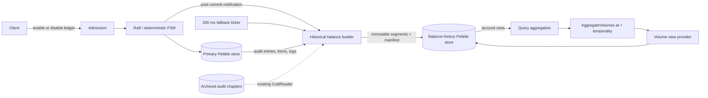
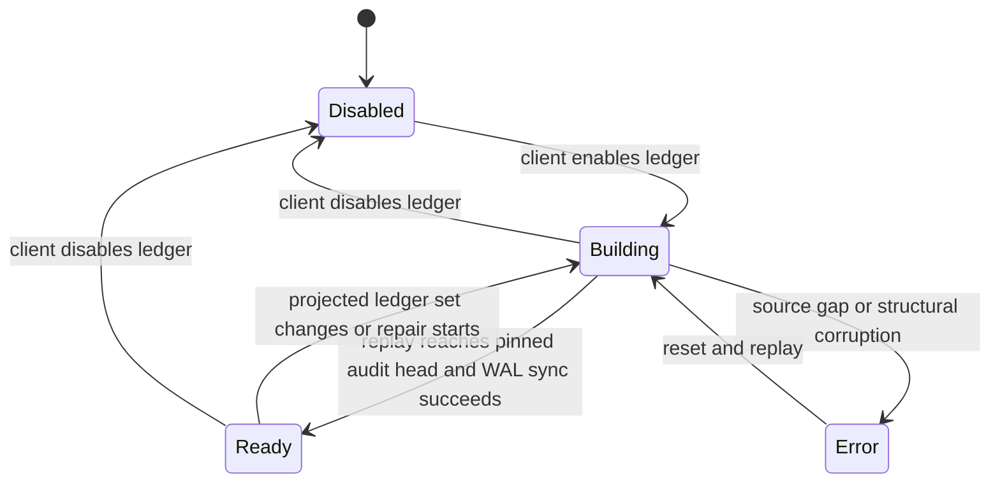

# Historical Balances

Historical balances reconstruct monetary account volumes at an arbitrary timestamp. The name is intentionally narrower than the v2 point-in-time feature: this projection does not historize transaction objects, metadata, schemas, account types, or indexes.

## Contract

- Activation is a client-owned, per-ledger setting. `ConfigureHistoricalBalances` is ordered by Raft and recorded in the audit chain.
- The projection is a peer store on every replica. It is rebuildable from the authoritative audit stream and is not part of the FSM hot path.
- Keys use the immutable ledger name. A deleted ledger name cannot be recreated, and Pebble prefix compression amortizes repeated names.
- Only account-level rows are persisted. Ledger-wide aggregation is computed by folding matching account rows at read time.
- `temporality` is either `effective` (business timestamp) or `insertion` (FSM insertion timestamp).
- Reads fail closed. They never substitute current balances, the nearest timestamp, or a partial projection.
- The projection has no cold tier, content checksum, semantic digest, or ledger-level aggregate. Audit chapters may still be read from the platform's existing cold storage during a rebuild.

## Components and data flow



The notification path matches the index builder: every committed batch wakes the worker immediately, including batches that emit no ledger log. Notifications are coalesced, and one wake drains every complete bounded batch already visible. Within a source batch, referenced hot logs are resolved by ordered scans of contiguous ranges rather than one Pebble point lookup per log. The ticker retries transient failures and guarantees progress if a wake-up is missed; it does not rate-limit notified processing.

## Configuration lifecycle



Changing the enabled ledger set resets the local peer projection and replays a fixed set from genesis. This is deliberately simple and deterministic. Disabling a ledger removes its rows after the rebuild; deleting a ledger removes it from the configured set. The setting itself needs no new primary-store projection: it is re-derived from audit-bound ledger logs.

## Pebble layout

The store has format version 2. All integers are big-endian so byte ordering matches numeric ordering.

| Prefix | Key | Value |
|---|---|---|
| `0x00` | store state | fail-closed state and diagnostic |
| `0x01` | latest manifest | `uint64` manifest version |
| `0x02` | manifest version | JSON `Manifest` |
| `0x10` | segment data | cumulative input/output pair |
| `0x11` | segment metadata | JSON `SegmentRef` |
| `0x12` | segment catalog | empty value |

One account identity is encoded as:

```text
temporality:u8
ledgerName:length-prefixed UTF-8
account:NUL-escaped bytes + NUL terminator
assetBase:length-prefixed UTF-8
assetPrecision:u8
color:length-prefixed UTF-8
```

Data keys prepend `0x10 | segmentID:u64` and append `timestamp:u64`. Catalog keys use the same identity under `0x12 | segmentID:u64` without a timestamp. The catalog permits exact-account and prefix scans without duplicating ledger-level values.

Values are cumulative unsigned input/output totals for that identity within one segment. A query reuses one bounded catalog iterator and one data iterator per segment, seeks to the last timestamp less than or equal to `at` for each selected identity, then adds the cumulative pairs. Exact-account and prefix selections are unioned before those seeks, avoiding repeated scans for overlapping predicates. Color collapse, precision merging, grouping, and unfiltered ledger totals happen after account rows are read.

### Segment and manifest

A segment is an immutable logical batch produced from a consecutive audit prefix. It is not a Pebble SST or a process execution. Its descriptor contains:

```text
id, level,
firstAuditSequence, lastAuditSequence, maxLogSequence,
entryCount, identityCount
```

The manifest atomically publishes the ordered segment set, audit/log watermarks, audit hash, reducer state, configured ledger names, and next segment ID. Segment data, metadata, the new manifest, and its latest pointer share one Pebble batch. Compaction merges old logical segments and atomically swaps the manifest; pinned views lease replaced segments until garbage collection can delete them.

## Integrity model

The audit log is the sole semantic authority. The builder validates consecutive audit entries, audit items, referenced logs, the audit hash chain, ledger lifecycle, and exact source watermarks before publishing. The local store checks manifest/segment structure and decodability; a completed rebuild scans every catalog and data record before reads reopen. Pebble owns physical block checksums.

There is deliberately no projection checksum, replay digest, certifier, or cold archive. On a source gap or malformed projection the store is quarantined and rebuilt from audit. This peer store is outside the primary-store checker by construction, like the read index; availability is fail-closed until a complete rebuild reaches the observed source head.

## Read semantics

HTTP uses `at=<RFC3339>` and `temporality=effective|insertion`. Native gRPC uses `HistoricalBalanceSelector`. A successful response carries an immutable `HistoricalBalanceView` in `X-Historical-Balance-View` (HTTP) or `x-historical-balance-view-bin` (gRPC).

Direct address and address-prefix filters use historical account identities. Filters requiring metadata or current indexes are evaluated against one current read snapshot because those dimensions are not historized. Historical balance reads and query checkpoints are mutually exclusive.

See [Historical Balance Performance](historical-balances-performance.md) for the cost model and benchmarks.
