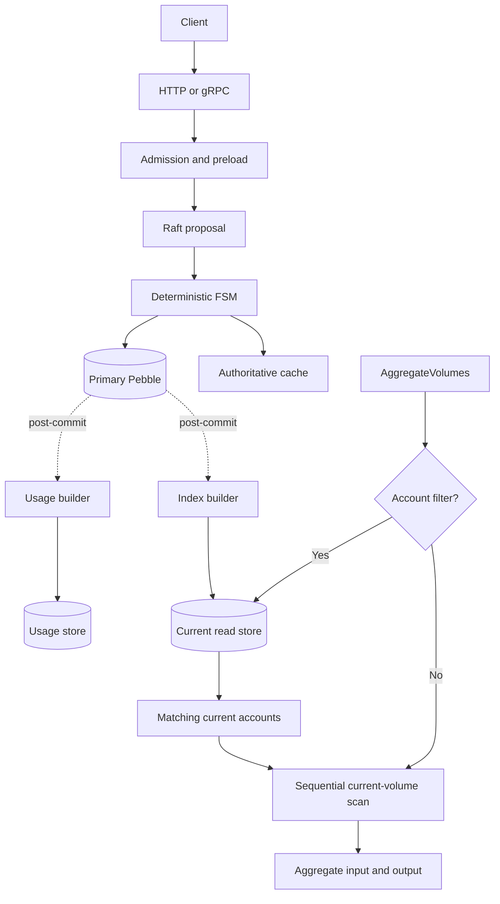

# Point-in-Time Balance Queries

> **Status:** Accepted. This document is the normative contract for the
> implementation.

## Decision

Ledger v3 supports arbitrary point-in-time (PIT) balance and volume queries
through a dedicated, asynchronous `balancehistory` projection.

The first production rollout is opt-in with `--balance-history-enabled`. This
avoids adding an unplanned `O(monetary changes)` disk footprint to existing
installations before their capacity and write-contention gates are measured.
When disabled, live reads are unchanged and PIT reads fail closed with
`HISTORY_SOURCE_MISSING`; a prior local history store is never served stale.

Rollout can be narrowed further with `--balance-history-ledgers`, an exact,
case-sensitive allowlist of ledger names. The gate applies only when opening a
PIT read; an empty allowlist means all ledgers. The builder and storage remain
cluster-wide so changing the allowlist cannot introduce projection gaps. The
resolved ledger name is checked before the store is opened, while the store
still selects data by the FSM-assigned numeric ledger ID. Recreating an allowed
name therefore enables its new incarnation without exposing the deleted one.

The projection covers monetary history only:

- resolved transaction postings;
- the input and output volume effects produced by those postings;
- transaction reversals, including `at_effective_date` reversals;
- effective-time and insertion-time query axes.

Metadata, metadata schemas, prepared-query definitions, account types, and other
non-monetary attributes are **not historized**. Account filters continue to use
the current read store. This is an explicit product semantic, not a temporary
implementation limitation.

The projection is a peer secondary store. It is populated after the primary FSM
commit and is never read or written by the FSM. Query-time replay is a rebuild
and verification mechanism, not the interactive read path.

Existing [query checkpoints](query-checkpoints.md) remain a separate feature:
they capture a pre-created applied-state snapshot. They are not an
effective-time PIT implementation.

## Goals

1. Answer historical aggregate-balance and aggregate-volume queries at an
   arbitrary timestamp.
2. Preserve both v2 time axes:
   - effective time, based on the transaction timestamp;
   - insertion time, based on the FSM-assigned `inserted_at` timestamp.
3. Keep the synchronous Raft/FSM write path unchanged.
4. Make hot historical query cost depend primarily on the selected account and
   volume cardinality, not linearly on ledger age.
5. Handle backdated transactions without rewriting every later balance on the
   synchronous write path.
6. Fail closed when history is incomplete, behind, unavailable, or corrupt.
7. Rebuild the complete projection from the verified audit and log history.

## Non-goals

- Historical account, transaction, or ledger metadata.
- Historical metadata filters. Metadata conditions are evaluated against the
  current read-store snapshot.
- Historical metadata schemas, account types, prepared-query definitions, or
  numscript definitions.
- A general-purpose MVCC view of the complete primary store.
- Replacing query checkpoints.
- Reading the primary Pebble store from the FSM to reconstruct old values.
- Serving an approximate checkpoint or partial replay as an exact PIT result.
- Keeping all historical segment bytes permanently on local disk. Cold tiering
  is allowed as long as availability and latency are explicit.

## Terminology

| Term | Meaning |
|------|---------|
| **Effective time** | The business timestamp stored on `Transaction.timestamp`, supplied by the client or defaulted to the FSM command timestamp. |
| **Insertion time** | The monotonic FSM HLC timestamp stored on `Transaction.inserted_at`. |
| **Audit watermark** | The highest consecutive `AuditEntry.sequence` included in a published history manifest. |
| **Log watermark** | The highest ledger-log sequence included in a published history manifest. |
| **Ledger incarnation** | One lifetime of a ledger, identified by its FSM-assigned `LedgerInfo.id`. Deleting and recreating a ledger name creates a new incarnation. |
| **History manifest** | An immutable description of the temporal segments that form one readable historical view and the watermarks covered by that view. |
| **Hot history** | Segments available on local storage and immediately readable. |
| **Cold history** | Segments that require retrieval from external cold storage before use. |

### Timestamp representation

PIT timestamps are non-negative Unix microseconds internally. The native gRPC
API carries them in `common.Timestamp.data`; the HTTP adapter accepts RFC3339
timestamps, including fractional seconds, and normalizes them to the same Unix
microsecond representation. Sub-microsecond precision is discarded during that
normalization. A timestamp before `1970-01-01T00:00:00Z` is invalid.

This normalization is part of the wire contract: the immutable view token and
its reported `requested_at` identify the normalized microsecond value actually
evaluated, not a higher-precision spelling supplied over HTTP.

## Temporal semantics

### Effective-time view

For effective timestamp `E` and a pinned audit watermark `K`, the monetary view
is:

```text
BalancesEffective(E, K) =
    Fold(effects where auditSequence <= K and effectiveAt <= E)
```

The fold is over monetary effects, not over the primary store's surviving
`Volume` rows. This distinction matters for `EPHEMERAL` accounts and for
draining `TRANSIENT` accounts: the live projection may delete a zero-balance
volume and restart its cumulative input/output pair from zero if that tuple is
used again, while the v2 PIT contract sums the historical moves. PIT therefore
keeps the input/output effects of a purged tuple. Account-type persistence is a
current-storage policy and is not replayed as a historical monetary mutation.

The default v2-compatible mapping is:

```text
pit=T
    -> effectiveAt=T
    -> K is pinned when the historical view opens
```

This is restated history. A transaction inserted today with an effective date
six months ago changes a six-month-old effective-time result after the history
builder publishes a manifest containing that transaction.

### Insertion-time view

For insertion timestamp `I` and pinned audit watermark `K`:

```text
BalancesInsertion(I, K) =
    Fold(effects where auditSequence <= K and insertedAt <= I)
```

The v2-compatible mapping is:

```text
pit=T&useInsertionDate=true
    -> insertedAt=T
    -> K is pinned when the historical view opens
```

A later backdated transaction does not change an insertion-time result for a
timestamp before that transaction was inserted.

### Reversals

A reversal contributes the resolved reverse postings emitted by the FSM:

- a normal reversal uses its command/effective timestamp and changes history
  from that timestamp onward;
- an `at_effective_date` reversal uses the original transaction's effective
  timestamp and therefore restates the earlier effective-time balance;
- both variants use the reversal transaction's own `inserted_at` value on the
  insertion axis.

### Metadata and account filters

Metadata is current-state-only. For filter `F`, current metadata snapshot `M`,
effective timestamp `E`, and audit watermark `K`:

```text
SelectedAccounts(F, M) = EvaluateCurrentReadStore(F, M)

Aggregate(F, E, K) =
    Sum(BalancesEffective(E, K) for SelectedAccounts(F, M))
```

Consequences:

- if an account's metadata changed after `E`, the new metadata controls whether
  it matches;
- an account that existed historically but is absent from the current account
  index does not match a current metadata or current `has asset` condition;
- an unfiltered PIT query still includes effects for every account in the
  selected ledger incarnation, including accounts no longer present in the
  current read store;
- direct address and address-prefix filters can operate on the historical
  account keys without requiring metadata history.

The response must not imply that its metadata selection represents historical
metadata.

## Current architecture

Today, `AggregateVolumes` reads current state. An unfiltered query scans every
current volume under the ledger prefix. A filtered query first compiles the
account filter against the read store and then scans the matching account
volume prefixes in the primary store.



Current cost is approximately:

```text
unfiltered = O(current volume keys)
filtered   = O(filter evaluation + matching accounts + matching volume keys)
```

Current primary attribute compaction deliberately discards historical values.
Passing an old index to the attribute computation path is therefore not a PIT
implementation and can return incomplete state.

## Target architecture

```mermaid
flowchart TB
    subgraph Synchronous[Unchanged synchronous path]
        Client[Client] --> API[HTTP or gRPC]
        API --> Admission[Admission]
        Admission --> Raft[Raft]
        Raft --> FSM[FSM]
        FSM --> Main[(Primary Pebble)]
        Main --> Ack[Write response]
    end

    subgraph Projection[Asynchronous balance-history projection]
        Ticker[200 ms polling ticker] -. wake and coalesce .-> Builder[BalanceHistoryBuilder]
        Builder --> Audit[AuditEntry and AuditItem]
        Audit --> Log[Referenced resolved LedgerLog]
        Log --> Effects[Normalized monetary effects]
        Effects --> Runs[Immutable temporal runs]
        Runs --> Manifest[Atomic history manifest]
        Manifest --> History[(Balance history store)]
    end

    subgraph HistoricalRead[Historical volume read]
        PIT[PIT request] --> Provider[VolumeViewProvider]
        Provider --> Pin[Pin manifest and watermarks]
        Pin --> Ready{History ready?}
        Ready -->|No| Closed[Typed retryable or permanent error]
        Ready -->|Yes| HasFilter{Account filter?}
        HasFilter -->|No| GlobalSummary[Temporal asset summaries]
        HasFilter -->|Yes| CurrentIndex[Current read-store snapshot]
        CurrentIndex --> AccountHistory[Historical per-account lookups]
        GlobalSummary --> Result[Aggregate result]
        AccountHistory --> Result
    end
```



The history builder has no edge back into the FSM, primary attributes, or
authoritative cache. Its output is rebuildable derived state.

## Module seam

The read path should hide live, checkpoint, and historical storage behind one
deep module. The conceptual interface is:

```go
type VolumeViewProvider interface {
	Open(ctx context.Context, ledger string, selector VolumeViewSelector) (VolumeView, error)
}

type VolumeView interface {
	Aggregate(ctx context.Context, filter *commonpb.QueryFilter, opts query.AggregateOptions) (*commonpb.AggregateResult, error)
	Token() VolumeViewToken
	Close() error
}
```

`VolumeViewSelector` selects exactly one of:

- live state;
- an existing `checkpoint_id`;
- point-in-time effective state;
- point-in-time insertion state.

The adapters are:

- `LiveVolumeView` — current primary store plus current read store;
- `CheckpointVolumeView` — frozen primary/read-store checkpoint pair;
- `HistoricalVolumeView` — pinned balance-history manifest plus the current read
  store when a metadata filter is present.

This is a real seam because multiple adapters implement materially different
read behavior. Callers do not open stores, wait for builders, select segments,
or interpret watermarks themselves.

The interface includes these behavioral guarantees:

1. The returned view is immutable for its lifetime.
2. A view never changes its manifest or watermark between reads.
3. `Close` releases manifest and segment leases.
4. Errors distinguish retryable lag from permanent unavailability.
5. The token identifies the ledger incarnation, axis, requested timestamp,
   manifest version, and resolved watermarks.

## Projection source

The audit chain remains the only source of truth. The builder consumes, in
strict sequence order:

1. successful `AuditEntry` records;
2. their `AuditItem` records;
3. the `LedgerLog` referenced by each non-zero `AuditItem.log_sequence`.

The audit item proves which accepted business order produced the effect. The
referenced log supplies the FSM-resolved postings, including numscript and
mirror results that cannot be recovered by inspecting the raw order alone.

The builder must reject a source gap. It must not skip an absent audit item or
referenced transaction log and then advance its cursor. Failed proposals and
orders that produced no monetary log advance source coverage without producing
effects.

Each published manifest records:

- first and last included audit sequence;
- maximum included log sequence;
- the ending audit hash;
- ledger-incarnation coverage;
- segment content hashes;
- history format and reducer versions.

## Normalized monetary effect

The logical effect model is:

```text
ledgerID          uint32
auditSequence     uint64
orderIndex        uint32
logSequence       uint64
effectiveAt       Timestamp
insertedAt        Timestamp
account           string
assetBase         string
assetPrecision    uint8
color             string
inputDelta        Uint256
outputDelta       Uint256
```

Every posting produces two account effects:

```text
source      -> outputDelta += amount
destination -> inputDelta  += amount
```

`(account, assetBase, assetPrecision, color)` is the complete volume identity.
Color must never be dropped from history keys, summaries, deduplication, or
compaction grouping.

The history representation preserves input and output independently. Native
v3 `AggregateVolumes` can therefore return the same result shape and reuse the
same maximum-precision and color-collapse semantics as live reads. A v2
compatibility adapter derives signed balances from the historical input/output
pair.

Summary arithmetic must never wrap. It must surface the same aggregate overflow
conditions as the live query path when input/output values, color collapse, or
precision rescaling exceed `Uint256`.

## History store

`balancehistorystore` is a dedicated peer store, separate from:

- the primary FSM Pebble store;
- the read store;
- the usage store.

It is local to each replica in the first implementation. Every replica builds
the same logical projection from the same ordered audit source, but physical
compaction layout does not need to be byte-identical.

### Immutable runs and manifests

The store uses immutable temporal runs referenced by immutable manifests:

```text
manifest(version, auditWatermark, logWatermark)
    effectiveRuns[]
    insertionRuns[]
    checksums[]
    formatVersion
    reducerVersion
```

An ingestion batch creates a small level-zero run. Background compaction merges
runs into larger levels and publishes a new manifest atomically. A manifest is
readable only after every referenced run is present in the same atomic Pebble
batch and its checksum is known.

Logical visibility and physical durability are deliberately separate. Publish,
compaction, and garbage-collection batches use the WAL without an `fsync` per
batch. The builder issues a serialized WAL barrier periodically, every 5 seconds
by default, and forces one after boot catch-up, after a repair or rebuild reaches
its pinned source head, and during `Stop` before the store closes. Therefore a
process or power failure may discard a bounded suffix of history publications,
but can never expose half of a publication. That suffix is replayed exactly from
the authoritative audit on restart; committed ledger data is unaffected.

A failed barrier does not advance the durable watermark or the cadence clock.
It is exported as an observable error and retried on the next builder tick. A
failed final barrier leaves the runtime store open so a later `Stop` can retry
before unregistering metrics or closing Pebble.

Active views hold leases on their manifests. Compaction and garbage collection
may delete an unreferenced run only after no active or retained manifest points
to it.

### Access orders

Two access orders are required for predictable performance on both supported
axes:

1. volume identity, then `effectiveAt`;
2. volume identity, then `insertedAt`.

The resolved effect payload may be stored once and referenced by both indexes,
or compactly duplicated when doing so reduces random reads. This is an
implementation and benchmark decision; the two observable axes are fixed.

### Block summaries

Each run contains exact prefix summaries so a query does not scan every effect
from ledger creation to the requested timestamp. At minimum it provides:

- per-volume input/output prefix summaries;
- per-asset/color summaries for unfiltered aggregation;
- index points sufficient to seek directly to a requested timestamp.

For a filtered query, the current read store supplies account identities and
the temporal runs supply the historical volume values for those accounts. For
an unfiltered query, per-asset/color summaries avoid enumerating every account.

Arbitrary `group_by_prefixes` may fall back to account-range aggregation unless
a benchmark justifies materializing additional prefix summaries. Query-provided
prefixes must not cause permanent index creation.

### Backdated writes

A backdated transaction is appended to a new level-zero run. It does not update
every later cumulative value synchronously. Reads sum the relevant prefix from
each manifest run; later compaction incorporates the correction into larger
runs.

This is the key difference from the v2 `moves` implementation: historical
correction is append-first and asynchronously compacted rather than an
unbounded synchronous rewrite of future rows.

## Builder lifecycle

The builder follows the existing usage-builder pattern:

- use a 200 ms polling and coalescing ticker as its sole production wake-up;
- leave the existing four post-commit notification targets unchanged, so PIT
  adds no synchronous fan-out work to the FSM write path;
- publish at most one immutable run per tick, bounding the production arrival
  rate at five runs per second before maintenance;
- persist progress in the peer store;
- process consecutive audit entries in bounded batches;
- publish data files before publishing their manifest;
- expose current source head and published watermark metrics;
- expose the last durable audit watermark, WAL-barrier failures, current
  barrier-error state, and publication wall-clock lag without unbounded labels;
- release primary-store snapshots between bounded catch-up slices;
- throttle boot-time backfill.

Builder boot performs only local structural checks and authoritative-source
reconciliation. It does not hydrate or scan cold runs, and it never compacts.
An independent maintenance worker owns bounded local compaction, cold tiering,
and remote collection so network or physical run work cannot stall publication
of the authoritative audit watermark. Maintenance starts asynchronously with a
bounded pass, then runs local compaction, tiering, and collection on independent
intervals. The production defaults run local maintenance every second with at
most two compactions per pass and a four-run merge threshold. Configuration
validation rejects combinations whose integer run-retirement capacity is below
the ticker publication ceiling:

```text
maxCompactionsPerPass * (runCompactionThreshold - 1) * tickInterval
  >= maintenanceInterval
```

Read readiness is process-local and starts closed on every process boot. A
persisted complete manifest is not sufficient: the builder must successfully
read the current authoritative head, reconcile rollback or divergence, reach
that exact head, force durability, and complete any required certification
before `Ready` opens. During shutdown the gate closes and all history workers
stop first; API servers then drain and release pinned Views before the archive
and history store close. The primary authoritative store closes last. A failed
final WAL barrier leaves history resources open so shutdown can retry safely.

`SOURCE_MISSING` and `REBUILDING` are persistent fail-closed states. Reaching a
manifest that starts at genesis is not enough to reopen reads: the builder must
reach the complete audit and log head pinned by its source snapshot, force the
WAL barrier, and ask the independent history verifier to compare the served
semantic digest with an authoritative scratch replay. Only a successful proof
allows `ClearFailure` or `CompleteRebuild` to remove the marker. The required
audit and log watermarks are rechecked under the store mutation lock, so neither
method can certify the first batch of a longer rebuild.

### Full-verifier resource isolation

Short verifier passes check manifest structure, source-head sanity, and a
bounded rotating sample across hot-run and cold-part physical targets. The
expensive semantic proof runs every 96 passes by default—once per day at the
default 15-minute interval—and for every explicit `Verify` or rebuild
certification.

Restart does not run two complete physical scans back-to-back. Builder boot
checks the local manifest/reducer structure and its relationship to the source
without cold I/O. The verifier's immediate startup pass checks structure plus
one rotating physical target. The first scheduled full pass occurs when the
periodic sequence reaches 96. Repair is stricter: reads remain closed until an
explicit full `Certify` has succeeded at the builder's pinned source head.

A full proof replays the authoritative source into a temporary Pebble store and
compares its canonical semantic digest with the exact manifest being served.
This scratch store can approach the size of the retained logical projection and
performs sequential source reads plus local writes. It is therefore background
maintenance work, not an interactive operation with a latency SLO. Between
source batches it observes the same context-aware cooperative yield as builder
backfill; cancellation stops the yield and removes the temporary store.

Production places scratch children under
`<effective balance-history-dir>/verifier-scratch`. Consequently a dedicated
`--balance-history-dir` volume also contains verifier scratch I/O and prevents
an accidental spill to the host-wide temporary filesystem. Without a dedicated
history volume, the replay can still contend with the primary data directory.
Operators must reserve capacity for the history store plus one full scratch
projection and must measure concurrent write latency. Scratch children are
removed after success, failure, or cancellation; the stable parent directory is
retained for later verifier runs.

### Rollback and restore

If the primary audit head is lower than the persisted history cursor after a
restore, the projection is ahead of its authority. The builder must:

1. stop serving affected manifests;
2. drop or quarantine the local history store;
3. reset its cursor to the available history floor;
4. rebuild before becoming ready.

It must not decrement a cursor while retaining segments built from the rolled
back source.

### Ledger deletion and recreation

Ledger name is not sufficient identity. All effects and manifests are scoped by
the FSM-assigned numeric ledger ID.

Deleting a ledger seals its incarnation. Recreating the same name obtains a new
ID and starts an independent history. Normal reads by name resolve the current
ledger ID and cannot accidentally include the deleted incarnation.

Historical data for deleted incarnations is removed only by the configured
history-retention lifecycle, not by current-state volume eviction.

## Read consistency

Opening a historical view performs these steps:

1. Resolve the current ledger name to its numeric incarnation.
2. Apply the existing Raft `ReadIndex` barrier when the request requires a
   latest or read-after-write view.
3. If `min_log_sequence` is present, wait for a history manifest whose log
   watermark reaches it.
4. Pin one published history manifest. Its audit watermark becomes the view's
   `knownThrough` value.
5. If a current account filter is present, open one current read-store snapshot
   and retain it for the complete query.
6. Execute all historical lookups against the pinned manifest.
7. Return the resolved token and release all leases on close.

New audit entries committed after step 4 are excluded. A later request may pin
a newer manifest and therefore see a backdated correction that the earlier view
did not contain.

The current metadata snapshot and historical monetary manifest intentionally
represent different temporal semantics. Both are internally immutable for the
request, but metadata is not rewound to the PIT timestamp.

## Query execution

### Unfiltered aggregation

Use the per-asset/color summaries from every run referenced by the manifest,
seek to the requested timestamp on the selected axis, and merge their input and
output sums.

Expected cost:

```text
O(asset/color buckets x manifest levels)
```

### Filtered aggregation

1. Compile the filter with the existing query compiler against a current
   read-store snapshot.
2. Iterate matching account identities.
3. Seek each account's historical volume ranges in the selected manifest runs.
4. Merge input/output sums with the existing aggregate semantics.

Expected cost:

```text
O(current filter evaluation
  + matching historical volume keys x manifest levels)
```

The primary cost driver is selected cardinality, not timestamp age.

### Address-prefix grouping

Account addresses are part of the history key. Direct account and address-prefix
queries therefore do not require metadata history. Grouped results preserve the
request's first-matching-prefix behavior.

## API contract

The native gRPC shape is additive: existing `AggregateVolumesRequest` fields
keep their field numbers and PIT uses field 8.

```protobuf
enum PointInTimeAxis {
  POINT_IN_TIME_AXIS_EFFECTIVE = 0;
  POINT_IN_TIME_AXIS_INSERTION = 1;
}

message PointInTimeSelector {
  Timestamp at = 1;
  PointInTimeAxis axis = 2;
}

message AggregateVolumesRequest {
  // Existing fields 1-7 are unchanged.
  PointInTimeSelector point_in_time = 8;
}

message PointInTimeView {
  Timestamp requested_at = 1;
  PointInTimeAxis axis = 2;
  uint32 ledger_id = 3;
  fixed64 audit_watermark = 4;
  fixed64 log_watermark = 5;
  fixed64 manifest_version = 6;
  Timestamp history_available_from = 7;
  string view_token = 8;
}
```

The generated JSON property is `pointInTime`, preserving the repository's
camelCase JSON rule.

Transport rules:

- `point_in_time` and `checkpoint_id` are mutually exclusive; combining them is
  a validation error rather than choosing one implicitly;
- `at` is required when `point_in_time` is present;
- an unspecified axis means effective time;
- `min_log_sequence` applies to the history manifest watermark for PIT reads;
- gRPC timestamps are unsigned Unix microseconds in `common.Timestamp.data`;
- a successful PIT gRPC response carries the binary `PointInTimeView` in the
  `x-point-in-time-view-bin` trailing metadata entry;
- the HTTP adapter accepts the parameters below and returns the same view as a
  standard-base64-encoded protobuf value in `X-Point-In-Time-View`.

| HTTP parameter | Contract |
|----------------|----------|
| `pit=<RFC3339>` | Required to enable PIT. Parsed with fractional-second support, normalized to Unix microseconds, and rejected before the Unix epoch. Effective time is the default axis. |
| `useInsertionDate=true` | v2-compatible insertion-axis selector. It is invalid without `pit`. |
| `use_insertion_date=true` | Deprecated legacy alias for `useInsertionDate`. If both spellings are supplied, they must agree. |

`PointInTimeView` exposes the normalized requested timestamp, selected axis,
numeric ledger incarnation, resolved audit/log watermarks, manifest version,
history floor, and opaque view token. A PIT success without this metadata is a
protocol error: clients must not treat an unbound aggregate as a valid PIT
result.

### v2 compatibility boundary

Compatibility is deliberately narrow. The v3 HTTP aggregate endpoint preserves
the v2 `pit` and `useInsertionDate` parameter semantics and both monetary time
axes. It does not add `/v2` routes, reproduce historical metadata joins, expose
the v2 moves representation, or change the v3 aggregate response shape. The
snake-case `use_insertion_date` spelling is accepted only as a deprecated
transport alias.

Metadata-dependent and current asset-existence filters remain current-state
selections on both axes. `useInsertionDate=true` changes which monetary effects
are included; it does not rewind metadata or any other non-monetary attribute.

Any implementation that changes protobuf or HTTP surfaces must update
`misc/proto`, generated code, `openapi.yml`, the API comparison document, and
CLI documentation in the same change.

## Error contract

Historical reads fail closed.

| Error | Retryable | gRPC / HTTP | Meaning |
|-------|-----------|-------------|---------|
| `HISTORY_BUILDING` | Yes | `UNAVAILABLE` / 503 | No readable initial manifest exists on this replica. |
| `HISTORY_BEHIND` | Yes | `UNAVAILABLE` / 503 | A manifest exists but has not reached the required log sequence or source head. |
| `HISTORY_EXPIRED` | No | `FAILED_PRECONDITION` / 400 | The requested timestamp is older than the retained history floor. |
| `HISTORY_SOURCE_MISSING` | No until repaired | `INTERNAL` / 500 | A required hot or cold source range is absent. |
| `HISTORY_CORRUPT` | No until rebuilt | `INTERNAL` / 500 | A checksum, source-coverage, or verifier check failed. |
| `UNSUPPORTED_TEMPORAL_FILTER` | No | `INVALID_ARGUMENT` / 400 | The request asks for semantics outside this design, such as historical metadata evaluation. |

HTTP responses for `HISTORY_BUILDING` and `HISTORY_BEHIND` include
`Retry-After: 1`. Clients must still discriminate using `errorCode`; a generic
500 or 503 does not authorize an approximate fallback.

The read path must never:

- fall back silently to live state;
- substitute the nearest query checkpoint;
- omit unavailable segments and return a partial aggregate;
- treat an unknown historical account as a zero balance without proving source
  coverage;
- serve a manifest whose audit range has a gap.

## Relationship to query checkpoints

| Property | Query checkpoint | Point-in-time balance history |
|----------|------------------|-------------------------------|
| Meaning | Applied state at a pre-created cutoff | Monetary state at arbitrary effective or insertion time |
| Creation | Explicit or scheduled Raft command | Continuous asynchronous projection |
| Arbitrary past timestamp | Only if an appropriate checkpoint already exists | Yes, within the history floor |
| Backdated transaction | Absent from an older checkpoint | Included in effective history after its manifest is published |
| Metadata | Frozen with checkpoint | Current only |
| Read cost | Same query over frozen stores | Temporal summaries and per-account lookups |
| Storage | Retained primary/read-store SSTs | Immutable monetary-effect segments |

A query checkpoint remains the correct choice for reconciliation that needs the
entire ledger representation exactly as it was applied. Point-in-time balance
history is the correct choice for v2-compatible monetary reporting.

## Write-path impact

No history write occurs before the primary FSM commit. The additional work is
asynchronous:

- read each successful audit entry and relevant resolved log once;
- emit two account effects per posting;
- maintain one or two temporal access orders;
- optionally maintain global per-asset summary entries;
- write and compact immutable history runs;
- publish progress and manifest metadata.

Depending on encoding and summary strategy, the expected logical write
amplification is approximately:

```text
effective axis only                    ~= 2-4 compact KVs per posting
effective + insertion + fast summaries ~= 4-8 compact KVs per posting
```

Capacity planning starts with:

```text
history KV/s = transactions/s
             x postings/transaction
             x history KVs/posting
```

Illustrative only: at 100 transactions/s, two postings per transaction, and
4-8 compact 100-byte records per posting, logical history data is roughly
7-14 GB/day/replica before measured compression and physical compaction write
amplification.

The synchronous latency target is:

```text
write p99 regression caused by PIT projection < 5%
```

This target includes indirect contention. Separate Pebble caches, bounded
builder batches, compaction rate limits, disk-watermark admission, and optional
dedicated storage are required controls. A builder that is behind may sacrifice
PIT freshness; it must not slow or block Raft application.

## Read-path performance

Measured baselines, commands, raw-result references, and target status are
maintained in
[Point-in-Time Balance Performance Evidence](point-in-time-balances-performance.md).

### Complexity

| Read | Expected dominant cost |
|------|------------------------|
| Live, unfiltered | Current volume-key scan |
| Live, filtered | Current filter plus selected current volumes |
| PIT, unfiltered | Asset/color summaries across bounded manifest levels |
| PIT, filtered | Current filter plus selected historical volume keys across manifest levels |
| PIT, cold miss | Segment retrieval plus the normal PIT cost |
| Replay/rebuild | Audit/log volume since the history floor; not interactive |

### Age independence

For an identical filter and cardinality, a PIT for yesterday and a PIT for six
months ago should have the same asymptotic cost when both histories are hot:

```text
PIT yesterday   ~= seek each run + merge block summaries
PIT six months  ~= seek each run + merge block summaries
```

The requested age changes seek positions, not the number of effects scanned.
The number of manifest levels grows logarithmically, not linearly, with retained
history.

Operationally, latency is not identical when older runs are absent from the
local cache. A view spans a logarithmically bounded number of immutable runs,
and a cold query can therefore fetch several independently verified parts,
currently in sequence. The first access cost is proportional to the number and
size of those missing parts plus backend latency; repeated queries reuse the
byte-bounded local cache. Benchmarks report runs, parts, backend GETs, bytes,
and end-to-end fetch latency rather than describing a cold PIT as one retrieval.

Query-time replay cannot satisfy this property. For effective history with the
latest knowledge, a replay must inspect later insertions to discover backdated
transactions, even when the requested effective timestamp is old.

### Acceptance targets

These are implementation gates, not guarantees inferred from the design:

| Scenario | Initial target |
|----------|----------------|
| Hot PIT, unfiltered or selective filter | p50 15-40 ms; p95 50-150 ms |
| Hot PIT, very large selected account set | p95 within 2x the equivalent live aggregation |
| Six-month hot PIT versus one-day hot PIT, identical cardinality | no more than 20% slower at p95 |
| Cold segment first access | 0.5-3 s for a bounded segment; reported separately |
| Steady-state history-builder lag | less than 500 ms at p99 |
| Synchronous write p99 regression | less than 5% |
| Full replay/rebuild | no interactive SLO |

Benchmarks must report hot and cold results separately. A cache-warmed benchmark
must not be used to claim cold-history latency.

## Retention and cold tiering

Exact arbitrary PIT requires retaining monetary effects for the supported
history window. Total retained information is therefore `O(monetary changes)`;
no exact implementation can make that information disappear while preserving
arbitrary history.

The target design bounds the hot local footprint independently:

1. keep recent immutable runs locally;
2. upload sealed old runs and their checksums to cold storage;
3. retain manifests and compact indexes locally;
4. fetch cold runs into a byte-bounded local cache on demand;
5. evict only runs with no active view lease;
6. expose `historyAvailableFrom` for every ledger incarnation.

Cold objects are immutable and content-addressed. A missing or checksum-invalid
object produces `HISTORY_SOURCE_MISSING` or `HISTORY_CORRUPT`, never a truncated
result.

Every replica owns a stable remote namespace rooted at
`<cluster>/balance-history/nodes/<nodeID>/runs/`. A replica may enumerate or
delete objects only below its own node ID; replica-local manifests are not a
cluster-wide proof that another node has released an object. Decommissioning a
node therefore does not automatically transfer or delete its namespace. An
operator must clean it manually, or a future decommission tool must first prove
through cluster membership that the owner is permanently retired. A shared
cluster-wide balance-history run namespace is not safe for destructive garbage
collection.

The implemented remote lifecycle protocol, destination binding, lock order,
crash windows, S3 lifecycle requirements, and metrics are specified in
[Balance-history remote garbage collection](balance-history-remote-gc.md).

The v3.0 server keeps this tier opt-in. With `--balance-history-cold-tier`, the
bootstrap binds the replica-owned namespace to the configured filesystem or S3
cold-storage destination, starts bounded uploads, and runs the durable remote
collector. Without the flag, local history storage grows with retained monetary
changes. Binding replacement or disabling is rejected until a complete current-
epoch inventory proves that the previous destination contains no referenced or
queued objects.

Segment size is a performance control. The implementation must bound cold-fetch
units so a single historical query does not require downloading an entire
multi-gigabyte chapter archive.

## Integrity and rebuildability

The history store is a peer secondary store and is outside the primary-store
checker scope by construction. That does not make it integrity-safe.

The first production version must include a `HistoryVerifier` that checks:

- manifest and segment checksums;
- consecutive audit-range coverage;
- ending audit hash against the primary source;
- reducer and format versions;
- ledger-incarnation identity;
- full aggregates and semantic digest against deterministic replay;
- identical logical digests across replicas where practical.

On verification failure, the replica quarantines the affected manifests and
returns `HISTORY_CORRUPT`. Recovery is drop-and-rebuild from verified hot and
cold audit/log history.

The 15-minute short pass does not perform that full replay. It verifies the
manifest structure, checks the authoritative source head, and verifies a
bounded rotating sample across hot runs and cold archive parts (one physical
target per pass by default). A hot target checks its descriptor plus the first
and last stored records; a cold target fetches and verifies the selected part.
The opaque sample cursor advances only after success, so repeated short passes
eventually cover the complete physical target set without scanning it on every
tick. Every `ReplayEvery` pass (96 by default, or once per day), explicit
`Verify`, and repair `Certify` performs the complete physical scan followed by
the semantic replay. Both paths propagate cancellation to cold fetches.

The full replay creates its temporary Pebble store beside the configured
history store, so `--balance-history-dir` controls the underlying volume. It
also yields cooperatively between authoritative source batches using the
builder backfill-yield setting. These controls reduce sustained contention;
they do not make the full pass part of the steady-state write-latency budget.

The projection must support a complete reset. Rebuild and normal tailing use the
same reducer and segment writer; a special rebuild-only implementation would
create two definitions of historical balance semantics.

## History floor and migration

The service cannot invent history that was not migrated or retained.

For an existing v3 ledger, the current production implementation requires the
complete verified audit/log range from ledger creation. Starting from the
earliest hot audit is not sufficient when an older chapter is missing: a zero
initial balance would silently truncate every later result.

For a ledger migrated from v2:

- import source events with their effective and insertion timestamps when those
  events remain available;
- preserve reversal and ledger-incarnation identity;
- do not write directly into history segments as an authoritative migration
  shortcut;
- do not use the live v3 volume snapshot as a migration base: purged ephemeral
  and draining-transient generations are absent from it;
- when the complete source is unavailable, the incarnation returns
  `HISTORY_SOURCE_MISSING`, including timestamps after migration. A migration
  or creation timestamp alone is not a valid history floor because a later
  backdated transaction can precede it.

`historyAvailableFrom` is therefore exactly zero on both axes in v3.0. The
reserved manifest floor fields reject non-zero publication, and
`HISTORY_EXPIRED` remains a reserved wire error rather than a production-
reachable retention claim.

A future non-zero floor needs more than a self-declared checkpoint checksum.
An attacker able to rewrite the peer store could otherwise alter cumulative
values, their run checksum, and the manifest consistently while retaining the
real audit hash and logical digest. Before enabling base import, its cumulative
per-volume and per-asset/color values must be bound to an authority the replica
can independently verify, for example:

- a chain-bound audit order whose business intent commits to the canonical base
  digest; or
- a signature over the base digest, both axis floors, numeric ledger
  incarnation, audit/hash/logical-digest/reducer provenance, and format version,
  verified by an explicitly configured migration authority.

That future mechanism must publish the certified base, provenance, floors, and
manifest pointer atomically; scope floors per numeric ledger incarnation; keep
base replacement safe across compaction and crashes; handle an empty migrated
ledger without fabricating a zero monetary record; and publish a verified
replacement before deleting the preceding base. Until then, production rebuild
and verification always start from the complete authoritative source.

## Observability

Required metrics and traces include:

- primary audit head and history audit watermark;
- primary log head and history log watermark;
- builder lag in entries and wall-clock time;
- effects and postings processed per second;
- level-zero run count and compaction debt;
- logical and physical history bytes by level;
- hot-cache bytes, hits, misses, and evictions;
- cold bytes fetched and fetch duration;
- manifest publication and verification failures;
- PIT request count and latency by axis and bounded filter shape;
- PIT failures by their bounded typed-error category;
- write latency correlated with history ingestion and compaction;
- rebuild/reset count, audit-sequence progress, batch throughput, and duration.

Metrics must not put ledger names, account addresses, assets, or client-provided
timestamps into unbounded-cardinality labels.

The builder exports the following label-free instruments from its
`balancehistory.builder` meter:

| Instrument | Type | Unit | Meaning |
|---|---|---|---|
| `balancehistory.builder.last_indexed_sequence` | Gauge | — | Latest atomically published audit sequence |
| `balancehistory.builder.audit_last_sequence` | Gauge | — | Latest sampled authoritative audit head |
| `balancehistory.builder.lag` | Gauge | — | Audit entries between the sampled head and published manifest |
| `balancehistory.builder.effects.processed` | Counter | `{effect}` | Normalized monetary effects published |
| `balancehistory.builder.postings.processed` | Counter | `{posting}` | Resolved postings published |
| `balancehistory.builder.publications` | Counter | `{publication}` | Atomic manifest publications |
| `balancehistory.builder.rebuilds` | Counter | `{rebuild}` | Full-prefix rebuilds started |
| `balancehistory.builder.resets` | Counter | `{reset}` | Successful projection resets |
| `balancehistory.builder.batch.duration` | Histogram | `us` | End-to-end duration of a published builder batch; background compaction is excluded |
| `balancehistory.builder.batch.proposals` | Histogram | `{proposal}` | Complete audit proposals per publication |
| `balancehistory.builder.publish_lag` | Histogram | `ms` | Wall time from the last audit entry in a batch to manifest publication |
| `balancehistory.builder.last_durable_audit_sequence` | Gauge | `{sequence}` | Published audit prefix covered by the last successful WAL barrier |
| `balancehistory.builder.durability_sync_failures` | Counter | `{failure}` | Failed WAL barriers since process start |
| `balancehistory.builder.durability_sync_error` | Gauge | `1` | Whether the most recently required WAL barrier failed |

`publish_lag` records only when a batch is published. It does not derive a
continuously growing `now - last event` gauge, so an idle ledger does not look
artificially unhealthy. Its explicit buckets cover steady tailing through a
six-month backfill and use no attributes.

The verifier exports bounded-cardinality instruments from its
`balancehistory.verifier` meter:

| Instrument | Type | Unit | Dimensions | Meaning |
|---|---|---|---|---|
| `balancehistory.verifier.runs` | Counter | `{run}` | none | Successful short or full passes |
| `balancehistory.verifier.failures` | Counter | `{failure}` | none | Failed passes, excluding cancellation/deadline |
| `balancehistory.verifier.duration` | Histogram | `s` | none | End-to-end pass duration |
| `balancehistory.verifier.last_success` | Gauge | `s` | none | Unix time of the latest successful pass |
| `balancehistory.verifier.archive.parts` | Counter | `{part}` | none | Cold parts verified by bounded short passes |
| `balancehistory.verifier.archive.bytes` | Counter | `By` | none | Declared cold bytes verified by bounded short passes |
| `balancehistory.verifier.physical.duration` | Histogram | `s` | `scope` | Physical scan duration; `scope` is only `sample` or `full` |

The archive byte/part counters describe the work exposed by bounded store
verification. The full store API currently returns only success or failure, so
full-pass archive bytes must be measured by archive I/O telemetry rather than
estimated by the verifier.

The controller exports the following PIT instruments from the `ctrl` meter:

| Instrument | Type | Unit | Dimensions |
|---|---|---|---|
| `ctrl.point_in_time.aggregate.requests` | Counter | `{request}` | `axis`, `filter_shape` |
| `ctrl.point_in_time.aggregate.errors` | Counter | `{error}` | `axis`, `filter_shape`, `error_category` |
| `ctrl.point_in_time.aggregate.duration` | Histogram | `us` | `axis`, `filter_shape` |

`axis` is one of `effective`, `insertion`, or the defensive `unknown` value.
`filter_shape` is one of `unfiltered`, `filtered`, or `grouped` (grouping takes
precedence over the presence of an account filter). `error_category` is limited
to the public history states (`history_building`, `history_behind`,
`history_expired`, `history_source_missing`, `history_corrupt`, and
`unsupported_temporal_filter`), cancellation/deadline outcomes, and `other`.
The `ctrl.aggregate_volumes` span carries the same bounded PIT axis, filter
shape, and error category attributes; it does not carry the ledger name or the
requested timestamp.

A single query can consult multiple local and archived runs, so the controller
does not guess one source-tier label for the whole request. Actual archive
activity is measured at the I/O boundary by
`balancehistory.archive.cache.hits`, `balancehistory.archive.cache.misses`,
`balancehistory.archive.cache.bytes`, and
`balancehistory.archive.fetch.duration`. Correlating those instruments with
the controller latency histogram distinguishes local-cache operation from a
cold fetch without misclassifying mixed-run queries or duplicating the archive
metrics.

## Verification plan

### Semantic tests

- backdated transaction inserted after the requested effective timestamp;
- future-dated transaction inserted before the requested effective timestamp;
- normal reversal and `at_effective_date` reversal;
- multiple orders in one proposal;
- identical effective timestamps ordered by audit sequence;
- numscript-resolved and mirror-ingested postings;
- skipped orders and failed proposals;
- colored volumes and color collapse;
- mixed asset precision and maximum-precision rescaling;
- aggregate overflow at every existing live-query overflow stage;
- ephemeral and draining current volumes whose historical effects must remain;
- ledger deletion and same-name recreation;
- builder restart, rollback, and reset;
- compaction while a manifest is leased;
- missing, corrupt, and restored cold segments;
- current metadata filter changed after the PIT timestamp.

### Differential tests

1. `pit=now` against the live aggregate result at the same pinned watermark for
   retained volume generations. Ephemeral and draining-transient fixtures are
   compared against the effect fold instead: their historical input/output is
   intentionally retained after the live row is purged.
2. Effective and insertion PIT results against deterministic audit replay.
3. The v2 compatibility adapter against v2 fixtures for the supported balance
   contract.
4. Independently built replica stores against one shared logical digest.

### Performance matrix

Benchmarks cover:

- one day, six months, and two years of history;
- hot and cold runs;
- zero, one, one thousand, and large account selections;
- low and high asset/color cardinality;
- zero, one percent, and high backdated-write rates;
- steady-state tailing, initial backfill, and compaction debt;
- concurrent writes and PIT reads;
- local shared disk and dedicated history disk configurations.

## Delivery sequence

1. Introduce the history store, reducer, cursor, verifier, and metrics with no
   public read path.
2. Backfill test ledgers and continuously compare history at `now` with live
   aggregation.
3. Enable effective-time `AggregateVolumes` behind the exact-name
   `--balance-history-ledgers` read allowlist. Keep the builder cluster-wide so
   expanding the allowlist does not require a new backfill.
4. Run shadow comparisons against deterministic replay and the v2 compatibility
   fixtures.
5. Enable insertion-time reads and the v2 HTTP compatibility parameters.
6. Add cold immutable runs, byte-bounded caching, and retention controls.
7. Expand availability gradually while enforcing the latency, lag, integrity,
   and write-regression gates above.

No phase may add history reads or writes to the FSM hot path.

## Accepted decisions summary

| Topic | Decision |
|-------|----------|
| Historical scope | Monetary effects and balance/volume aggregation only |
| Metadata semantics | Current metadata and current metadata filters |
| Time axes | Effective and insertion |
| Source of truth | Audit chain; resolved postings obtained through referenced logs |
| Write integration | Asynchronous post-commit builder |
| Storage | Dedicated peer history store with immutable runs and manifests |
| Backdated writes | New level-zero correction run, asynchronous compaction |
| Interactive replay | Rejected |
| Query checkpoints | Retained as separate applied-state snapshots |
| Old-history latency | Same hot complexity; explicit cold-miss class |
| Failure behavior | Typed fail-closed errors, no partial or live fallback |
| Integrity | Checksums, source coverage, verifier, and drop/rebuild |
| Ledger identity | FSM-assigned numeric ledger incarnation |
| Rollout gate | Global opt-in plus an optional exact-name read allowlist; projection remains cluster-wide |
