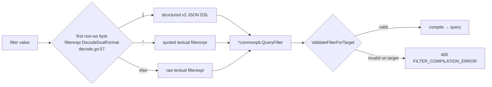

# Query Filtering — the canonical QueryFilter surface

## 1. Overview

Every migrated filtered endpoint accepts one `filter` query parameter. That
parameter has two interchangeable serializations:

- a **textual** `filterexpr` grammar; and
- a **structured** v2 JSON DSL.

Both serializations compile to the same `*commonpb.QueryFilter` and pass the
per-target validity gate `domain.ValidateFilterForTarget`. Over HTTP a caller
may send either form; the parser sniffs the first non-whitespace byte to decide
how to decode (`filterexpr.DecodeDualFormat`, `internal/pkg/filterexpr/decode.go:57`).
gRPC consumes the structured proto only — the client pre-parses the textual form
into a `*commonpb.QueryFilter` before the call.



## 2. Parameter classification

Every query parameter on every filtered endpoint plays exactly one role. The
master table below classifies them; the **Status** column records each endpoint's
relationship to the canonical `filter` surface (`canonical`, `option-only`, or the
`body-driven` prepared-query path). Every list/aggregation endpoint that selects by
account, transaction, or log is now on the canonical surface.

| Endpoint | Canonical `filter` | Typed coercion | Pagination | Endpoint/output options | Status |
|----------|---|---|---|---|---|
| `GET /v3/{ledger}/accounts` | filter (ACCOUNTS) | — | `after`(addr), `pageSize`, `reverse` | — | canonical |
| `GET /v3/{ledger}/transactions` | filter (TRANSACTIONS) | `startDate`,`endDate` | `after`(txID), `pageSize`, `reverse` | — | canonical |
| `GET /v3/{ledger}/logs` | filter (LOGS) | `startDate`,`endDate` | `after`(logID), `pageSize` | — | canonical |
| `GET /v3/_/audit-entries` | filter (AUDIT, textual-only) | — | `after`(seq), `pageSize`, `reverse` | — | canonical |
| `GET /v3/{ledger}/volumes` | filter (ACCOUNTS) | — | — | `useMaxPrecision`, `collapseColors`, `groupByPrefixes` | canonical |
| `GET /v3/{ledger}/accounts/{addr}` | — | — | — | `collapseColors` | option-only |
| `GET /v3/_/indexes/status` | — | — | — | `ledger` | option-only |
| `GET /v3/_/indexes` | — | — | — | `scope` | option-only |
| `.../indexes/{id}/inspect` | — | — | `cursor`, `pageSize` | `mode` | option-only |
| `analyze-accounts` / `analyze-transactions` | — | — | — | `variableThreshold` | option-only |
| prepared-query `execute` | — (stored; see note) | — | `cursor`, `pageSize` | `parameters`, `mode`, `minLogSequence` | body-driven |

The four roles:

- **canonical filter** — a dual-format `QueryFilter` (textual or structured JSON)
  compiled against the endpoint's target and gated by `ValidateFilterForTarget`.
- **typed coercion** — an RFC3339 date shorthand (`startDate`/`endDate`) coerced
  into a builtin timestamp/date range.
- **pagination** — opaque/typed cursor controls (`after`/`cursor`/`reverse`/`pageSize`),
  default page 100, capped at 1000.
- **endpoint/output option** — shapes output or scope, not selection.

> **The prepared-query `filter` is not a request parameter.** A prepared query's
> `filter` is defined once on the create/update path
> (`CreatePreparedQueryRequest.query` / `UpdatePreparedQueryRequest.filter`,
> `misc/proto/bucket.proto`) and stored server-side. The `execute` body
> (`internal/adapter/http/handlers_execute_prepared_query.go:32`) carries **no**
> `filter` — only `parameters` (bind values for the stored definition),
> pagination (`cursor`, `pageSize`), a freshness floor (`minLogSequence`), and
> `mode`. A `filter` sent at execute time is silently ignored.

## 3. Textual vs structured expressiveness

The two serializations are interchangeable for the common case but are **not**
equally expressive. There are three asymmetries; each is one-directional.

| Capability | Textual | Structured JSON | Note |
|---|---|---|---|
| Arbitrary raw address prefix | `address ^= "users"` | only when value ends `:` → `{"$match":{"address":"users:"}}` | a non-`:` byte prefix is textual-only |
| Transaction reference match | *(rejected: unknown field)* | `{"$match":{"reference":"ref-1"}}` | reference is structured-only |
| Audit conditions | `outcome == failure` (bare, EN-1549) | *(rejected: no JSON form)* | audit is textual-only |

## 4. Removed aliases → canonical replacements

The following convenience aliases have been **removed** (not deprecated — they no
longer exist):

- `prefix=` (accounts) → `filter=address ^= "users:"` (textual) or the structured
  `{"$match":{"address":"users:"}}`.
- `prefix=` (volumes, EN-1541) → the same `filter=address ^= "users:"`. The
  dual-format `filter`, compiled for the Accounts target, is now the sole account
  selector on `GET /v3/{ledger}/volumes`; the aggregation options
  (`useMaxPrecision`, `collapseColors`, `groupByPrefixes`) are unaffected.
- `reference=` (transactions) → `{"$match":{"reference":"..."}}` (**structured
  only** — the textual grammar has no `reference` field).

URL-encoded, the structured reference replacement is:

```http
GET /v3/{ledger}/transactions?filter=%7B%22%24match%22%3A%7B%22reference%22%3A%22ref-1%22%7D%7D
```

## 5. Combination semantics

Multiple filter inputs combine with a **pure AND** (`combineFilters`,
`internal/adapter/http/list_filter.go:56`). There is no conflict detection and no
cross-condition normalization. `startDate`/`endDate` AND-combine with the `filter`
parameter. `$or`/`$not` exist only *inside* a single filter expression — they do
not compose across separate query parameters.

## 6. Typed date coercion

`startDate`/`endDate` are RFC3339-only convenience shorthands that map to a
builtin timestamp/date range. They are not the only way to express a date bound:
the DSL `date`/`timestamp` fields **also** accept RFC3339 (EN-1544) *and* raw
microseconds. Pre-epoch values are rejected (EN-1542). Do not read this section as
"the structured DSL lacks date coercion" — it does not; only the top-level
`startDate`/`endDate` query parameters are restricted to RFC3339.

## 7. Audit

Audit filtering is **textual-only**. The bare fields are `outcome`, `ledger`,
`seq`, `proposal_id`, `timestamp`, `log_seq`, `caller_subject`, `order_type`
(EN-1549). There is no structured JSON form for audit conditions; the textual
grammar is the canonical serialization for `GET /v3/_/audit-entries`.

---

**Source of truth.** The per-target validity table is
`internal/proto/commonpb/common_queryfilter_validity.pb.go`; the parse entry point
is `internal/pkg/filterexpr/decode.go`.
