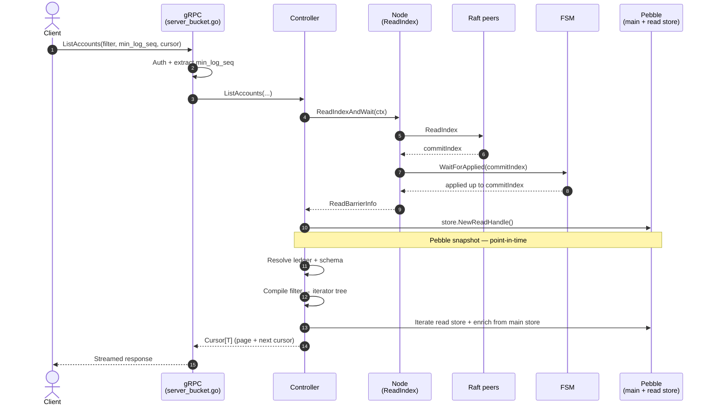

# Query Pipeline

## Overview

Every read goes through four stages: a **Raft `ReadIndex`** barrier for linearizability, an optional **`min_log_sequence`** wait for read-side freshness, a **Pebble snapshot** for point-in-time consistency, and a **composable iterator pipeline** over the read store. The result is streamed back through gRPC with cursor-based pagination.

The pipeline is deliberately uniform across endpoints: `ListAccounts`, `ListTransactions`, `ListLogs`, and `GetX` variants all go through the same controller layer and the same iterator algebra. The differences are which read-store prefix is scanned and how iterators are composed.

## Entry points

`internal/adapter/grpc/server_bucket.go` — every read RPC:

| RPC | Server method (line) | Controller method |
|-----|----------------------|-------------------|
| `ListAccounts` | `:624` | `ListAccounts` |
| `ListTransactions` | `:442` | `ListTransactions` |
| `ListLogs` | `:1121` | `ListLogs` |
| `GetTransaction` | `:299` | `GetTransaction` |
| `GetAccount` | `:606` | `GetAccount` |
| `ListLedgers` | — | `ListLedgers` |
| `ListPreparedQueries` | — | `ListPreparedQueries` |
| `ExecutePreparedQuery` | — | (see [prepared-queries.md](prepared-queries.md)) |

The HTTP REST surface (`internal/adapter/http/`) is a thin wrapper that routes to the same controller methods.

### Filter input: dual-format decode (EN-1511)

Whatever the transport, a filter reaches the pipeline as a single
`*commonpb.QueryFilter`. Callers may express it in **either** the textual
`filterexpr` grammar (`metadata[k] == v`) or the structured v2 JSON
`QueryFilter` DSL (`{"$match":{"metadata[k]":"v"}}`); both are decoded by the one
shared helper `filterexpr.DecodeDualFormat` (`internal/pkg/filterexpr/decode.go`),
which detects the form from the first non-whitespace byte, parses to the same
proto, and applies the single per-target validity gate
(`domain.ValidateFilterForTarget`). The HTTP list handlers call it via
`parseListFilter` (`internal/adapter/http/list_filter.go`) for the `?filter=`
query parameter and AND-combine the result with the endpoint's convenience params
(`reference`, `prefix`, date range) through `combineFilters`; prepared-query
create/update decode the JSON `filter` body field through the same helper; and
`ledgerctl --filter` routes through it in `cmdutil.BuildQueryFilter`. Audit
conditions (`audit[...]`) exist only in the textual form — the JSON codec has no
representation for them (EN-1241) — so the textual form is canonical for
`GET /v3/_/audit-entries`. See
[api-comparison.md](../../../contributing/api-comparison.md#filter-input-formats-dual-format-contract-en-1511)
for the full contract.

## Linearizability — `ReadIndex`

`internal/infra/node/read_index.go:101` — `ReadIndexAndWait(ctx)`:

1. Call `node.ReadIndex(ctx)` — Raft sends a heartbeat round-trip to confirm quorum and returns the current commit index.
2. `fsm.WaitForApplied(commitIndex)` — block until the local FSM has applied every entry up to that commit index.

Once both succeed, the local Pebble snapshot reflects state at least as fresh as the moment the request reached the cluster. This guarantees **linearizable reads on any node**: a read started after a successful write returns at least that write's effects, regardless of which node serves the read.

If the node is syncing or otherwise unable to confirm `ReadIndex`, the call fails — callers either retry or forward to the leader.

## Freshness — `min_log_sequence`

The client can pass `min_log_sequence` in gRPC metadata to demand a *read-side* freshness guarantee. `ReadIndex` only guarantees the **FSM** has caught up; `min_log_sequence` additionally waits for the **read store** to have indexed up to that log sequence.

`waitMinLogSequence()` (`server_bucket.go:434`) calls `readStore.WaitForSequence(ctx, minLogSequence)`, which blocks until the indexer's persisted progress cursor (see [indexer / Progress Cursors](../indexer/indexer.md#progress-cursors)) has caught up.

Important nuance, repeated from the indexer page: `min_log_sequence` pins **log application** on this replica, **not local rewrite completion**. A read against an index undergoing schema rewrite will keep serving `v_current` until the atomic switch lands — see [indexer / Changing a Metadata Key's Type](../indexer/indexer.md#changing-a-metadata-keys-type-setmetadatafieldtype).

Checkpoint reads (see below) ignore `min_log_sequence` — a frozen checkpoint is by definition at a single past sequence.

## Pebble snapshot

`store.NewReadHandle()` returns a Pebble snapshot. Every read in the controller layer uses the **same** snapshot for both the read store iterators (inverted index) and the main store reads (enrichment with volumes, metadata, transaction bodies). This is what makes a paginated `ListAccounts` consistent: page 2 sees the same world page 1 saw, even if the FSM committed new writes in between.

Multiple concurrent readers share snapshots cheaply (Pebble's snapshot is a versioned reference, not a copy).

## The generic list pipeline

`internal/application/ctrl/list_entities.go:57` — `listEntities[T]` is the shared dispatcher for everything that returns a page of entities:

1. Resolve the ledger (`query.GetLedgerByName`) and its declared-metadata schema (so filter conditions can be typed).
2. Compile the filter (if any) into an iterator tree (`internal/query/compile.go:90`).
3. Build the leaf iterators against the read store at the version returned by `SnapshotVersionResolver` (so an index undergoing rewrite still serves under `v_current`).
4. Apply the cursor — fast-forward iterators past the resume position.
5. Read up to `pageSize + 1` entities; the +1 is the *peek* that lets the streamer detect whether more pages exist without leaking a phantom cursor.
6. Enrich each candidate entity with its volumes / metadata / transaction body from the main store.
7. Return a `Cursor[T]` whose next cursor is derived from the **last sent** entity (not the peeked one).

## Iterator algebra

`internal/storage/readstore/iterator_*.go` — the iterators implement a small set of composable operators, all sharing an `EntityIterator` interface (`Next`, `Current`, `SeekGE`, `Err`, `Close`):

| Operator | Purpose |
|----------|---------|
| `PebbleAccountIterator`, `PebbleReverseTxIterator`, `LedgerLogsIterator`, … | Leaf scans over one read-store prefix. |
| `AndIterator` | Merge-intersect of sorted child iterators. |
| `OrIterator` | Merge-union. |
| `NotIterator` | Difference against the entity-existence index (`0x02`). |
| address-prefix iterator | Leaf scan with a chart-of-accounts prefix predicate. |

The filter compiler turns a `QueryFilter` proto into a tree of these. Recent work (commit `7662d2bae`) added monotonic-skip and probe-based optimisations to the `AndIterator` to short-circuit when one child runs ahead of the others.

## Pagination

A `Cursor[T]` is opaque to the client. Internally the cursor encodes the position of the *last returned* entity — a transaction ID as a decimal string (cursor.go:508), an account address as-is (`:676`), etc. The streamer (`server_bucket.go` → `sendPagedToStream`, `internal/adapter/grpc/stream_helper.go:44`):

1. Reads `pageSize + 1` entities.
2. If exactly `pageSize` are read, emits them with **no next cursor** (end of stream).
3. If `pageSize + 1` are read, emits the first `pageSize` and computes the next cursor from the **last sent** (the `+1`th is dropped — it was a peek).

This avoids the classic "phantom trailing cursor" bug where a result set of exactly `pageSize` items would advertise a non-existent next page.

The cursor is sent back as an `x-next-cursor` gRPC trailer.

## Special read paths

**Query checkpoints.** When the request carries a `checkpoint_id > 0`, the controller resolves the checkpoint to its frozen main-store + read-store snapshot pair, ignores `min_log_sequence` entirely, and runs the same iterator pipeline against the frozen views. Useful for reconciliation and auditing. See [query-checkpoints.md](query-checkpoints.md).

**Aggregate volumes.** `ExecutePreparedQuery` with the `AGGREGATE_VOLUMES` mode runs the same compiled filter to obtain a candidate account set, then loops over per-account asset volumes in the main store and sums per asset. The aggregation is computed at request time — there is no precomputed aggregate table.

**Inspect index** is documented under the indexer subsystem — see [indexer / indexes.md](../indexer/indexes.md#statistics-computed-on-demand).

## Where to look in the code

| Concern | Where |
|---------|-------|
| gRPC entry + auth + min_log_seq | `internal/adapter/grpc/server_bucket.go` |
| Controller read methods | `internal/application/ctrl/controller_default.go` |
| `ReadIndexAndWait` | `internal/infra/node/read_index.go:101` |
| Generic list | `internal/application/ctrl/list_entities.go:57` |
| Filter compile | `internal/query/compile.go:90` |
| Iterator algebra | `internal/storage/readstore/iterator_*.go` |
| Cursor + streamer | `internal/pkg/cursor/cursor.go`, `internal/adapter/grpc/stream_helper.go:44` |
