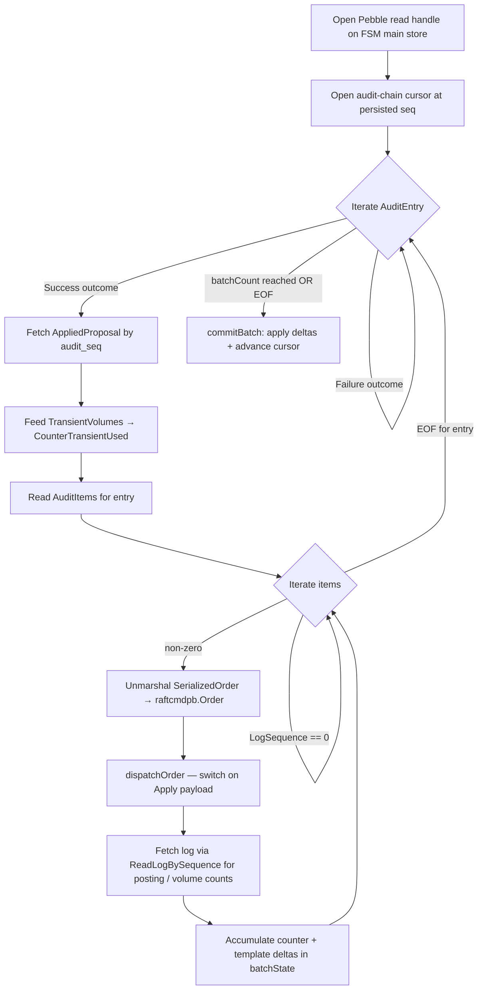

# Usagebuilder Pipeline

## Overview

The **usagebuilder** (`internal/application/usagebuilder`) is the background goroutine that turns committed audit entries into per-ledger housekeeping counters + per-Numscript-template invocation records. It runs on every node, tails the FSM audit chain, and writes to the **usagestore** — a Pebble instance dedicated to usage projections, peer to the read store.

This page covers the pipeline mechanics. For the **what** of counters (definitions, storage keys, log-payload plumbing), see [counters.md](counters.md).

## Why the audit chain, not the log stream

The subsystem tails `AuditEntry + AuditItem` (`ZoneCold` / `SubColdAudit` + `SubColdAuditItem`), not `ZoneCold` / `SubColdLog`. The reason is Numscript template usage: the log's `CreatedTransaction` payload does not carry the `NumscriptReference` of the order — only the resolved postings and metadata. The reference survives on `AuditItem.SerializedOrder`, which is the deterministic serialised bytes of the original `raftcmdpb.Order`. Reading the audit chain lets the usagebuilder unmarshal the order, extract `NumscriptReference.Name` for template tracking, and decide whether the order should feed the numscript-execution counter.

For counters that live on the log directly (posting count, purge lists), the usagebuilder fetches the specific log at `AuditItem.LogSequence` via `query.ReadLogBySequence` — a single point read on the hot Pebble cache.

## Builder Lifecycle

### Wake-up

```mermaid
flowchart LR
    FSM["FSM Commit<br/><i>infra/state/machine.go</i>"] -->|NotifyLogsCommitted| SIG["signal.Notifications.LogCommitted<br/><i>name:\"usage\" FanOut target</i>"]
    SIG -->|select case| LOOP["Builder.loop()"]
    TICK["100 ms Ticker"] -->|fallback case| LOOP
```

| Trigger | Source |
|---------|--------|
| FSM commit signal | `signal.Notifications.LogCommitted.C()` — fired by the FSM via `NotifyLogsCommitted(lastSeq)`. The FanOut in `bootstrap/module.go` dispatches to a dedicated `name:"usage"` `Notifications` so the usagebuilder does not compete with the indexer, events, or mirror consumers. |
| 100 ms fallback ticker | `time.NewTicker(100 * time.Millisecond)` in `Builder.loop()`. Same rationale as the indexer's — bound query staleness even if the signal layer is starved. |
| Cancellation | `ctx.Done()` (wired through `worker.Worker`). |

### Constructor injection for notifications

Unlike the indexer (which uses `SetNotifications` after construction), the usagebuilder receives its `*signal.Notifications` through the `NewBuilder` constructor — the fx graph passes the correctly-tagged `Notifications` at wire time. See `feedback_constructor_injection` in the project memory: setters create a hidden init protocol that constructor parameters do not.

### Boot

On `Start()`, the builder:

1. Reads the persisted progress cursor from `usagestore` (key `[0xFE][0x01]` — highest processed audit sequence).
2. Samples the current audit-chain head via `query.ReadLastAuditSequence` on a short-lived read handle. The handle is closed immediately to release the `dbMu.RLock` so a concurrent `RestoreCheckpoint` is not blocked while the builder is idle.
3. Runs an **initial catch-up pass** with a larger batch size (`max(configured, 2_000)`), split into 5-second slices so a single Pebble snapshot is not held for the full catch-up duration on large stores. Between slices the snapshot is released; between passes cache-warmed reads keep it cheap.

## `processAuditEntries` — Batched Commit



`internal/application/usagebuilder/process_audit.go`.

### Pass 1 — collect

- Opens a direct Pebble read handle on the FSM main store (`b.pebbleStore.NewDirectReadHandle()`).
- Opens an audit-entry cursor at `cursor + 1` (`query.ReadAuditEntries(ctx, handle, &cursor)`).
- For each entry:
  - Failure outcomes are skipped — no state change to project.
  - For successful entries, fetches the matching `AppliedProposal` (`query.ReadAppliedProposal(ctx, handle, entry.GetSequence())`) once. Its `TransientVolumes` map (per-ledger) feeds `CounterTransientUsed` — a single per-entry Get that avoids re-reading it per item.
  - Reads all `AuditItem` rows for the entry (`query.ReadAuditItems`).
  - For each item with `LogSequence != 0` (skipping idempotent replays and non-log-producing orders), unmarshals `SerializedOrder` and dispatches on the order variant. `dispatchCreateTransaction` and `dispatchRevertTransaction` fetch the produced log via `ReadLogBySequence` to extract resolved posting count + the three volume-annotation lists — see [counters.md](counters.md) for the fields.
- All deltas accumulate into a per-batch `batchState` (per-ledger counter map + per-(ledger, template) usage map).

### Pass 2 — commit

`commitBatch` does read-modify-write against the usagestore in a single Pebble batch:

1. For each `(ledger, counterID)` in the batch state, `Get` the current counter, apply the signed delta with `applyDelta` (clamps at zero on underflow), `PutCounter` the new value.
2. For each `(ledger, template)` template delta, `Get` the current `TemplateUsage` proto, fold the batch aggregation into it (add counts, take max of `last_used` timestamps), `PutTemplateUsage`.
3. `WriteProgress(batch, lastAuditSeq)` — persists the cursor in the **same batch** as the counter mutations.
4. `batch.Commit()`.

The invariant is the same as the indexer's two-pass commit: cursor and counter deltas move atomically. A crash mid-batch either commits both or neither — the loop resumes cleanly on restart.

### Batch sizing

Default is 200 audit entries per commit (`DefaultBatchSize` in `builder.go`). Higher during initial catch-up (`max(configured, 2_000)`). The trade-off is Pebble fsync frequency vs snapshot lifetime — the same one the indexer solves with `catchUpBudget = 5 * time.Second`.

## Snapshot on the reader side

`GetLedgerStats` reads seven counters (posting, revert, numscript-exec, reference, ephemeral, transient, volume) plus optional template-usage records. If each `GetCounter` opened its own Pebble read, a concurrent usagebuilder commit could land between two `Get`s and produce a partial view (e.g. VolumeCount reflects a commit that PostingCount does not). To avoid this the API opens a single `usagestore.Snapshot` and routes all reads through it:

```go
snap := ctrl.usageStore.NewSnapshot()
defer snap.Close()
stats.PostingCount, _ = snap.GetCounter(ledger, usagestore.CounterPosting)
// … all six other event counters read from the same snap
```

`Snapshot` wraps `*pebble.Snapshot` and re-exposes the read helpers. Writes stay batched atomically on the usagebuilder side; reads see a consistent point-in-time view.

## Failure semantics

| Failure mode | What survives | What replays |
|--------------|---------------|--------------|
| Usagebuilder crash mid-batch | Cursor at last successful commit; committed counter deltas are durable | Loop restarts, reads persisted cursor, resumes from `cursor + 1`. |
| Cold-storage archival of an early chapter | Nothing lost — counters already applied by the usagebuilder are persisted in usagestore | Cursor stays past the archived range; no re-processing. |
| Ledger deletion (audit log `DeleteLedger`) | Usagestore range-deletes every counter + template row keyed on the ledger via `DeleteLedger(batch, ledgerName)` | Re-created ledgers start at zero counters; audit-chain history for the old incarnation is idempotent to re-process. |
| Primary store rolled back beneath the persisted cursor | Nothing — `usagestore.Reset()` drops every counter + template row and clears the cursor | The next boot/tick replays from audit sequence 0 into the freshly-reset store. |

## Cutover semantics

The migration that introduced this subsystem (EN-1420 / EN-1422) moved every non-ID-generator counter off `LedgerBoundaries` and onto the usagestore. On production upgrade, each ledger's counters **reset to 0** and repopulate from the earliest audit entry still reachable in Pebble. Historic pre-upgrade values are lost — accepted trade-off. Fresh ledgers boot with a genesis-derived count that matches the FSM.

## Snapshot / restore

The usagestore is not part of Pebble snapshots or backups: it is a projection that is trivially rebuildable from the audit chain. On restore, the running usagebuilder catches up organically from wherever its persisted cursor points; if the primary store was rolled back beneath that cursor, `usagestore.Reset()` fires on the next boot/tick and the projection repopulates from audit sequence 0.

The audit chain remains the source of truth in every case.

> **3.0 limitation.** There is no offline drop-and-rebuild-from-scratch command. The now-removed `ledgerctl store rebuild-usage` replayed the audit chain from sequence 0 over the self-purging primary store, which undercounts `VolumeCount` once a chapter has been archived (the volumes touched by archived entries are gone from the reachable audit). Rather than ship a rebuild that lies, offline rebuild is deferred to 3.1, where it will seed `VolumeCount` from live `SubAttrVolume` state instead of replaying archived history. In 3.0, reconvergence relies exclusively on the online boot/tick fold + `Reset()`.

## Integrity verification (checker scope)

The usagestore is **deliberately excluded from `internal/application/check/checker.go`**. Invariant #8 ("every persisted projection must be verified by the checker") is scoped to projections that live in the **primary** Pebble store — the store that participates in Pebble snapshots, backups and cold-storage, and that an operator cannot rebuild without stopping the cluster. The usagestore, like the read store (`readstore`), is a physically separate secondary Pebble instance at `<data-dir>/usage/`: it is never snapshotted, never backed up, and is rebuildable from the audit chain via the online boot/tick fold (and `usagestore.Reset()` on rollback detection). A tampered or corrupted usagestore is therefore not a durable integrity vector — the next fold reconstructs it from the hash-chained audit, which the checker *does* verify. Extending the checker to walk a peer store would couple it to a subsystem it has no authority over and duplicate the rebuild logic that already re-derives every counter from the same source of truth.

## Summary

| Concern | Mechanism | File |
|---------|-----------|------|
| Loop skeleton | `tailworker.TailWorker` — shared boot/tick/wake driver used by every tail-worker subsystem (audit indexer, usagebuilder, …) | `internal/pkg/tailworker/tailworker.go` |
| Wake-up | Dedicated `name:"usage"` `Notifications` from the FSM FanOut fed into the tailworker's `Wake` channel + `TickInterval` fallback | `builder.go` |
| Source | Audit chain (`ReadAuditEntries` + `ReadAuditItems`), not the log stream — needed for Numscript template ref survival | `process_audit.go` |
| Atomicity | `WriteProgress` shares the same Pebble batch as counter / template mutations | `process_audit.go`, `usagestore/store.go` |
| Read consistency | Multi-counter reads via `usagestore.NewSnapshot()` | `usagestore/snapshot.go`, `ctrl/controller_default.go` |
| Isolation | Dedicated Pebble instance at `<data-dir>/usage/`, own comparer, WAL disabled | `usagestore/{store,comparer,keys}.go` |
| Metrics | `tailworker.RegisterTailGauges` — 3 shared gauges (`last_indexed_sequence`, `audit_last_sequence`, `lag`) | `builder.go`, `internal/pkg/tailworker/gauges.go` |
| Rebuild | Online boot/tick fold from the persisted cursor; `usagestore.Reset()` drops rows + replays from 0 on rollback detection (offline rebuild-from-scratch deferred to 3.1 — see Snapshot / restore) | `builder.go`, `usagestore/store.go` |
