# Local validation

## Authority and trust model

Local validation is fast engineering feedback and targeted evidence. GitHub CI
is the authoritative broad, clean validation boundary before merge.

Local agents are cooperative. The workflow protects against accidental stale
cache entries, cross-worktree mistakes, the wrong toolchain, a stale target,
the wrong candidate, flaky focused tests, generated drift, and process crashes.
It does not isolate caches against deliberate same-user poisoning of Go or lint
cache internals.

The cooperative cache policy does not relax publication identity:

- candidate and trusted-root worktrees remain distinct and mechanically bound;
- the exact candidate SHA and complete worktree state remain review inputs;
- the target is fetched and revalidated at publication boundaries;
- pushes retain the exact remote-head lease; and
- required GitHub checks and human review remain merge gates.

## Shared external caches

`scripts/agent-validation-env` provisions stable caches under
`${LEDGER_AI_CACHE_ROOT}`. The default is `$HOME/.cache/ledger-ai`:

| Variable | Shared location |
| --- | --- |
| `GOCACHE` | `go-build/` |
| `GOMODCACHE` | `go-mod/` |
| `GOPATH` | `go-path/` |
| `GOLANGCI_LINT_CACHE` | `golangci-lint/` |
| `XDG_CACHE_HOME` | `xdg/` |

The cache root must be absolute and outside the candidate worktree, trusted
root, and disposable validation directory. Run cleanup never removes it.
`HOME` is inherited for validation; it is not synthesized per run. Reviewer
adapters may still isolate `HOME`/`CODEX_HOME` to exclude personal reviewer
configuration, while their Go and lint caches use the shared root. `TMPDIR`
remains per run because temporary filenames and cleanup are process lifecycle
state rather than reusable cache state.

Go's normal content, build-option, race, tag, toolchain, and module checksum
keys remain authoritative. There is no verified seed/copy layer and no
run-local extracted module tree. If normal cache corruption or suspicious lint
behavior occurs, perform one explicit clean retry:

```bash
bash scripts/agent-validation-env --clean-cache --ephemeral true
```

Cache clearing is exceptional recovery, not a cost imposed on every run.
Coordinate it with other local agents and do not clear a cache while another
validation is using it.

## Cost map and design evidence

Reference measurements on 2026-09-03 used the pinned development shell on an
Apple workstation. They are comparative evidence, not performance budgets:

| Stage | Observed wall time | Repeated by CI | In-scope local value | Decision |
| --- | ---: | --- | --- | --- |
| Environment/cache setup | 0.08s | No | Exact paths and tool inputs | `SIMPLIFY`: one shared wrapper |
| Isolated cold pre-commit | >10m31s; operator lint timed out | `Dirty` | Generated drift, but not hostile-cache defense | `REMOVE`: no per-run caches |
| Shared warm full pre-commit | 64.83s | `Dirty` | Relevant generation/lint drift | `TARGET_LOCAL`: affected changes only |
| Fast baseline | 22.44s | Build/`Dirty` overlap | Compile, invariants, diff hygiene | `KEEP_LOCAL` |
| Focused race tests | 2.7-28.4s in representative packages | `Tests` overlap | Regression and affected behavior | `KEEP_LOCAL` when affected |
| Full root race fallback | 7m32s warm end to end | `Tests` and coverage overlap | Useful only for unknown/high-risk changes | `MOVE_TO_CI` by default |
| Exact review | Provider-dependent | Human review is independent | Candidate intent and exact bytes | `KEEP_LOCAL` |
| Repeated review/validation | Provider-dependent | No | None in the linear workflow | `REMOVE` |
| Target/head revalidation and leased push | Seconds | Merge protection is additive | Fresh base and exact publication identity | `KEEP_LOCAL` |

Two detached worktrees at the same target SHA also completed concurrent lint
against the shared caches with zero findings in 35.97s each. Cooperative Go
cache tests cover same-source worktrees, different source contents, race and
non-race builds, build tags, and concurrent processes.

The alternative input-sensitive pre-commit proposal added roughly 1,500 lines
of selector and dependency machinery. A straightforward warm pre-commit at
about 65 seconds was preferable: the exact-diff selector remains small and
only decides whether that recipe is relevant. Likewise, verified module-cache
seeding and per-run copying are not part of this threat model; ordinary shared
`GOMODCACHE` plus Go checksum verification is the selected design.

## Command hierarchy

`bash scripts/agent-check` is the fast baseline. It checks repository
invariants, compiles the root module, and checks tracked and untracked diff
whitespace. It does not run the full pre-commit recipe or unit suite.

`AI_REVIEW_BASE_SHA=<sha> bash scripts/agent-check-pr` is the normal PR path.
It classifies the exact base-to-worktree diff, runs the straightforward
pre-commit recipe only when Go/generated/tooling inputs are involved, runs the
baseline, and adds focused race or affected subsystem tests.

`bash scripts/agent-check-full` is the explicit broad fallback. It runs full
normalization, the baseline, and the complete root-module race suite. It is not
the default publication path.

The selector intentionally stays small. Unknown inputs, dependency/toolchain
changes, protobuf/generated surfaces, shared public types, and production Go
deletions fall back to `agent-check-full`. It does not maintain a second build
graph or generated-output dependency engine.

## Check placement

| Check | Default placement |
| --- | --- |
| Repository invariants, compile, diff whitespace | `LOCAL_ALWAYS` |
| Focused package race/regression tests | `LOCAL_WHEN_AFFECTED` |
| Generation, tidy, lint normalization | `LOCAL_WHEN_AFFECTED`; full in CI `Dirty` |
| E2E | `LOCAL_WHEN_AFFECTED` when E2E/testserver paths change; otherwise CI |
| Scenarios | `LOCAL_WHEN_AFFECTED` for scenario/Numscript paths; otherwise CI |
| Schemathesis | `LOCAL_WHEN_AFFECTED` for HTTP/OpenAPI paths; otherwise CI |
| Operator tests | `LOCAL_WHEN_AFFECTED` for operator paths; otherwise CI |
| Full root race suite and coverage | `CI_ONLY`, except explicit high-risk fallback |
| Three-node model run and Antithesis workload | `CI_ONLY` or explicit diagnosis |
| Active fuzzing and broad optional-tag suites | `CI_ONLY` or explicit diagnosis |

The focused regression that demonstrates a real bug remains local evidence.
The selector supplements that evidence; it does not invent or replace it.

## Linear workflow DAG

One normalization pass is followed by at most one replay on the resulting
state. A clean replay proves the fixpoint. The committed candidate then receives
one proportional validation followed by one exact final review. The publication
path does not add another identical last-mile validation when HEAD and worktree
state are unchanged.

```mermaid
flowchart LR
    A[Fetch and bind target/head] --> B[Focused reproduction or regression]
    B --> C[Applicable normalization]
    C --> D[Exact candidate commit]
    D --> E[Targeted agent-check-pr]
    E --> F[Collect unresolved GitHub findings]
    F --> G[Exact final review]
    G --> H[Revalidate target and remote head]
    H --> I[Leased push]
    I --> J[Clean CI in parallel with human review]
    J --> K[Required checks and approval]
    K --> L[Merge]
```



An existing PR's CI starts from its first push while local review proceeds.
Subsequent fixes are not delayed by local replays of broad jobs that CI runs
independently.

Representative warm local compute is therefore about 23 seconds for a docs-only
change, 1.5-2 minutes for a focused test-only change, 2-5 minutes plus its
reproduction/review evidence for an ordinary bugfix, and about 7.5 minutes for
the explicit high-risk fallback. Tooling changes that exercise all script
launchers are typically 3-4 minutes. Provider review time is intentionally not
hidden inside these command measurements.

## CI boundary

The default workflow runs clean normalization, unit coverage, operator, E2E,
scenario, model, Antithesis workload, Schemathesis, build, and coverage jobs.
The organization ruleset requires the `Dirty` and `Tests` checks on the default
branch, and the protected-branch ruleset requires an approved pull request,
code-owner review, resolved threads, linear history, and squash merge. Local
success never substitutes for those controls.
