# Local validation

## Authority and trust model

Local validation is fast engineering feedback and targeted evidence. GitHub CI
is the authoritative broad, clean validation boundary before merge.

Local agents are cooperative. The workflow protects against accidental stale
cache entries, cross-worktree mistakes, the wrong toolchain, a stale target,
the wrong candidate, flaky focused tests, generated drift, and process crashes.
It does not isolate caches against deliberate same-user poisoning of Go or lint
cache internals, intercept Git commands, or defend against mutate-and-restore
behavior in the primary checkout.

The cooperative cache policy does not relax publication identity:

- candidate and trusted-root worktrees remain distinct and mechanically bound;
- the exact candidate SHA and complete worktree state remain review inputs;
- the target is fetched and revalidated at publication boundaries;
- pushes retain the exact remote-head lease; and
- required GitHub checks and human review remain merge gates.

## Shared external caches

`scripts/agent-validation-env` provisions stable caches under
`${LEDGER_AI_CACHE_ROOT}`. The default is `$HOME/.cache/ledger-ai`:

| Variable | Shared location |
| --- | --- |
| `GOCACHE` | managed generation under `go-build-generations/` |
| `GOMODCACHE` | `go-mod/` |
| `GOPATH` | `go-path/` |
| `GOLANGCI_LINT_CACHE` | `golangci-lint/` |
| `XDG_CACHE_HOME` | `xdg/` |

The cache root must be absolute and outside the candidate worktree, trusted
root, and disposable validation directory. Run cleanup never removes it.
`HOME` is inherited for validation; it is not synthesized per run. Reviewer
adapters may still isolate `HOME`/`CODEX_HOME` to exclude personal reviewer
configuration, while their Go and lint caches use the shared root. `TMPDIR`
remains per run because temporary filenames and cleanup are process lifecycle
state rather than reusable cache state.

### Bounded Go build-cache generations

Go build entries have high cardinality across candidate SHAs, race builds,
coverage and build tags. `agent-validation-env` therefore binds each run to a
managed `GOCACHE` generation. Runs that start together reuse the same current
generation. When its measured size exceeds the soft budget, a later run
atomically selects a fresh generation; processes already running keep using the
retired generation through a PID lease. A retired generation is removed only
after none of its lease processes exists.

The defaults are a 32 GiB soft budget and a five-minute size-check interval.
Set `LEDGER_AI_GOCACHE_MAX_MIB` or
`LEDGER_AI_GOCACHE_CHECK_INTERVAL_SECONDS` to tune them for a workstation.
The budget is intentionally soft: a single run may grow beyond it, and leased
retired generations temporarily count in addition to the current generation.
This preserves concurrent validation and never deletes a cache used by a live
cooperative run.

`GOMODCACHE`, `GOPATH`, `GOLANGCI_LINT_CACHE`, and `XDG_CACHE_HOME` remain
stable shared directories. Legacy `go-build/` data created by older workflow
versions is not adopted or deleted automatically because older live processes
cannot hold generation leases; remove it only during an explicitly coordinated
cache cleanup.

### golangci-lint cross-worktree safety

The development shell provides upstream golangci-lint v2.13.2 through
`flake.lock`, without a package override or source patch. Identical packages
share cache entries across worktrees; current-module issue positions are stored
relative to the module and rebased to the consuming checkout on load. A
payload-format salt excludes the unsafe v2.12.2 entries, which stored absolute
producer paths ([upstream #6695](https://github.com/golangci/golangci-lint/issues/6695)).

Cached diagnostics must not reopen the producer's files after it is removed.
Suggested fixes use the rebased issue filename and retain byte offsets; the
content-derived package key ensures those offsets describe the consuming file.

Go's normal content, build-option, race, tag, toolchain, and module checksum
keys remain authoritative. There is no verified seed/copy layer and no
run-local extracted module tree. If lint-cache corruption or suspicious lint
behavior occurs, perform one explicit clean retry:

```bash
bash scripts/agent-validation-env --clean-cache --ephemeral true
```

Despite its historical name, `--clean-cache` now removes only
`GOLANGCI_LINT_CACHE`. It preserves `GOCACHE`, `GOMODCACHE`, `GOPATH`, and
`XDG_CACHE_HOME`. Clearing is exceptional recovery, not a cost imposed on every
run. Coordinate it with other local agents: do not clear the shared lint cache
while another validation is using it.

### Alternatives considered

| Design | Safety | Warm behavior | Decision |
| --- | --- | --- | --- |
| Stable cache directory per canonical worktree | Safe across worktrees, including symlink aliases after canonicalization | Warm only within one physical path; duplicates entries and leaves namespaces after removed worktrees | Not selected once the upstream value fix became available |
| Absolute worktree path in the cache key | Safe because different paths cannot hit the same entry | Same hit topology as per-worktree directories, with no cross-worktree reuse | Upstream temporarily used this fallback in #6697 |
| Relative positions rebased on load | Safe when every path-bearing cached value is normalized and old payloads are salted out | Preserves global cross-worktree hits | Provided by the pinned upstream v2.13.2 package |
| Per-execution lint cache | Safe | No lint-cache warm path; repeats analysis on every validation | Rejected on performance grounds |
| v2.12.2 global cache plus routine cleaning | Unsafe between cleans | Fast only until another checkout supplies a location-bound value | Rejected; cleaning is recovery, not isolation |

## Cost map and design evidence

Reference measurements on 2026-09-03 used the pinned development shell on an
Apple workstation. They are comparative evidence, not performance budgets:

| Stage | Observed wall time | Repeated by CI | In-scope local value | Decision |
| --- | ---: | --- | --- | --- |
| Environment/cache setup | 0.08s | No | Exact paths and tool inputs | `SIMPLIFY`: one shared wrapper |
| Isolated cold pre-commit | >10m31s; operator lint timed out | `Dirty` | Generated drift, but not hostile-cache defense | `REMOVE`: no per-run caches |
| Shared warm full pre-commit | 64.83s | `Dirty` | Relevant generation/lint drift | `TARGET_LOCAL`: affected changes only |
| Fast baseline | 22.44s | Build/`Dirty` overlap | Compile, invariants, diff hygiene | `KEEP_LOCAL` |
| Focused race tests | 2.7-28.4s in representative packages | `Tests` overlap | Regression and affected behavior | `KEEP_LOCAL` when affected |
| Full root race fallback | 7m32s warm end to end | `Tests` and coverage overlap | Useful only for unknown/high-risk changes | `MOVE_TO_CI` by default |
| Exact review | Provider-dependent | Human review is independent | Candidate intent and exact bytes | `KEEP_LOCAL` |
| Repeated review/validation | Provider-dependent | No | None in the linear workflow | `REMOVE` |
| Target/head revalidation and leased push | Seconds | Merge protection is additive | Fresh base and exact publication identity | `KEEP_LOCAL` |

The earlier 35.97s concurrent-worktree measurement used the unsafe original
v2.12.2 value format and is no longer correctness evidence. The cache
regression creates two identical worktrees, caches a positioned diagnostic in
A, removes A, and proves that B obtains a cross-worktree hit while reporting
and reopening only B's file. Companion cases cover simultaneous writers,
same-worktree warm reuse, content changes, deterministic cold/warm diagnostics,
preservation of the shared Go caches, and lint-only cleanup.

A 2026-09-07 comparison on a one-package positioned-diagnostic fixture measured
the selected global/rebased cache at 31.9ms cold in worktree A and 27.2ms for a
cross-worktree hit in B. A stable per-worktree namespace measured 45.0ms cold
and 27.3ms warm in A, then paid another 32.3ms cold in B; a per-execution cache
paid the cold analysis on both runs (32.7ms and 31.0ms). These targeted timings
demonstrate cache reuse, not a full-module performance budget.

The alternative input-sensitive pre-commit proposal added roughly 1,500 lines
of selector and dependency machinery. A straightforward warm pre-commit at
about 65 seconds was preferable: the exact-diff selector remains small and
only decides whether that recipe is relevant. Likewise, verified module-cache
seeding and per-run copying are not part of this threat model; ordinary shared
`GOMODCACHE` plus Go checksum verification is the selected design.

## Command hierarchy

`bash scripts/agent-check` is the fast baseline. It checks repository
invariants, compiles the root module, and checks tracked and untracked diff
whitespace. It does not run the full pre-commit recipe or unit suite.

`AI_REVIEW_BASE_SHA=<sha> bash scripts/agent-check-pr` is the normal PR path.
It classifies the exact base-to-worktree diff, runs the straightforward
pre-commit recipe only when Go/generated/tooling inputs are involved, runs the
baseline, and adds focused race or affected subsystem tests.

`bash scripts/agent-check-full` is the explicit broad fallback. It runs full
normalization, the baseline, and the complete root-module race suite. It is not
the default publication path.

The selector intentionally stays small. Unknown inputs, dependency/toolchain
changes, protobuf/generated surfaces, shared public types, and production Go
deletions fall back to `agent-check-full`. It does not maintain a second build
graph or generated-output dependency engine.

## Check placement

| Check | Default placement |
| --- | --- |
| Repository invariants, compile, diff whitespace | `LOCAL_ALWAYS` |
| Focused package race/regression tests | `LOCAL_WHEN_AFFECTED` |
| Generation, tidy, lint normalization | `LOCAL_WHEN_AFFECTED`; full in CI `Dirty` |
| E2E | `LOCAL_WHEN_AFFECTED` when E2E/testserver paths change; otherwise CI |
| Scenarios | `LOCAL_WHEN_AFFECTED` for scenario/Numscript paths; otherwise CI |
| Schemathesis | `LOCAL_WHEN_AFFECTED` for HTTP/OpenAPI paths; otherwise CI |
| Operator tests | `LOCAL_WHEN_AFFECTED` for operator paths; otherwise CI |
| Full root race suite and coverage | `CI_ONLY`, except explicit high-risk fallback |
| Three-node model run and Antithesis workload | `CI_ONLY` or explicit diagnosis |
| Active fuzzing and broad optional-tag suites | `CI_ONLY` or explicit diagnosis |

The focused regression that demonstrates a real bug remains local evidence.
The selector supplements that evidence; it does not invent or replace it.

## Linear workflow DAG

One normalization pass is followed by at most one replay on the resulting
state. A clean replay proves the fixpoint. The committed candidate then receives
one proportional validation followed by one exact final review. The publication
path does not add another identical last-mile validation when HEAD and worktree
state are unchanged.

```mermaid
flowchart LR
    A[Fetch and bind target/head] --> B[Focused reproduction or regression]
    B --> C[Applicable normalization]
    C --> D[Exact candidate commit]
    D --> E[Targeted agent-check-pr]
    E --> F[Collect unresolved GitHub findings]
    F --> G[Exact final review]
    G --> H[Revalidate target and remote head]
    H --> I[Leased push]
    I --> J[Clean CI in parallel with human review]
    J --> K[Required checks and approval]
    K --> L[Merge]
```



An existing PR's CI starts from its first push while local review proceeds.
Subsequent fixes are not delayed by local replays of broad jobs that CI runs
independently.

Representative warm local compute is therefore about 23 seconds for a docs-only
change, 1.5-2 minutes for a focused test-only change, 2-5 minutes plus its
reproduction/review evidence for an ordinary bugfix, and about 7.5 minutes for
the explicit high-risk fallback. Tooling changes that exercise all script
launchers are typically 3-4 minutes. Provider review time is intentionally not
hidden inside these command measurements.

### Cooperative-boundary baseline

The 2026-09-04 PR-tooling measurement used a primary checkout containing
219,330 ignored entries and 14.28 GiB of ignored logical content. The previous
integrity guard took more than 65.662 seconds for one snapshot, took seven
snapshots per straight run, and launched 63 Git processes. Its measured lower
bound exceeded 7 minutes 40 seconds. The cooperative guard does not enumerate
ignored entries: a warm six-process benchmark of the same checkout took 235
ms, while the final complete boundary measured 175 ms before and 153 ms after
(328 ms of snapshot compute and 0.49 seconds wall time). The two snapshots
launch 12 Git processes. The Git interceptor was removed.

The proportional validation for that tooling change completed in about 90
seconds on a warm cache, including the single affected race suite. The guard
was therefore below 1% of measured local compute. Use the following warm local
objectives to identify future measured optimization work; they are diagnostic
objectives, not validation gates:

| Change class | Local compute objective | Excluded time |
| --- | ---: | --- |
| Documentation or small tooling | <3m | Reviewer-provider latency |
| Focused test-only | <5m | Reviewer-provider latency |
| Focused Go change | <5m | Intrinsically slow affected tests and reviewer-provider latency |
| Ordinary bugfix | <10m | Reviewer-provider latency |

## CI boundary

The default workflow runs clean normalization, unit coverage, operator, E2E,
scenario, model, Antithesis workload, Schemathesis, build, and coverage jobs.
The organization ruleset requires the `Dirty` and `Tests` checks on the default
branch, and the protected-branch ruleset requires an approved pull request,
code-owner review, resolved threads, linear history, and squash merge. Local
success never substitutes for those controls.

## Future tooling changes

Correctness or safety machinery requires a reproduced recurring problem and an
expected return on its ongoing cost. Performance, simplification, and UX work
requires measured cost or friction, a measurable expected gain, and no net
complexity increase unless a small increase has overwhelming measured value.
Prefer deletion, batching, reuse, and fewer processes or network calls over new
state, schemas, protocols, or orchestration. Hypothetical same-user sabotage is
outside the local cooperative boundary.
