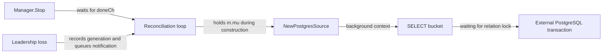
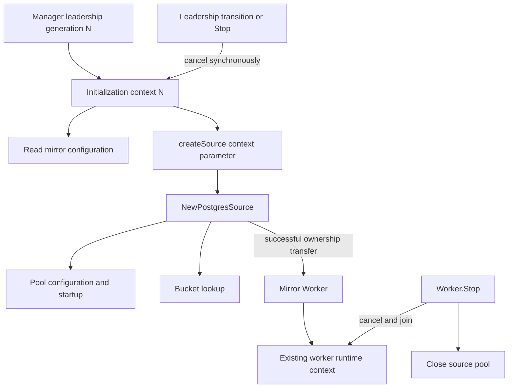
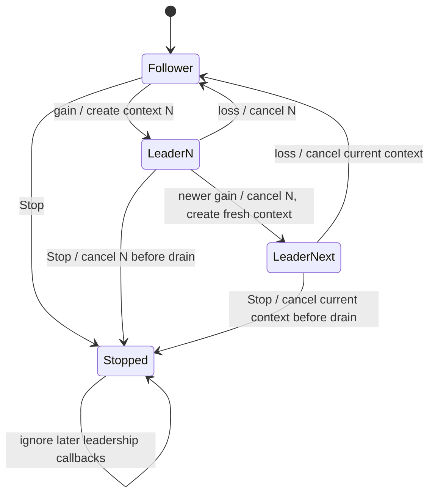
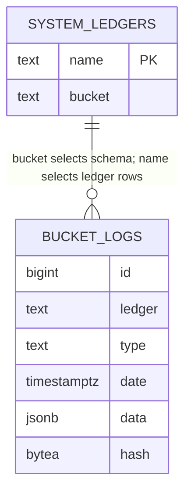
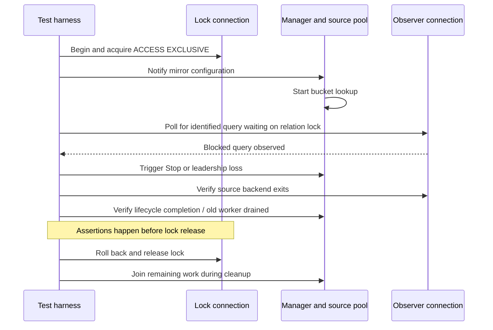

# EN-1997: Cancel blocked PostgreSQL mirror initialization

## Evidence and scope

Ticket: https://formance-team.atlassian.net/browse/EN-1997

Base: origin/release/v3.0, aa05833cd (checked 2026-09-10).
Branch: codex/en-1997-mirror-startup-cancellation.

The mirror manager reconciles under its worker-map mutex. PostgreSQL source
construction queries `_system.ledgers` synchronously using a background context.
Stop fences leadership then waits for reconciliation; leadership loss queues
reconciliation. Neither can interrupt the query, so both worker teardown and
shutdown can stall indefinitely behind a source database lock.

EN-1959 / PR #1916 generation fencing is present and must remain intact.
EN-1963 owns shared Node leadership leases, atomic authorization, proposal
acceptance, and migration of other consumers. This change addresses only the
concrete mirror startup cancellation and cleanup path; it does not implement
or claim the broader lease guarantees. No matching open implementation PR was
found in the inspected open PR inventory.

## Proposed design

- Give each manager leadership generation a cancellable initialization context,
  protected by leadershipMu. Capture generation and context consistently.
- Cancel the previous context when recording a leadership transition and when
  Stop closes the manager lifecycle gate, before waiting for reconciliation.
- Pass this context through createSource to NewPostgresSource; use it for the
  reconciliation read where appropriate. Never hold leadershipMu during I/O,
  worker shutdown, or loop draining. Existing m.mu ownership remains unchanged.
- Retain generation fencing. After construction, reject stale work and close
  its source before starting a worker. Preserve the existing post-start fence.
- Compile rewrite rules before allocating a source, or explicitly close a
  successfully constructed source if subsequent preparation fails. The existing
  PostgreSQL constructor closes its pool on bucket-query failure.
- Existing worker Stop remains responsible for canceling and joining runtime
  work and closing its source after reconciliation unblocks.

Tradeoff: a small manager-local cancellation mechanism fixes the defect now;
EN-1963 can later replace it with the shared lease context. A fixed query timeout
alone would merely bound the stall and would not express leadership ownership.
No wire, persistent state, configuration, or FSM changes are required.

## Current failure: the wait chain

The problem is a missing cancellation path, rather than a cycle of mutually
held locks. The database can keep reconciliation waiting indefinitely, and
shutdown waits for that reconciliation to finish.



```mermaid
sequenceDiagram
    participant Caller as Fx shutdown
    participant M as Manager
    participant R as Reconciliation loop
    participant P as PostgreSQL
    R->>M: Lock worker map (m.mu)
    R->>P: SELECT bucket with background context
    Note over P: Another transaction holds ACCESS EXCLUSIVE
    Caller->>M: Stop()
    M->>M: Mark stopped and invalidate generation
    M->>R: Close stopCh
    Note over R,P: Query does not observe stopCh
    M->>R: Wait for doneCh
    Note over Caller,M: Stop cannot complete; worker teardown has not run
```

For leadership loss, the callback itself already returns promptly. The defect
is that queued teardown cannot run while construction remains blocked. Tests
must therefore assert teardown and query cancellation, not merely callback
completion.

## Proposed ownership and state schema

The following is a conceptual in-memory schema; exact private field/helper
names can be chosen during implementation. No database migration is needed.

| State | Protection | Owner and lifetime |
|---|---|---|
| `leadershipGeneration` | `leadershipMu` | Monotonically increases on each recorded transition and Stop |
| `isLeader`, `stopped` | `leadershipMu` | Determines whether a generation may reconcile; stopped is terminal |
| `initializationCtx`, `cancelInitialization` | `leadershipMu` | One context for the current leader generation; canceled on supersession or Stop |
| `resourcesGeneration` | `m.mu` | Identifies which generation owns the current worker set |
| `workers[name]` | `m.mu` | Manager owns retained workers and stops them during teardown |
| Constructed, unretained source | Reconciliation goroutine | Constructor owns partial resources; manager owns a successful result until Worker takes ownership |

A reconciliation snapshot carries generation, leader/stopped flags, and the
matching initialization context together. A follower snapshot does not permit
construction. Leadership gain creates a fresh context before publishing its
notification. Construction must never fall back to Background if its snapshot
is stale or canceled.



The initialization context is passed through constructor APIs that already
accept a context. This does not assert that every internal pgx pool background
activity is directly derived from it: pool cleanup must still be checked on
the real driver failure path. The successful worker retains its existing
runtime context; source initialization and worker execution are separate
lifetimes in this fix.



### Ordering and lock rules

1. Under `leadershipMu`, invalidate the previous generation, cancel its
   initialization context, and install the next state/context if applicable.
2. Release `leadershipMu` before notifying reconciliation or waiting for work.
3. Reconciliation holds `m.mu` for worker-map ownership and briefly acquires
   `leadershipMu` for a consistent snapshot or fence check.
4. No path holds `leadershipMu` while waiting for `m.mu`, database I/O,
   Worker.Stop, or manager loop completion. Stop releases leadershipMu before
   draining and acquiring m.mu. This avoids reversing the lock order.
5. Cancellation invokes no application cleanup callback under leadershipMu;
   source cleanup and worker teardown happen in the lifecycle-owned path.

## Proposed shutdown and leadership-loss flow

```mermaid
sequenceDiagram
    participant C as Shutdown or Raft observer
    participant M as Manager
    participant R as Reconciliation loop
    participant P as PostgreSQL source
    participant W as Existing HTTP worker
    R->>P: Bucket lookup using context N
    Note over P: Query is observably blocked on database lock
    C->>M: Stop() or OnLeadershipChange(false)
    M->>M: Invalidate generation and cancel context N
    Note over M: Release leadershipMu before waiting
    M-->>C: Leadership callback returns (loss case)
    P-->>R: Canceled query; constructor closes pool
    R->>R: Reject superseded generation and finish reconciliation
    alt Shutdown
        R-->>M: Loop done
        M->>W: Stop, join, close source
        M-->>C: Stop returns
    else Leadership loss
        R->>R: Consume latest configuration notification
        R->>W: Stop, join, close source
    end
    Note over P,W: Database lock remains held through cancellation and teardown assertions
```

This removes the initialization query as the obstacle to teardown. It is not
a hard wall-clock shutdown guarantee for arbitrary dependencies that ignore
their contexts. It also does not close the existing check/start race: loss can
occur between a generation check and Worker.Start. The post-start fence still
stops that worker. Atomic authorization and lease-scoped runtime execution
remain EN-1963 responsibilities.

### Source ownership on each exit path

| Exit point | Required cleanup |
|---|---|
| Invalid rewrite configuration | Prefer compiling before source construction; no pool allocated |
| Pool configuration or creation fails | Constructor returns its error and cleans up whatever it acquired |
| Bucket lookup fails or is canceled | Existing constructor closes the pool before returning |
| Construction succeeds but generation is stale | Manager closes the source; do not start a worker |
| Leadership changes during Worker.Start | Existing post-start fence calls Worker.Stop, which joins and closes the source |
| Worker retained successfully | Worker owns source closure; manager initiates Worker.Stop on removal/teardown |

## PostgreSQL regression fixture schema

Use an isolated test database. This is the minimal test schema for exercising
the adapter, not a reproduction of the full Ledger v2 database schema.



The diagram shows a logical relationship; no cross-schema foreign key is
required. `_system.ledgers.bucket` selects the SQL schema, while the configured
ledger name filters rows within that schema's logs table.

```sql
CREATE SCHEMA _system;
CREATE TABLE _system.ledgers (
    name text PRIMARY KEY,
    bucket text NOT NULL
);
CREATE SCHEMA source_bucket;
CREATE TABLE source_bucket.logs (
    id bigint NOT NULL,
    ledger text NOT NULL,
    type text NOT NULL,
    date timestamptz NOT NULL,
    data jsonb NOT NULL,
    hash bytea
);
INSERT INTO _system.ledgers (name, bucket)
VALUES ('source-ledger', 'source_bucket');
```

An empty logs table supports successful source startup and an idle worker when
testing recovery. For the failing constructor itself, only `_system.ledgers`
is required.

Three independent database connections have distinct roles:

| Connection | Purpose |
|---|---|
| Lock holder | `BEGIN; LOCK TABLE _system.ledgers IN ACCESS EXCLUSIVE MODE;` |
| Mirror pool | Executes the actual constructor query; DSN explicitly sets `statement_timeout=0`, `lock_timeout=0`, and a unique `application_name` |
| Observer | Uses `pg_stat_activity` and `pg_locks` to establish the exact blocked query and identify its backend PID |

The observer must match the test's application name, bucket query, relation,
and ungranted relation lock. Merely observing an open connection is not proof
that the constructor reached the failing branch. Test deadlines bound the
harness; they must not become the source query's cancellation mechanism.



### Regression matrix

| Case | Trigger and evidence | Expected outcome |
|---|---|---|
| Blocked startup + shutdown | Observe bucket query lock wait, then Stop | Stop completes and source connection disappears while lock stays held |
| Blocked startup + leadership loss | First retain HTTP worker; add PostgreSQL mirror within same generation; observe query; send loss | Callback returns, query cancels, HTTP worker stops, worker map becomes empty |
| Recovery after canceled startup | Cancel old generation, release fixture lock, then regain leadership | Fresh source starts under new generation; old source is not retained |
| Coalesced loss/regain | Preserve existing generation regression and add context assertions | Old context canceled; new context distinct and live; prior workers replaced |
| Stop then late gain | Preserve existing Stop fence test | No new context or worker created after Stop |
| Constructor succeeds just as generation changes | Focused synchronization at ownership seam if needed | Source closed or started worker immediately stopped; no stale retained worker |
| Invalid rewrite preparation | Validate preparation order or exercise failure cleanup | No successful source is abandoned without closure |

Do not use `workerNames` while reconciliation is intentionally blocked: it
takes `m.mu` and would hang the test observer. Capture an existing worker before
adding the blocked mirror; inspect its completion signal independently. Only
read the worker map after the blocked operation has unwound.

Failure cleanup must release the database lock before joining a manager running
the unfixed code. This lets the regression fail with useful assertions rather
than hanging the entire test suite. The passing assertions still occur before
cleanup releases the lock.

## Files expected to change

| File | Planned change |
|---|---|
| `internal/application/mirror/manager.go` | Generation context ownership, cancellation ordering, context propagation, and source ownership cleanup |
| `internal/application/mirror/manager_test.go` | Preserve and extend deterministic generation/lifecycle coverage |
| `internal/application/mirror/manager_integration_test.go` | New real PostgreSQL lock regression fixture and lifecycle tests; final filename may follow nearby conventions |
| `docs/technical/architecture/subsystems/events-mirror/mirror.md` | Describe initialization cancellation and cleanup guarantees |
| `docs/technical/architecture/subsystems/events-mirror/README.md` | Point readers to the lifecycle contract |

The PostgreSQL constructor already accepts a context and closes its pool on
query failure. Production changes there are only warranted if regression
evidence reveals an additional cleanup defect. Shared worker and Node APIs
should remain unchanged.

## Implementation slices and regression seams

1. Add real PostgreSQL integration regressions through Manager.Start,
   OnLeadershipChange, configuration notifications, and Stop. Use a dedicated
   database fixture and disable statement_timeout and lock_timeout. Hold an
   ACCESS EXCLUSIVE lock on `_system.ledgers`; observe the exact source query
   waiting via pg_stat_activity/pg_locks before triggering cancellation.
   - Shutdown: Stop must complete while the lock remains held.
   - Leadership loss: establish an HTTP worker first, then add the blocked
     PostgreSQL source within the same generation. Loss must return promptly,
     cancel the query, and permit teardown of the established worker while
     the lock remains held.
   - Always release locks and join goroutines during cleanup, including when
     asserting the pre-fix failure; avoid worker-map lock reads while blocked.
2. Demonstrate the regression failures before the production fix. Implement
   context ownership and source cleanup. Add focused generation tests for
   loss/regain and shutdown fencing, preserving all existing cases.
3. Update mirror lifecycle documentation and subsystem README to describe
   cancellation ordering and the narrower guarantee relative to EN-1963.
4. Run focused tests, race checks, baseline validation, diff review, and the
   code-review workflow. Resolve actionable findings and commit locally using
   a Conventional Commit. Publishing and tracker changes are outside scope.

## Validation

- Focused mirror and adapter unit tests with `go test -race`.
- PostgreSQL integration tests with `go test -race -tags=integration` against
  the mirror package and the exact added regression names.
- Confirm regressions distinguish cancellation from database timeout or lock
  release; verify failed startup leaves no retained source connection/worker.
- `bash scripts/agent-check`.
- `AI_REVIEW_BASE_SHA=aa05833cdd6cf3fe444cfcd76fe18882d0c82424 bash scripts/agent-check-pr`.
- Inspect final diff and run code review against the recorded base.

## Acceptance and implementation evidence

Stop and leadership loss interrupt an observed blocked bucket lookup without
requiring database timeouts or lock release. Existing workers drain after loss,
stale generations retain no new worker, and a later generation can initialize
normally. All acquired sources are closed on unsuccessful ownership transfer.

The user approved this scope: ship the narrow fix independently of EN-1963,
retaining manager-local generation fencing until the broader lease migration.

Implemented the generation-owned initialization context, cancellation before
drain, propagation to source construction, and cleanup on stale ownership.
Rewrite rules now compile before allocating a source.

Both real PostgreSQL regressions failed on the original implementation at
their intended lifecycle assertions, after observing the exact blocked query.
Their cleanup released the lock and joined shutdown without hanging the suite.
After the fix, both pass under the pinned Nix toolchain with the race detector.
The leadership-loss case also verifies fresh-generation recovery and subsequent
pool cleanup. Mirror and adapter unit suites pass with the race detector.

Completed validation:

- `bash scripts/agent-check`: PASS.
- Exact-base `agent-check-pr`: PASS (normalization, baseline, mirror race suite).
- `go test -race ./internal/application/mirror ./internal/adapter/v2`: PASS.
- `go test -race -tags=integration ./internal/application/mirror -count=1 -timeout=3m`:
  PASS, including the full mirror package and PostgreSQL regressions.
- Explicit integration-tagged mirror lint: PASS, zero issues.
- Standards review: zero actionable findings.
- Spec review: zero actionable findings.

The plan is retained in `docs/technical/plans/` as reviewable documentation
rather than an untracked scratch artifact. Runtime worker cancellation and
atomic authorization remain outside this ticket, as described above.
